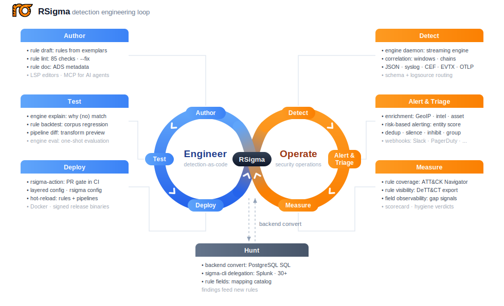
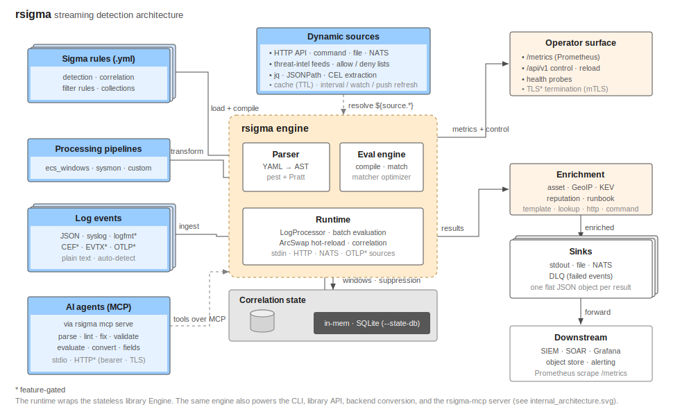
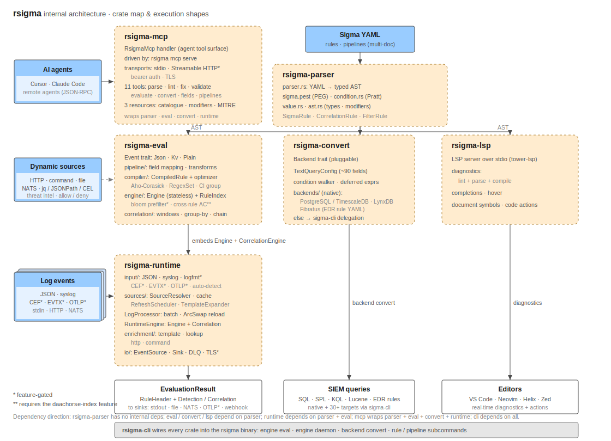

<p align="center">
    <a href="https://github.com/timescale/rsigma">
        
    </a>
    <p align="center">A complete Sigma detection engineering toolkit</p>
</p>

<p align="center">
    <a href="https://github.com/timescale/rsigma/actions/workflows/ci.yml"></a>
    <a href="https://timescale.github.io/rsigma/"></a>
    <a href="https://crates.io/crates/rsigma"></a>
    <a href="https://github.com/timescale/rsigma/blob/main/Cargo.toml"></a>
    <a href="https://ghcr.io/timescale/rsigma"></a>
    <a href="https://github.com/timescale/rsigma/releases/latest"></a>
    <a href="https://opensource.org/licenses/MIT"></a>
</p>

RSigma is a complete detection engineering toolkit for the [Sigma](https://sigmahq.io/) detection standard, including a parser, evaluation engine, rule conversion, streaming runtime, linter, CLI, MCP, and LSP.

RSigma parses Sigma YAML rules into a strongly-typed AST, compiles them into optimized matchers, and evaluates them against log events in real time. It handles stateful correlation logic in-process with memory-efficient compressed event storage. Or as Zack Allen put it in [DEW #149](https://www.detectionengineering.net/i/191079258/detection-engineering-gem), "RSigma is essentially a SIEM."

You can send events in many formats, including JSON, syslog (RFC 3164/5424), logfmt, CEF, EVTX (Windows Event Log), plain text, and OTLP (OpenTelemetry Protocol), with auto-detection by default. pySigma-compatible processing pipelines handle field mapping and backend configuration. OTLP support lets any OpenTelemetry-compatible agent (Grafana Alloy, Vector, Fluent Bit, OTel Collector) forward logs to RSigma via HTTP or gRPC for detection.

For rule quality and editor integration, a built-in linter validates rules against 85 checks derived from the Sigma v2.1.0 specification, and an LSP server provides real-time diagnostics, completions, hover documentation, and quick-fix code actions in any editor.

Full documentation, including guides, CLI reference, and library API docs, lives at [timescale.github.io/rsigma](https://timescale.github.io/rsigma/).



## Supported Features

### Author

* **[Sigma parsing](https://timescale.github.io/rsigma/library/parser/):** Parses Sigma YAML into a strongly-typed AST with support for detection, correlation, and filter rules
* **[Array matching](https://timescale.github.io/rsigma/guide/array-matching/) (experimental):** Matches members of arrays in nested event data with any/all-member semantics, same-element correlation, and positional indexing, opt-in via `sigma-version: 3`
* **[Rule drafting](https://timescale.github.io/rsigma/guide/rule-drafting/):** Drafts a detection rule from exemplar events contrasted against a baseline corpus with `rule draft`
* **[Built-in linter](https://timescale.github.io/rsigma/guide/linting-rules/):** Validates rules with 85 checks, four severity levels, suppressions, custom tag namespaces, and auto-fix for 14 safe rules
* **[ADS metadata](https://timescale.github.io/rsigma/guide/detection-strategy/):** Documents rules with [Palantir ADS](https://github.com/palantir/alerting-detection-strategy-framework) sections under `rsigma.ads.*`, enforced by the linter and scaffolded with `rule doc`
* **LSP server:** Provides real-time diagnostics, completions, hover documentation, document symbols, and quick-fix code actions in [VSCode](https://timescale.github.io/rsigma/editors/vscode/), [Neovim](https://timescale.github.io/rsigma/editors/neovim/), and any LSP-capable editor
* **[MCP server](https://timescale.github.io/rsigma/guide/mcp-server/):** Exposes the toolchain to AI agents (Cursor, Claude Code, ...) as structured MCP tools over stdio or Streamable HTTP with `rsigma mcp serve`

### Test

* **[Detection diagnostics](https://timescale.github.io/rsigma/cli/engine/explain/):** Explains why a rule did or did not match an event with `engine explain`, diffs pipeline transformations with `pipeline diff`, and introspects live correlation windows
* **[Corpus backtesting](https://timescale.github.io/rsigma/cli/rule/backtest/):** Replays an event corpus against declared per-rule expectations with `rule backtest`, emitting a JSON or JUnit XML report for CI
* **[Output formats](https://timescale.github.io/rsigma/reference/output/):** Renders every command's results as JSON, NDJSON, table, CSV, or TSV with a TTY-aware default via a global `--output-format` flag

### Deploy

* **[CI integration](https://timescale.github.io/rsigma/guide/ci-cd/):** Gates a rule repository in one pull-request check with the [`timescale/rsigma-action`](https://github.com/timescale/rsigma-action) GitHub Action, wrapping lint, validate, fields-drift diff, backtest, and coverage
* **[Configuration](https://timescale.github.io/rsigma/reference/configuration/):** Layers settings from YAML config files, environment variables, and CLI flags, managed with the `rsigma config` command group
* **[Signed artifacts](https://timescale.github.io/rsigma/deployment/docker/):** Ships multi-arch Docker images with cosign signatures, SBOM, and SLSA Build L3 provenance, plus prebuilt binaries for Linux, macOS, and Windows

### Detect

* **[Rule evaluation](https://timescale.github.io/rsigma/guide/evaluating-rules/):** Compiles rules into optimized matchers and evaluates them against events in real time, with stateless detection and stateful correlation (sliding/tumbling/session windows, group-by, chaining, suppression)
* **[Streaming daemon](https://timescale.github.io/rsigma/guide/streaming-detection/):** Runs as a long-lived detection daemon with hot-reload, Prometheus metrics, stdin/HTTP/NATS/OTLP/Unix-socket input, and async sinks (stdout, file, NATS, OTLP, webhook, Unix socket) with per-sink retry and DLQ
* **[Input formats](https://timescale.github.io/rsigma/guide/input-formats/):** Ingests JSON, syslog (RFC 3164/5424), logfmt, CEF, EVTX (Windows Event Log), plain text, and OTLP logs with format auto-detection
* **[Processing pipelines](https://timescale.github.io/rsigma/guide/processing-pipelines/):** Maps fields and transforms rules with pySigma-compatible pipelines (transformations, conditions, finalizers)
* **[Dynamic pipelines](https://timescale.github.io/rsigma/reference/dynamic-sources/):** Populates any pipeline value from external sources (HTTP, files, commands, NATS) with template expansion, auto-refresh, and extraction via jq, JSONPath, or CEL
* **[Schema recognition](https://timescale.github.io/rsigma/cli/engine/classify/):** Recognizes which schema each event uses (ECS, Sysmon, CEF, OCSF, or user-defined) with `engine classify`, watches a live daemon for unrecognized sources, and mines candidate signatures with `engine discover-schemas`
* **[Schema routing](https://timescale.github.io/rsigma/guide/schema-routing/):** Builds one engine per pipeline set and dispatches each classified event to its engine, feeding a shared correlation store
* **[Logsource routing](https://timescale.github.io/rsigma/guide/logsource-routing/):** Skips rules whose logsource conflicts with an event's declared `product`/`service`/`category`, so a mixed-product stream only pays for the rules that can match
* **[Eval prefilters](https://timescale.github.io/rsigma/guide/performance-tuning/):** Prunes large rule sets before evaluation with a bloom substring prefilter and a cross-rule Aho-Corasick index
* **[NATS JetStream](https://timescale.github.io/rsigma/guide/nats-streaming/):** Consumes and publishes over JetStream with authentication (credentials, mTLS), replay, consumer groups, and dead-letter queues
* **[OTLP integration](https://timescale.github.io/rsigma/guide/otlp-integration/):** Receives logs from any OpenTelemetry-compatible agent (Grafana Alloy, Vector, Fluent Bit, OTel Collector) via HTTP or gRPC, and exports detections to an OTLP collector
* **[TLS termination](https://timescale.github.io/rsigma/reference/security/):** Terminates TLS in-process on the daemon API listener with optional mutual TLS and cross-platform certificate hot-reload
* **[State persistence](https://timescale.github.io/rsigma/guide/streaming-detection/):** Persists correlation, alert-pipeline, risk, and disposition state to SQLite with `--state-db` and restores it across restarts
* **Live operations:** Inspects a running daemon with [`engine status`](https://timescale.github.io/rsigma/cli/engine/status/), records replayable fixtures with [`engine tap`](https://timescale.github.io/rsigma/cli/engine/tap/), and streams live detections with [`engine tail`](https://timescale.github.io/rsigma/cli/engine/tail/)

### Alert & Triage

* **[Enrichment](https://timescale.github.io/rsigma/guide/enrichers/):** Injects context (asset info, IP reputation, identity, GeoIP, runbook URLs, ...) into detection and correlation results via `template`, `lookup`, `http`, and `command` primitives
* **[Risk-based alerting](https://timescale.github.io/rsigma/guide/risk-based-alerting/):** Scores each firing per entity (user, host, source IP) and raises a single incident when an entity's accumulated risk crosses a threshold
* **[Alert pipeline](https://timescale.github.io/rsigma/guide/alert-pipeline/):** Silences, inhibits, and deduplicates results, then groups the survivors into incidents, modeled on Alertmanager
* **[Webhook alerts](https://timescale.github.io/rsigma/guide/webhooks/):** Delivers detections to Slack, Teams, Discord, PagerDuty, or any HTTP endpoint with templated payloads, HMAC request signing, per-webhook retry, rate limiting, and DLQ
* **[Triage feedback](https://timescale.github.io/rsigma/guide/triage-feedback/):** Ingests analyst dispositions into a per-rule false-positive ratio that feeds the detection scorecard

### Measure

* **[ATT&CK coverage](https://timescale.github.io/rsigma/guide/attack-coverage/):** Exports an ATT&CK Navigator layer with `rule coverage` and reports gaps against Atomic Red Team, the SigmaHQ baseline, and a target technique list
* **[Telemetry visibility](https://timescale.github.io/rsigma/guide/visibility-and-data-sources/):** Scores data-source maturity with `rule visibility`, exporting [DeTT&CT](https://github.com/rabobank-cdc/DeTTECT) administration files and a Navigator layer that surfaces blind spots
* **[Field observability](https://timescale.github.io/rsigma/guide/observability/):** Surfaces which event fields no rule references and which rule fields never appear in events, live on the daemon or as a one-shot report from `engine eval`
* **[Detection scorecard](https://timescale.github.io/rsigma/guide/detection-scorecard/):** Fuses backtest, coverage, production-volume, and triage signals with `rule scorecard` into per-rule keep/tune/retire verdicts
* **[Rule hygiene](https://timescale.github.io/rsigma/guide/rule-hygiene/):** Flags retirement candidates with `rule hygiene`: silent, noisy, untagged, unowned, incomplete ADS, broken field coverage, or stale status

### Hunt

* **[Rule conversion](https://timescale.github.io/rsigma/guide/rule-conversion/):** Converts rules into backend-native queries via a pluggable backend trait, with native PostgreSQL/TimescaleDB, LynxDB, and Fibratus backends plus sigma-cli delegation for 30+ pySigma backends (Splunk, Elasticsearch, Microsoft Sentinel, ...)
* **[Field catalog](https://timescale.github.io/rsigma/cli/rule/fields/):** Lists every field a ruleset references, before or after pipeline mapping, with `rule fields`

## Crates

| Crate | Description |
|-------|-------------|
| [`rsigma-parser`](crates/rsigma-parser/) | Parse Sigma YAML into a strongly-typed AST |
| [`rsigma-ir`](crates/rsigma-ir/) | Intermediate representation shared by evaluation and conversion |
| [`rsigma-eval`](crates/rsigma-eval/) | Compile and evaluate rules against JSON events |
| [`rsigma-convert`](crates/rsigma-convert/) | Transform rules into backend-native query strings |
| [`rsigma-runtime`](crates/rsigma-runtime/) | Streaming runtime with input adapters, log processor, and hot-reload |
| [`rsigma-mcp`](crates/rsigma-mcp/) | Model Context Protocol (MCP) server exposing the toolchain as tools for AI agents |
| [`rsigma`](crates/rsigma-cli/) | CLI for parsing, validating, linting, evaluating, converting rules, field catalog, and running a detection daemon |
| [`rsigma-lsp`](crates/rsigma-lsp/) | Language Server Protocol (LSP) server for IDE support |
| [`rstix`](crates/rstix/) | STIX 2.1 library: typed objects, bundle parse/stream, semantic validation, and pattern engine |

> [!TIP]
> To learn more about RSigma, read these articles:
> 
> - [Pattern Detection and Correlation in JSON Logs](https://mostafa.dev/pattern-detection-and-correlation-in-json-logs-fab16334e4ee)
> - [Streaming Logs to RSigma for Real-Time Detection](https://mostafa.dev/streaming-logs-to-rsigma-for-real-time-detection-72084b8041ad)
> - [Building a Detection Layer on PostgreSQL with Sigma Rules](https://mostafa.dev/building-a-detection-layer-on-postgresql-with-sigma-rules-042caeb42b2a)
> - [Security Observability with RSigma and the LGTM Stack](https://mostafa.dev/security-observability-with-rsigma-and-the-lgtm-stack-375ccd260795)
> - [Wiring Live Threat Intel into Sigma Detection with Dynamic Pipelines](https://mostafa.dev/wiring-live-threat-intel-into-sigma-detection-with-dynamic-pipelines-4de29b4af7ca)
> - [Cloud Detection at Scale on a Laptop](https://mostafa.dev/cloud-detection-at-scale-on-a-laptop-e46540322856)
> - [The State of RSigma](https://mostafa.dev/the-state-of-rsigma-7ba0a99020d9)
> - [Detection-as-Code in One GitHub Action with RSigma](https://mostafa.dev/detection-as-code-in-one-github-action-with-rsigma-0ebfb4c857fa)

> [!NOTE]
> RSigma has been featured in:
> 
> - [Detection Engineering Weekly #149](https://www.detectionengineering.net/i/191079258/detection-engineering-gem) (March 2026)
>   *"Building a tool like RSigma is challenging because the Sigma specification has evolved into a robust domain-specific language over the years."*
> - [tl;dr sec #320](https://tldrsec.com/p/tldr-sec-320#blue-team) (March 2026)
>   *"Accurately evaluating the full spectrum of what Sigma rules can express is quite complex, it's pretty neat to read about how RSigma handles all of these conditional expressions, correlating across rules, etc."*
> - [The Deep Purple Sec by BlackNoise - March 2026](https://www.blacknoise.co/the-deep-purple-sec-march-2026/) (April 2026)
>   *"Defensive teams can pipe logs through CLI commands, apply field-mapping pipelines, and chain correlations for multi-stage attack detection."*
> - [Detection Engineering Weekly #154](https://www.detectionengineering.net/i/195467950/state-of-the-art) (April 2026)
>   *"RSigma is not a SIEM, but it's an impressive feat to build a self-contained Rust binary that operates much like one. For teams doing pre-SIEM rule validation or forensics, it's a solid plug-and-play option."*
> - [Detection Engineering Weekly #157](https://www.detectionengineering.net/p/dew-157-shai-hulud-goes-open-source) (May 2026)
>   *"Instead of hardcoding IOC values in rule YAML, you declare external sources in the pipeline config, and RSigma fetches and injects them at evaluation time. This works very similarly to how I've seen SIEMs implement threat intelligence pipelines, but since it's RSigma, it's self-contained within its ecosystem."*

## Installation

Prebuilt binaries for Linux, macOS, and Windows (amd64 and arm64), with SLSA Build L3 provenance, are attached to every [GitHub release](https://github.com/timescale/rsigma/releases/latest).

Or install from crates.io:

```bash
# Install the CLI
cargo install --locked rsigma

# Install the LSP server
cargo install --locked rsigma-lsp
```

To build from source:

```bash
cargo build --release --all-features --workspace
```

### Docker

Multi-arch images (linux/amd64, linux/arm64) are published to GHCR on every release, signed with cosign and carrying an SPDX SBOM and SLSA Build L3 provenance. See the [Docker deployment guide](https://timescale.github.io/rsigma/deployment/docker/).

```bash
docker pull ghcr.io/timescale/rsigma:latest
docker run --rm ghcr.io/timescale/rsigma:latest --help
```

Run with full runtime hardening:

```bash
docker run --rm \
  --read-only \
  --cap-drop=ALL \
  --security-opt=no-new-privileges:true \
  -v /path/to/rules:/rules:ro \
  ghcr.io/timescale/rsigma:latest rule validate /rules/
```

Verify the image signature:

```bash
cosign verify \
  --certificate-identity-regexp 'github.com/timescale/rsigma' \
  --certificate-oidc-issuer https://token.actions.githubusercontent.com \
  ghcr.io/timescale/rsigma:latest
```

## Quick Start

```bash
# Evaluate a single event against Sigma rules
rsigma engine eval -r rules/ -e '{"CommandLine": "cmd /c whoami"}'

# Stream NDJSON from stdin (auto-selected when stdout is piped)
cat events.ndjson | rsigma engine eval -r rules/

# Interactive triage in a terminal: width-aligned table view
rsigma engine eval -r rules/ -e @events.ndjson --output-format table

# Recognize which schema each event is (ECS, Sysmon, CEF, OCSF, ...)
cat events.ndjson | rsigma engine classify --output-format table

# Pipe a CSV view into a spreadsheet or data tool
rsigma engine eval -r rules/ -e @events.ndjson --output-format csv > matches.csv

# Run as a daemon with hot-reload and Prometheus metrics
rsigma engine daemon -r rules/ -p ecs.yml --api-addr 0.0.0.0:9090

# Accept events via HTTP POST
rsigma engine daemon -r rules/ --input http

# Check a running daemon's status (rules loaded, events processed, uptime)
rsigma engine status

# Record 30s of a running daemon's live events to a replayable fixture
# (opt-in: start the daemon with --enable-tap)
rsigma engine tap --duration 30s --redact-fields user.email,src_ip -o fixture.ndjson

# Stream a running daemon's live detections to the terminal
# (opt-in: start the daemon with --enable-tail)
rsigma engine tail --level high

# Convert rules to PostgreSQL SQL for historical threat hunting
rsigma backend convert rules/ -t postgres

# Any non-native target delegates to sigma-cli when it is installed (pipx install sigma-cli)
rsigma backend convert rules/ -t splunk

# Draft a detection rule from exemplar events, contrasted against a baseline corpus
rsigma rule draft -e @incident.ndjson --baseline @normal-day.ndjson

# Backtest a corpus against per-rule expectations (CI fixture harness)
rsigma rule backtest -r rules/ --corpus ci/corpus/ --expectations ci/expectations.yml

# Map coverage onto MITRE ATT&CK: export a Navigator layer and gate on a target list
rsigma rule coverage -r rules/ --navigator coverage.json --targets threat-model.txt --fail-on-gaps
```

See the [Quick Start guide](https://timescale.github.io/rsigma/getting-started/quick-start/) for a guided tour and the [CLI README](crates/rsigma-cli/) for complete documentation of all subcommands and flags.

### MCP Server (AI agents)

Expose the toolchain to MCP-aware agents (Cursor, Claude Code, ...) over stdio:

```bash
# Run the MCP server (register it in your agent's mcp.json / via `claude mcp add`)
rsigma mcp serve --rules-dir rules/
```

The agent then calls structured tools (`parse_rule`, `lint_rules`, `validate_rules`, `evaluate_events`, `convert_rules`, `list_fields`, ...) and gets back JSON. See the [MCP server guide](https://timescale.github.io/rsigma/guide/mcp-server/).

### Library Usage

Use the crates directly from Rust:

```rust
use rsigma_parser::parse_sigma_yaml;
use rsigma_eval::Engine;
use rsigma_eval::event::JsonEvent;
use serde_json::json;

let yaml = r#"
title: Detect Whoami
logsource:
    product: windows
    category: process_creation
detection:
    selection:
        CommandLine|contains: 'whoami'
    condition: selection
level: medium
"#;

let collection = parse_sigma_yaml(yaml).unwrap();
let mut engine = Engine::new();
engine.add_collection(&collection).unwrap();

let event = JsonEvent::borrow(&json!({"CommandLine": "cmd /c whoami"}));
let matches = engine.evaluate(&event);
assert_eq!(matches[0].rule_title, "Detect Whoami");
```

## Architecture



A Sigma rule is parsed into a strongly-typed AST (`rsigma-parser`), lowered into a shared intermediate representation (`rsigma-ir`), then compiled and evaluated against live events (`rsigma-eval` inside `rsigma-runtime`), converted into backend-native queries (`rsigma-convert`), or served to editors and AI agents (`rsigma-lsp`, `rsigma-mcp`). The full walkthrough, covering every module and all four execution shapes, lives in the [Architecture reference](https://timescale.github.io/rsigma/reference/architecture/).



## Performance

RSigma is designed for high-throughput detection. On an Apple M4 Pro:

- **Parsing**: 12.4 MiB/s for 1000 rules
- **Detection**: 1.12M events/sec (JSON runtime pipeline, 100 rules)
- **Correlation**: 501K events/sec (temporal + event-count)
- **Dynamic pipelines**: 2.85M events/sec once built (no per-event overhead)

See [BENCHMARKS.md](BENCHMARKS.md) for full Criterion results across all subsystems.

## Reference

- [pySigma](https://github.com/SigmaHQ/pySigma): reference Python implementation
- [Sigma Specification V2.1.0](https://github.com/SigmaHQ/sigma-specification): formal specification
- [sigma-rust](https://github.com/jopohl/sigma-rust): Pratt parsing approach
- [sigmars](https://github.com/crowdalert/sigmars): correlation support patterns
- [sigma_engine](https://github.com/SigmaHQ/sigma_engine): official SigmaHQ Rust library for parsing and matching Sigma rules against events
- [pySigma-backend-sqlite](https://github.com/SigmaHQ/pySigma-backend-sqlite): SQLite backend for pySigma (inspiration for the PostgreSQL backend)
- [pySigma-backend-athena](https://github.com/SigmaHQ/pySigma-backend-athena): AWS Athena backend for pySigma (SELECT fields, CTE-based correlation, sliding window patterns)

## License

MIT
