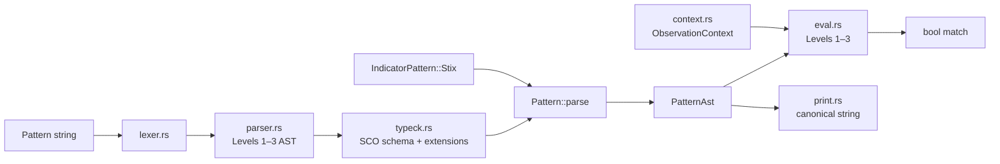

# rstix

[](https://github.com/timescale/rsigma/actions/workflows/ci.yml)

`rstix` is a Rust library crate for STIX 2.1 in the rsigma workspace. It provides a typed object model for all built-in STIX types (meta objects, all 19 SDOs, SROs, 18 SCOs, and extensions), `StixObject` dispatch, `Bundle` parsing with streaming support (`parse_reader`) for ATT&CK-scale corpora, deterministic SCO ID derivation, and advisory semantic checks (`Bundle::validate()`), all with fixture-backed tests.

Two optional features extend the core model:

- `pattern` — the STIX patterning engine: parse, type-check, and Level 1-3 evaluation against observations, a canonical printer, and `Indicator` wiring via `IndicatorBuilder`.
- `validate` — a profile-based validation pipeline with all twelve checks, `STIX-E/W/I/H` diagnostics, raw-JSON entry points, and a pattern parse/semantic split.

## Install

```toml
[dependencies]
rstix = "0.18"
# For the pattern engine and validation pipeline:
# rstix = { version = "0.18", features = ["pattern", "validate"] }
```

This library is part of [rsigma].

## Public API

### Entry points

- `parse_bundle(json: &str)`: parse a STIX 2.1 bundle into a typed [`Bundle`](model::Bundle) (alias for [`Bundle::parse`](model::Bundle::parse)).
- `model::Bundle::parse_reader(R: Read)`: stream-parse large bundles with default [`ParseOptions`](model::ParseOptions).
- `model::Bundle::parse_with_options(json, opts)` / `parse_reader_with_options`: bundle parse with custom types and limits.
- `core::StixId::parse(id: &str)`: parse and validate STIX object IDs in `{type}--{uuid}` form.
- `core::StixId::generate(type_name: &str)`: create a random UUIDv4-based STIX ID for a type prefix.
- `id::generate_sco_id(kind, value)`: generate deterministic SCO IDs using canonicalized contributing properties.
- `id::select_id_contributing_properties(kind, value)`: extract SCO id-contributing fields.
- `id::jcs_canonicalize(value)`: canonicalize JSON for deterministic ID derivation.

### Error types

- `ParseError`: top-level parse error enum (JSON errors, bundle shape, duplicate ids, object limits, unknown types, and wrapped `ModelError`).
- `model::ModelError`: model-level invariant violations (for example non-empty `source_name`, external-reference §2.5.2 detail fields, granular-marking exclusivity and selectors).
- `core::StixIdError`: errors for STIX ID parsing and typed-ID conversion.
- `core::TimestampError`: errors for STIX/TAXII timestamp parsing.
- `core::ConfidenceError`: confidence range and scale-label errors.
- `core::LanguageTagError`: language tag parsing errors.
- `id::DeterministicIdError` / `id::JcsError`: deterministic SCO-ID derivation errors.

### Module surface

- `core` (always): `StixId`, typed IDs (42 wrappers), `StixObjectKind` + SDO/SCO/SRO/Meta discriminants, `StixTimestamp`, `TaxiiTimestamp`, `Confidence` and built-in scales, `SpecVersion`, `LanguageTag`, `QueryableStixObject`, `QueryValue`.
- `model` (always): `ModelError`; `model::common` — `SdoSroCommonProps`, `ScoCommonProps`, `ExternalReference`, `GranularMarking`, `ExtensionMap`, `KillChainPhase`, and related types; `model::meta` — `MarkingDefinition`, `ExtensionDefinition`, `LanguageContent`, `MetaObject`, and TLP UUID constants; `model::sdo` — all 19 STIX domain objects, `SdoObject`, `IndicatorPattern`, `IndicatorBuilder`, `ObservedDataForm`, `ObservedDataEmbeddedObject`, and typed ref unions; `model::sro` — `Relationship`, `Sighting`, `WhereSightedRef`, `SroObject`, and typed ref unions; `model::sco` — all 18 STIX cyber-observable types, `ScoObject`, typed ref unions, and 12 predefined SCO extensions; `model::StixObject` — top-level enum dispatching SDO/SCO/SRO/Meta plus `CustomStixObject`; `model::Bundle` — bundle container with ref validation, `x_*` property capture, and `validate()` semantic warnings; `model::ValidationReport` / `ValidationCode` / `ValidationFinding` — SHOULD-level advisory findings; `model::ParseOptions` / `TypeRegistry` — parse-time limits and optional custom type registration.
- `id` (always): deterministic SCO ID derivation (`select_id_contributing_properties`, canonicalization, UUIDv5 generation).
- `vocab` (always): open/closed vocabulary tables and `OpinionValue` ordering enum.
- `pattern` (`pattern` feature): `Pattern::parse`, `Pattern::evaluate`, `Pattern::matches_single`, `Pattern::evaluate_observed_data`, `Pattern::canonical`, `PatternAst`, `ObservationContext`, `PatternScoType`, `PatternError`, `PatternMatchError`; `IndicatorPattern::parsed_pattern`, `IndicatorPattern::evaluate` — STIX Specification §9 Levels 1–3 parse, type-check, evaluation, and canonical printing (see [Pattern Engine (STIX §9)](#pattern-engine-stix-9)).
- `validate` (`validate` feature): `Validator`, `ValidatorBuilder` (`with_allow_custom`, `with_parse_options`, `with_phase`), `ValidationPhase`, `Leniency`, `Diagnostic`, `DiagnosticCode`, `Severity`, `SourceSpan`, `PipelineValidationReport` (re-export alias) — profile-based validation pipeline with `validate_json_str`, `validate_json_value`, `validate_bundle`, and `validate_object` (see [Validation Pipeline](#validation-pipeline)).
- `serde_impls` (internal, `serde` feature): hand-written serializers for `StixId`, timestamps, and `Confidence`; typed-ID serde is generated in the `define_typed_id!` macro.

## Feature flags

- `serde` (default): enables serialization and deserialization support.
- `pattern`: STIX patterning lexer, Level 1–3 parser, SCO schema type-checker, and evaluator (`Pattern::parse`, `Pattern::evaluate`).
- `validate`: profile-based Validation Pipeline (`Validator`, structured `STIX-E/W/I/H` diagnostics, raw JSON entry). Implies `serde` and `pattern`.

## Current status

- **Data Model + Serialization:** **complete**
- **Pattern Engine:** **complete** (`--features pattern`)
- **Validation Pipeline:** **complete** (`--features validate`) — all twelve checks, 39 structured diagnostics, conformance corpus + per-code coverage tests
- **Next after Validation Pipeline:** **Graph + Marking + Store**
- **Optional corpus:** real MITRE ATT&CK bundle via `RSTIX_ATTCK_BUNDLE` / `tests/fixtures/corpus/enterprise-attack.json` (integration test skips when absent; synthetic large-bundle tests run in CI today).

## Usage

```rust
use rstix::core::{IndicatorId, StixId, StixTimestamp};
use rstix::model::common::SdoSroCommonProps;
use rstix::parse_bundle;

let bundle = parse_bundle(
    r#"{"type":"bundle","id":"bundle--00000000-0000-0000-0000-000000000000","objects":[]}"#,
)
.unwrap();
assert_eq!(bundle.id().type_name(), "bundle");

let id = StixId::generate("indicator");
let typed = IndicatorId::from_stix_id(id).unwrap();
assert_eq!(typed.as_stix_id().type_name(), "indicator");

let ts = StixTimestamp::parse("2016-05-12T08:17:27.000Z").unwrap();
let common = SdoSroCommonProps::new(StixId::generate("campaign"), ts.clone(), ts);
let json = serde_json::to_string(&common).unwrap();
assert!(json.contains("\"spec_version\":\"2.1\""));
```

## Pattern Engine (STIX §9)

The optional **`pattern`** feature adds the full STIX patterning engine: parse, type-check, evaluate Levels 1–3, canonical printing, and Indicator AST wiring at deserialize time.



| Module | Role | Status |
| ------ | ---- | ------ |
| `pattern/lexer.rs` | Tokenizer; 64 KiB input cap | Done |
| `pattern/parser.rs` | Recursive-descent parser; dict keys, ref-list `[*]`, custom SCO types | Done |
| `pattern/typeck.rs` | Property paths, `extensions.'…'`, `_ref.type`, ISSUBSET on CIDR strings | Done |
| `pattern/eval.rs` | Level 1–3 evaluation, `matches_single`, `matches_single_with_bundle`, `evaluate_observed_data` | Done |
| `pattern/context.rs` | `ObservationContext`, `TimestampedObservation` (`at: Option<_>`), observed-data builder | Done |
| `pattern/path.rs` | Object-path resolution (extensions, ref lists, binary fields), CIDR, `_ref` via bundle | Done |
| `pattern/security.rs` | Regex compile size limit + PCRE DOTALL for `MATCHES` | Done |
| `pattern/print.rs` | Canonical pattern printer (`Pattern::canonical`, `Display`) | Done |

```rust
use rstix::Pattern;
use rstix::model::sdo::Indicator;
use rstix::pattern::{ObservationContext, TimestampedObservation};

let pattern = Pattern::parse("[ipv4-addr:value = '198.51.100.1/32']")?;
assert_eq!(pattern.observed_types().len(), 1);
assert_eq!(pattern.canonical(), "[ipv4-addr:value = '198.51.100.1/32']");

// Level 1: single SCO
let sco = /* ... */;
assert!(pattern.matches_single(&sco)?);

// Levels 2–3: timestamped observations
let ctx = ObservationContext::from_scos(&observations);
assert!(pattern.evaluate(&ctx)?);

// Indicator: STIX patterns carry parsed AST at deserialize time (pattern + serde)
let indicator: Indicator = serde_json::from_str(json)?;
indicator.pattern.parsed_pattern()?.evaluate(&ctx)?;

// Programmatic construction (always available; STIX patterns parse at build when `pattern` is on)
use rstix::model::sdo::IndicatorBuilder;
let indicator = IndicatorBuilder::with_timestamps(created, modified)
    .stix_pattern("[ipv4-addr:value = '198.51.100.3']", None)
    .valid_from(valid_from)
    .build()?;
```

### Scope (Pattern Engine — complete)

| Shipped in the `pattern` feature |
| ---------------------------------- |
| Lexer, Level 1–3 parser, `PatternAst`, type-checker |
| `Pattern::parse`, `Pattern::evaluate`, `matches_single`, `matches_single_with_bundle`, `evaluate_observed_data` |
| Full §9 evaluation: comparisons (including `MATCHES`, hex/binary), temporal qualifiers, `_ref` paths, custom SCO types |
| `ObservationContext`, observed-data context builder (embedded SRO skipped) |
| Canonical printer + §9.8 parse/print round-trip tests |
| `IndicatorPattern::Stix { parsed }` at deserialize; `IndicatorPattern::evaluate` |
| `IndicatorBuilder` — fluent STIX/external pattern construction; setters store config, validation (parse + [`Indicator::validate`]) at `build()` — same materialization boundary as deserialize |
| `fuzz_stix_pattern` fuzz target |
| Spec §9.8 fixture-backed parse + eval tests (`tests/pattern_spec_eval.rs`) |

Authoritative grammar: **STIX Specification §9** (not §8). The `Pattern` struct holds a validated `PatternAst` after parse and type-check.

Evaluation notes (STIX §9):

- **`TimestampedObservation::at`**: `Option<StixTimestamp>`; patterns with `WITHIN`, `FOLLOWEDBY`, `REPEATS`, or `START`/`STOP` return `MissingTimestamp` when any observation lacks a timestamp. Plain observation expressions accept `at: None`.
- **`matches_single_with_bundle`**: pass a bundle when Level 1 patterns dereference `_ref` paths. Absent optional `_ref` properties yield no match for comparisons and `false` for `EXISTS`; present refs that cannot be resolved in the bundle still return `RefResolution`.
- **`LIKE` / `MATCHES` (§9.6.1)**: pattern constants and string property values are NFC-normalized before comparison; `MATCHES` compiles with PCRE DOTALL (`.` matches newlines) and a 1 MiB compile-size cap (`pattern::security`).
- **Custom SCO types**: vendor types (e.g. `x-usb-device`) deserialize as `CustomSco` and evaluate nested property paths.
- **`file:created`**: alias for `ctime`.
- **`network-traffic:dst_ref.type`**: `_ref` dereference then `type` property on the target SCO.
- **`file:hashes.MD5`**: dictionary dot-key syntax per §9.7.3.
- **`extensions.'…'`**: predefined SCO extension paths (e.g. `windows-pebinary-ext.sections[*].entropy`).
- **`ISSUBSET` / `ISSUPERSET` on string**: IP/CIDR subset checks per §9.6.
- **Custom SCO types** (`x-usb-device`, …): parsed and type-checked permissively (leaf properties as string).

Fixtures: `tests/fixtures/pattern/` (§9.8 examples) and `tests/fixtures/pattern/sco-fields/` (manifest-driven SCO field paths). Acceptance tests: `pattern::parser::level1`, `level23`, `not`, `pattern::typeck::`, `pattern::security`, `pattern::eval`, `tests/pattern_eval.rs`, `tests/pattern_spec_eval.rs`, `tests/pattern_eval_operators.rs`, `tests/pattern_eval_sco_fields.rs`, `tests/pattern_eval_errors.rs`.

## Validation Pipeline

The optional **`validate`** feature adds a profile-based validator distinct from advisory [`Bundle::validate()`](model::Bundle::validate) (see **DD-VP-001** below).

```rust
use rstix::validate::{Validator, ValidationPhase, DiagnosticCode};

let report = Validator::consumer_strict().validate_json_str(untrusted_json);
if !report.is_valid() {
    for diag in report.errors() {
        eprintln!("{}: {}", diag.code, diag.message);
    }
}

let custom = Validator::builder()
    .with_phase(ValidationPhase::Schema)
    .with_phase(ValidationPhase::References)
    .build();
```

| Profile | Checks | Implemented today | Use case |
| ------- | ------ | ----------------- | -------- |
| `consumer_permissive` | JSON, type, schema, references | JSON + type | Mixed-trust ingest |
| `consumer_strict` | all 12 | Full pipeline | Untrusted external input |
| `producer_strict` | all except references | Full pipeline minus reference resolution | Publishing/export |
| `interop_strict` | all 12, zero leniency | Full pipeline; warnings fail `is_valid()` | OASIS interop tests |

### Validation Pipeline design decisions

Recorded engineering choices for the `validate` feature. Summaries also appear on the [rstix library page](../../docs/library/rstix.md#validation-pipeline).

<a id="dd-vp-001--bundlevalidate-vs-validatevalidator"></a>

#### DD-VP-001 — `Bundle::validate()` vs `validate::Validator`

| | |
| --- | --- |
| **Status** | Accepted |
| **Applies to** | `validate` feature, `model::Bundle::validate` |
| **`Bundle::validate()`** | Warning-only SHOULD findings; `model::ValidationReport` + `ValidationCode` enum |
| **`validate::Validator`** | Profile-driven pipeline; Error/Warning/Info/Hint; OASIS-style string codes |

**Decision.** Use `Validator` for untrusted JSON and named profiles. With `validate` enabled, `Bundle::validate()` delegates to shared pipeline semantics to keep advisory and pipeline behavior aligned. Prefer [`PipelineValidationReport`](crate::PipelineValidationReport) at the crate root when both report types are in scope.

**Current status.** All twelve checks are implemented and active. The in-repo conformance corpus (`tests/fixtures/conformance/`) and `validate_diagnostic_coverage` integration test assert one pipeline case per `DiagnosticCode::ALL` entry (39 codes).

### Pattern Engine design decisions

Recorded engineering choices for the `pattern` feature and Indicator integration. Summaries also appear on the [rstix library page](../../docs/library/rstix.md#pattern-engine-design-decisions).

<a id="dd-pe-001--indicatorbuilder-validates-at-build-not-in-setters"></a>

#### DD-PE-001 — `IndicatorBuilder` validates at `build()`, not in setters

| | |
| --- | --- |
| **Status** | Accepted (Pattern Engine PR 3.6) |
| **Applies to** | `model::sdo::IndicatorBuilder`, `IndicatorBuilderError` |
| **Feature** | `pattern` optional for STIX parse; builder API always available |

**Context.** Indicators carry a detection pattern (`pattern` / `pattern_type` / `pattern_version` on the wire). STIX patterns (`pattern_type = stix`) must parse and type-check when the Pattern Engine is enabled. Callers can construct indicators from JSON (deserialize) or programmatically (`IndicatorBuilder`).

**Decision.** `IndicatorBuilder` setters (`stix_pattern`, `name`, `valid_from`, …) only store configuration and return `Self`. All validation runs in `build()`:

1. Required fields present (`common`, `pattern`, `valid_from`).
2. STIX pattern parse and type-check (`Pattern::parse`) when the `pattern` feature is enabled.
3. `Indicator::validate()` (time window, kill-chain phases, SDO common props).

`stix_pattern()` stores the raw string; it does **not** parse or return `Result`.

**Rationale.**

- **Same materialization boundary as deserialize.** JSON deserialization parses STIX patterns in `indicator_pattern_from_wire` when the full `Indicator` is constructed, not when individual fields are read. `build()` is the programmatic equivalent of that boundary.
- **Single validation choke point.** One `IndicatorBuilderError` surface for missing fields, pattern errors, and model invariants — consistent with fluent builders elsewhere (`http::Request::builder`, client builders).
- **Fluent chain.** Setters return `Self`, so callers use one `?` at the end of the chain instead of after every setter.

**Alternatives considered.**

| Alternative | Why not chosen |
| ----------- | -------------- |
| Parse in `stix_pattern() -> Result<Self, _>` | Fail-fast at the call site, but breaks the infallible setter chain (`?` after every step). |
| Error accumulation (parse in `stix_pattern`, store `Err`, return at `build()`) | Same user-visible outcome as `build()`-time parse with more internal state; no clear benefit for rstix. |
| Type-state builder (`MissingPattern` → `HasPattern` → `Ready`) | Strongest compile-time guarantees; rejected as disproportionate for Phase 3 scope. |

**Consequences.**

- Invalid STIX patterns surface as `IndicatorBuilderError::Pattern` from `build()`, not from `stix_pattern()`.
- With `pattern` disabled, `build()` stores `IndicatorPattern::Stix { raw, pattern_version }` without an AST (same as serde-only deserialize).
- Pre-parsed patterns can be supplied via `.pattern(IndicatorPattern::stix(...)?)` or `.pattern(...)` after calling `Pattern::parse` / `IndicatorPattern::stix` directly.

User-facing docs: [rstix library page](../../docs/library/rstix.md#pattern-engine-stix-9).

### Bundle API

| Method | Use when |
| ------ | -------- |
| `Bundle::parse(&str)` | Entire JSON is in memory. |
| `Bundle::parse_with_options(&str, &ParseOptions)` | Custom types or stricter limits. |
| `Bundle::parse_reader(R: Read)` | Large files (MITRE ATT&CK ~50 MiB); streaming reader with byte cap. |
| `Bundle::parse_reader_with_options(R, &ParseOptions)` | Streaming + options. |

Navigation:

| Method | Description |
| ------ | ----------- |
| `bundle.objects()` | All objects in document order. |
| `bundle.get(&StixId)` | Untyped lookup by id. |
| `bundle.get_typed::<T>(&StixId)` | Typed lookup (`Malware`, registered custom types, …). |
| `bundle.objects_of_type::<T>()` | Iterator over all objects of type `T`. |
| `bundle.extra_properties(&StixId)` | Top-level `x_*` and hoisted extension keys peeled at parse. |
| `bundle.validate_refs()` | Re-run MUST ref resolution (normally called during parse). |
| `bundle.validate()` | Collect SHOULD-level semantic warnings (see below). |

The originally sketched `get::<T>()` API is implemented as **`get_typed::<T>()`** to avoid clashing with untyped `get`.

### `ParseOptions` defaults

| Field | Default | Purpose |
| ----- | ------- | ------- |
| `max_nesting_depth` | 64 | Reject deeply nested JSON (DoS guard). |
| `max_string_length` | 1_048_576 (1 MiB) | Max length of any JSON string value. |
| `max_bundle_bytes` | 256 MiB | Max bytes read from stream / checked for string parse. |
| `max_object_count` | `usize::MAX` | Max objects in one bundle. |
| `allow_custom` | `false` | Unknown `type` → error unless registered or allowed. |

Register custom STIX types on a `ParseOptions` instance (not global). Implement [`BundleObjectCast`](model::BundleObjectCast) on your type and call `ParseOptions::register_custom_type::<T>("x-my-type")`. See `tests/integration.rs`.

### Semantic validation (`Bundle::validate`)

Parse enforces STIX **MUST** rules (hard errors via `ParseError` / `ModelError`). **`Bundle::validate()`** collects **SHOULD**-level and advisory findings without rejecting the bundle. There is no `strict` parse flag — permissive parse + explicit validation is the supported workflow (maintainer direction on [issue #267](https://github.com/timescale/rsigma/issues/267)).

```rust
use rstix::model::{Bundle, ValidationCode};

let report = bundle.validate();
assert!(report.is_ok()); // warnings only; never fails the bundle
for w in report.warnings_with_code(ValidationCode::StixW0031TlpV1Encoding) {
    eprintln!("{}: {}", w.object_id.as_deref().unwrap_or("?"), w.message);
}
```

| `ValidationCode` | Meaning |
| ---------------- | ------- |
| `StixW0031TlpV1Encoding` | Legacy TLP 1.x marking encoding or TLP1 marking ref (STIX-W0031). |
| `ScoDeterministicIdMismatch` | SCO `id` does not match UUIDv5 from id-contributing properties. |
| `GranularSelectorSemanticInvalid` | Granular-marking selector does not resolve on the object. |
| `LanguageContentFieldUnknown` | Translation field is not a property on the target object. |
| `LanguageContentValueMismatch` | Translation type or list length does not mirror the target property. |
| `LanguageContentObjectModifiedMismatch` | `object_modified` does not match target `modified`. |
| `LocationCountryNotIso3166` | `country` is not ISO 3166-1 alpha-2. |
| `LocationRegionNotInOpenVocab` | `region` is not in STIX `region-ov`. |
| `InvalidCapecExternalReference` | CAPEC `external_id` shape (attack-pattern). |
| `InvalidCveExternalReference` | CVE `external_id` shape (vulnerability). |
| `RelationshipEndpointMatrixInvalid` | Relationship source/target types outside STIX 2.1 matrix. |
| `EncryptionAlgorithmInvalid` | Artifact `encryption_algorithm` not in closed vocabulary. |

### Wire-format validation (pragmatic vs full spec)

STIX **SHOULD** cite full Internet standards for some string fields. rstix uses **lightweight structural checks** at the Data Model parse boundary and runs **full wire-format validators** only in the Validation Pipeline (`validate` feature), emitting `STIX-I0002` for SHOULD-level format issues.

| Field | STIX reference | Parse boundary (`serde`) | Validation Pipeline (`validate`) |
| ----- | -------------- | ------------------------ | -------------------------------- |
| `domain-name.value` | RFC 1034 / 5890 | ASCII label rules | **IDNA** (UTS #46) via optional `idna` dep |
| `email-addr.value` | RFC 5322 | Basic `@` / label structure | **RFC 5322 addr-spec** via optional `email_address` |
| `url.value` | Valid URL | `http`/`https`/`ftp` prefix | **WHATWG URL** via optional `url` crate |

### Local MITRE ATT&CK corpus test

The full ATT&CK STIX bundle (~50 MiB) locally tested. CI uses synthetic 5 000-object streaming tests. For local verification, download a bundle (for example MITRE ATT&CK 19.1) and point the integration test at it:

```bash
# Point at a local ATT&CK bundle file (download separately; not in the repo)
RSTIX_ATTCK_BUNDLE=/path/to/enterprise-attack-19.1.json \
  cargo test -p rstix --features serde attck_corpus_roundtrip_when_present -- --nocapture
```

This runs `parse_reader` → serialize → reparse and asserts object count stability. Verified locally against `enterprise-attack-19.1.json` (~53 MiB).

## Development Notes

- `rstix` follows rsigma workspace standards for MSRV, edition, lint policy, and CI checks.
- Release notes belong to the repository root `CHANGELOG.md` only.
- Public API and behavior updates must be synchronized with workspace docs under `docs/`.

### Testing layout

Two layers, consistent across the Data Model + Serialization phase:

| Layer | Location | Purpose |
| ----- | -------- | ------- |
| **Wire / JSON** | `tests/spec.rs` + `tests/fixtures/spec/` | Deserialize → serialize → reparse; negative fixtures; `roundtrip_strict` for complete types, subset `roundtrip` for common-property-only structs. |
| **Bundle integration** | `tests/bundle.rs` | Bundle container, ref validation, `x_*` round-trip. |
| **Semantic validation** | `tests/validation.rs` + `tests/fixtures/validation/` | `Bundle::validate()` advisory codes. |
| **Streaming / custom types / ATT&CK** | `tests/integration.rs` | `parse_reader`, `TypeRegistry`, optional local ATT&CK corpus via `RSTIX_ATTCK_BUNDLE`. |
| **Pattern parse + type-check** | `tests/pattern_parse.rs` + `tests/fixtures/pattern/` | STIX §9.8 examples; requires `pattern` feature. |
| **Unit** | `#[cfg(test)]` in `src/` | Invariants, normative constant pins, and parse smoke tests that do not need a dedicated fixture file (or that use `include_str!` for a single inline read). |

Do not duplicate wire-format coverage in unit tests. Do not put fixture-backed integration tests under `src/test_support/`.

### STIX version vs TLP marking encoding

Developers often conflate three independent ideas. They are **not** the same axis:

| Concept | JSON signal | What it means | rstix API |
| ------- | ----------- | ------------- | --------- |
| **STIX object model** | `"spec_version": "2.1"` on any object | The object follows STIX **2.1** field rules. | `SpecVersion::V2_1` |
| **TLP v1 encoding** (legacy) | `"definition_type": "tlp"` and `"definition": {"tlp":"white"}` | Old way to embed a TLP label inside a `marking-definition`. **Deprecated for new markings** in STIX 2.1, but still in real bundles. | Match ids with `TLP1_WHITE_ID`, …, `TLP1_RED_ID`; read `MarkingDefinition::definition_type` / `definition` |
| **TLP v2 encoding** (current) | `"extensions": { … "tlp_2_0": "clear" }` | Current way predefined TLP markings are represented. | Match ids with `TLP2_CLEAR_ID`, …, `TLP2_RED_ID`; read `MarkingDefinition::extensions` |

**Key point:** a STIX **2.1** bundle routinely contains `marking-definition` objects that use the **legacy TLP v1 encoding**. That is why a fixture named `marking-definition-tlp-v1-white-stix21.json` has both `spec_version: "2.1"` and `definition_type: "tlp"` — the filename means *TLP wire encoding v1*, not *STIX version 1*.

```
STIX 2.1 bundle
└── marking-definition  (spec_version: "2.1")
    ├── Legacy path  ──► definition_type + definition     ← TLP v1 encoding (parse-only for ingestion)
    └── Current path ──► extensions.tlp_2_0             ← TLP v2 encoding (preferred for new content)
```

**What is deprecated in STIX 2.1 (meta objects on this branch):**

- Only the **TLP v1 encoding** (`definition_type` / `definition` for TLP labels). STIX 2.1 says producers should use TLP v2 (`extensions`) for new markings. rstix still **parses** v1 because ATT&CK and other feeds reference the four predefined v1 UUIDs.
- Call [`Bundle::validate()`](model::Bundle::validate) to collect **STIX-W0031** warnings when v1 encoding or TLP1 marking refs are present.

**What is not deprecated:** `ExtensionDefinition`, `LanguageContent`, statement markings (`definition_type: "statement"`), and all five TLP v2 predefined markings.

**How to use the constants in application code:**

```rust
use rstix::core::StixId;
use rstix::model::meta::{MarkingDefinition, TLP1_WHITE_ID, TLP2_CLEAR_ID};

fn is_legacy_tlp_white(marking_id: &StixId) -> bool {
    marking_id.as_str() == TLP1_WHITE_ID
}

fn is_current_tlp_clear(marking_id: &StixId) -> bool {
    marking_id.as_str() == TLP2_CLEAR_ID
}

// After parsing a MarkingDefinition from JSON:
fn tlp_encoding(m: &MarkingDefinition) -> &'static str {
    if !m.extensions.is_empty() {
        "tlp-v2-extensions"
    } else if m.definition_type.as_deref() == Some("tlp") {
        "tlp-v1-legacy"
    } else {
        "other"
    }
}
```

Prefer **id comparison** (`TLP1_*` / `TLP2_*`) on `object_marking_refs` when you only need to know which predefined marking was applied. Inspect `definition` vs `extensions` only when you need the on-object encoding details.

**Test fixtures** under `tests/fixtures/spec/meta/` follow the naming pattern `marking-definition-tlp-v{1|2}-<level>-stix21.json`: TLP **encoding** version + level + STIX **2.1** object model.

### TLP marking-definition UUID constants

`model::meta::marking_def` exports nine public `TLP*` constants (four TLP 1.x + five TLP 2.0 predefined `marking-definition` ids from the STIX specification). Callers compare `object_marking_refs` and granular markings against these ids without loading JSON.

**Why the values are hardcoded:** they are normative spec identifiers, not application configuration. The constants are the public API surface for known TLP markings (the same pattern as Core Foundation SCO ID golden vectors).

**Why `constants_match_spec_ids` exists:** the unit test `constants_match_spec_ids` in `marking_def.rs` pins all nine ids against the spec literals so a mistaken edit to a `pub const` fails CI. It does not parse JSON; it guards the full constant set in one place.

**Relationship to wire tests:** `tests/spec.rs` round-trips `marking-definition-tlp-v1-white-stix21.json` (legacy TLP v1 encoding on a STIX 2.1 object) and `marking-definition-tlp-v2-clear-stix21.json` (current TLP v2 encoding). Parsed ids must match `TLP1_WHITE_ID` and `TLP2_CLEAR_ID`. See [STIX version vs TLP marking encoding](#stix-version-vs-tlp-marking-encoding) above.

**Limitation (intentional):** `constants_match_spec_ids` compares each constant to a duplicate literal in the test. It catches const drift relative to the test’s spec copy; wire round-trips independently validate parsing for the fixtures that exist.

### Model invariant decisions (`model::common`)

The **Data Model + Serialization** phase validates STIX invariants at deserialize time (and via `new` / `validate` for programmatic construction). Where the spec distinguishes “absent” from “invalid”, rstix **enforces MUST rules at parse time** and emits SHOULD-level findings via **`Bundle::validate()`**.

| Area | Enforced behavior | Why not defer? |
| ---- | ----------------- | -------------- |
| `confidence` on SDO/SRO common props | `Option<Confidence>` — omitted in JSON → `None`; present values use typed `Confidence` (range + scale). | Distinguishes “not set” from “set to zero/unknown”; avoids silently accepting out-of-range integers. |
| `external-reference` (STIX §2.5.2) | Non-empty `source_name` **and** at least one of `description`, `url`, or `external_id`. | `source_name`-only objects are invalid per spec; rejecting at deserialize catches bad CTI data early. Negative fixture: `external-reference-source-only.json`. |
| `granular-marking` selectors | Field is **required** on deserialize (no `#[serde(default)]`); must be non-empty in `validate()`. | Empty or missing selectors are invalid; `with_marking_ref` / `with_lang` delegate to `new()` so the same rules apply programmatically. |
| `ExtensionDefinition.created_by_ref` | Required on deserialize (`ExtensionDefinitionMissingCreatedByRef`). | STIX §7.2.2 requires the authoring identity reference for extension definitions. |
| `Relationship.relationship_type` | ASCII `[a-z0-9-]` only; `stop_time` must be later than `start_time` when both set. Per-type source/target matrix is a **SHOULD** checked by `Bundle::validate()`. | STIX §5.1.2 charset and time-window MUST rules; matrix advisory only. |
| `Sighting.summary` | Wire bool or string; stored as `Option<String>` (`true`/`false` normalized); serializes bool for `"true"`/`"false"`. | STIX §5.2.1 boolean default with string wire form. |
| SDO/SRO common props | `SdoSroCommonProps::validate`: id prefix matches `type`, `modified >= created`, marking refs not self, ref kind checks for `created_by_ref` / marking refs, `ExtensionMap::validate`. | STIX §3.2 / §7.2.1 shared invariants centralized in `model/validate.rs`. |
| Bundle container | Rejects bundle `spec_version`; requires bundle id prefix; `validate_refs` checks existence + ref kinds; serialize merges `x_*` from `extra_properties`. | STIX §8 bundle rules; no default object count cap (`usize::MAX`). |
| Semantic validation | `Bundle::validate()` returns `ValidationReport` with SHOULD-level warnings (STIX-W0031, SCO deterministic id, granular selector semantics, language-content field/type/list checks, ISO 3166 country, region open vocab, CAPEC/CVE, relationship matrix, encryption algorithm). Parse remains permissive for these rules. | STIX advisory codes; no `strict` parse flag. |
| SDO invariants | Removed stricter-than-spec empty-name / empty-list checks on grouping context length, note/opinion/report refs, malware-analysis product emptiness and analysis window ordering. Retained spec MUST rules: observed-data XOR + ordering + count range; indicator time window; malware family name when `is_family: true`; malware-analysis result/sco_refs + SCO kind on `analysis_sco_refs`; location geo rules; kill-chain phase empties; `OpinionValue` closed vocab. CAPEC/CVE external ref shape is validated as warnings via `Bundle::validate()`. | Align deserialize validation with STIX property tables. |
| `Relationship` per-type matrix | Advisory via `Bundle::validate()` (`ValidationCode::RelationshipEndpointMatrixInvalid`). | STIX relationship context tables are SHOULD-level. |
| `language-content` | `object_modified` is `Option<StixTimestamp>`; `lang` rejected on common props; bundle validates `object_ref` exists; `object_modified`, unknown fields, and translation type/list-length mirroring are warnings via `Bundle::validate()`. | STIX §7.2.4. |
| SCO `*_enc` (§3.9.1) | `file.name_enc`, `directory.path_enc`, `email-message.subject_enc`, `email-message.body_enc` modeled. | Full STIX 2.1 encrypted-property inventory. |
| `marking-definition` | `spec_version` required; legacy `definition_type` + `definition` required when `extensions` empty. | STIX §7.2.1. |
| `extension-definition` | Rejects `extensions`, `confidence`, and `lang` on common props. | STIX §7.2.2 forbidden common properties. |
| SCO ref/format checks | `file.contains_refs` SCO kind; domain-name/email-addr/url basic format validation; observed-data `object_refs` SCO or SRO kind. Artifact `encryption_algorithm` closed vocab is a warning via `Bundle::validate()`. | STIX §6 reference targets; encryption vocab is SHOULD-level. |
| Extension map | Predefined extension keys (`*-ext`, TLP definition id) must not carry `extension_type`; toplevel-property-extension entries peeled before typed deserialize and hoisted keys stored in `extra_properties` (with unmodeled top-level keys captured on reparse via `common.extra` drain). | STIX §3.10 / §7.3. |
| `Sighting.count` | `0..=999_999_999` when present. | STIX §5.2.1 inclusive range. |
| `Sighting` time window | `last_seen >= first_seen` when both set. | STIX §5.2.1 ordering rule. |
| `Sighting.where_sighted_refs` | Each entry must be `identity` or `location` (`WhereSightedRef`). | STIX §5.2.1 reference targets. |
| `Relationship` / `Sighting` ref kind | `source_ref` / `target_ref` must be SDO or SCO kinds; `sighting_of_ref` must be SDO kind (checked via `StixObjectKind` on the id prefix). | STIX §5.1.2 / §5.2.1 reference target classes. |
| Bundle reference existence | After parse, every collected internal ref must resolve to an object id present in the same bundle (`BundleReferenceMissing`). | Cross-object integrity within a bundle; standalone object JSON does not run this pass. |
| `x_*` top-level properties | Keys prefixed `x_` are peeled before typed deserialize and stored in `Bundle::extra_properties()` keyed by object id; re-merged on bundle serialize. | ATT&CK and vendor extensions (Group H3); typed fields remain lossless. |
| SDO `type` field | Each SDO struct rejects wrong/missing `"type"` at deserialize. | Same single-pass validation as SRO/meta/SCO objects. |
| SDO typed refs | `Malware.operating_system_refs` and `MalwareAnalysis` VM/OS/software refs use `SoftwareId`; sample refs use typed unions. | STIX §4.11.1 / §4.12.1 software-object constraints. |
| `Indicator.pattern` | Stored as `IndicatorPattern` enum (`Stix` vs `Other`); wire JSON remains flat `pattern` / `pattern_type` / `pattern_version`. | Separates STIX patterning from other languages without **Pattern Engine** AST parse. |
| `ObservedData` content | `ObservedDataForm` enum: `ObjectRefs` XOR `DeprecatedObjects` (embedded `ObservedDataEmbeddedObject` map — SCO or SRO). | STIX §4.14 mutual exclusion and deprecated objects form. |
| `SdoObject` / `StixObject` | `#[non_exhaustive]`; `created()` / `modified()` populated for SDO/SRO/Meta arms, `None` for SCO. | STIX §3.2 common property rules. |
| SCO `type` field | Each SCO struct rejects wrong/missing `"type"` at deserialize (`UnexpectedObjectType`). | Same single-pass validation as SRO/meta/SDO objects. |
| SCO invariants (artifact, file, email-message, network-traffic, process, user-account, …) | Enforced in `validate()` called from custom `Deserialize`; see `ModelError` variants. | Spec MUST rules (payload XOR url, hashes or name, multipart body rules, protocols + endpoint refs, at-least-one-property types). |
| SCO typed ref unions | `DomainNameResolvesToRef`, `DirectoryContainsRef`, `NetworkTrafficEndpointRef`, `EmailMimeBodyRawRef` reject wrong target types at deserialize. | STIX §6 union ref targets. |
| SCO extensions | Parent types (`File`, `NetworkTraffic`, `Process`, `UserAccount`) call `validate_in_map` for known extension keys during `validate()`. Negative unit fixtures: shared `extensions/no-properties.json` for empty-body `*NoProperties` cases, plus per-extension invalid payloads where the failure mode differs. Parent `*-with-invalid-*-ext.json` fixtures in `spec.rs` prove dispatch. `ExtensionDeserializeFailed { key, detail }` preserves serde context. | Predefined extension invariants (STIX 2.1 §3.10). |
| `Process` at-least-one-property | §6.13 type-specific fields **or** `windows-process-ext` / `windows-service-ext` key present; extension body validated separately. | STIX 2.1 Specification §6.13. |
| `UserAccount` at-least-one-property | §6.16.1 specific fields **or** `unix-account-ext` key present; extension body validated separately (`windows-registry-key` checks §6.17.1 fields only — no predefined extension). | STIX 2.1 Specification §6.16 / §6.16.2 / §6.17. |
| `ScoObject` / `QueryValue` | `#[non_exhaustive]`; `created()` / `modified()` always `None` for SCO arms. | STIX §3.2 — SCOs have no created/modified. |
| `ExtensionMap` | Public `insert()` mirrors `BTreeMap` semantics. | Programmatic extension assembly without reaching into the inner map. |
| Round-trip helpers (`tests/support/roundtrip.rs`) | `roundtrip_strict`: re-serialized JSON must equal the fixture (complete types — meta, SDO, SRO, SCO, common leaf types). `roundtrip`: subset compare for `SdoSroCommonProps` / `ScoCommonProps` fixtures only. | Strict mode catches dropped fields; subset mode is documented as partial. |

## License

MIT License.

[rsigma]: https://github.com/timescale/rsigma
