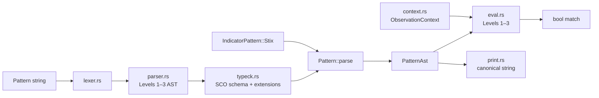
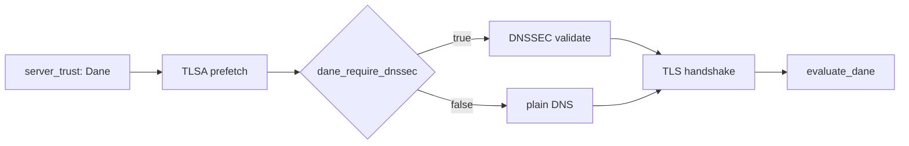

# rstix

[](https://github.com/timescale/rsigma/actions/workflows/ci.yml)

`rstix` is a Rust library crate for **STIX 2.1** in the rsigma workspace. With the default **`serde`** feature it provides a typed object model for all 42 built-in STIX types (3 meta, 19 SDO, 2 SRO, 18 SCO), `StixObject` dispatch, `Bundle` parsing with streaming (`parse_reader`) for ATT&CK-scale corpora, deterministic SCO ID derivation, and advisory semantic checks via **`Bundle::validate()`** (T1 — see [Validation tiers](#validation-tiers)). Without `serde`, `core`, `id`, `vocab`, and programmatic **`model`** types are available, but not bundle parse/serialize or `Bundle::validate()`.

Six optional Cargo features extend the default `serde` bundle model (each implies `serde` unless noted):

- `pattern` — STIX patterning engine: parse, type-check, Level 1–3 evaluation, canonical printer, and `Indicator` wiring via `IndicatorBuilder`.
- `validate` — profile-based Validation Pipeline: all twelve checks, `STIX-E/W/I/H` diagnostics, and raw-JSON entry points (implies `pattern`).
- `graph` — property graph construction and traversal over parsed bundles (SRO edges, inlined `_ref`/`_refs`, indicator-centric expansion).
- `marking` — effective TLP and statement marking resolution (object-level and granular property selectors).
- `store` — in-memory STIX store with typed queries, SCO fingerprint reporting, and bundle import.
- `store-fs` — filesystem-backed durable store (`FsStore`; implies `store`).
- `taxii` — TAXII 2.1 HTTP client: discovery, collections, object CRUD, manifest, status polling, auth providers, pagination, retry, rustls TLS (PEM and PKCS#12 mTLS via `ClientCertificate`; `TaxiiClient`; implies `serde`).
- `taxii-store` — TAXII collection ingest into [`StixStore`](store::StixStore) via [`ingest_collection`](taxii::ingest_collection) (implies `taxii` and `store`).

## Install

```toml
[dependencies]
rstix = "0.19"
# Pattern Engine + Validation Pipeline:
# rstix = { version = "0.19", features = ["pattern", "validate"] }
# Graph, marking, store (combine as needed):
# rstix = { version = "0.19", features = ["graph", "marking", "store"] }
```

This library is part of [rsigma].

## Public API

### Entry points

- `parse_bundle(json: &str)`: parse a STIX 2.1 bundle into a typed [`Bundle`](model::Bundle) (alias for [`Bundle::parse`](model::Bundle::parse)).
- `model::Bundle::parse_reader(R: Read)`: stream-parse large bundles with default [`ParseOptions`](model::ParseOptions).
- `model::Bundle::parse_with_options(json, opts)` / `parse_reader_with_options`: bundle parse with custom types and limits.
- `core::StixId::parse(id: &str)`: parse and validate STIX object IDs in `{type}--{uuid}` form.
- `core::StixId::generate(type_name: &str)`: create a random UUIDv4-based STIX ID for a type prefix.
- `id::generate_sco_id(kind, value)`: generate deterministic SCO IDs using canonicalized contributing properties.
- `id::select_id_contributing_properties(kind, value)`: extract SCO id-contributing fields.
- `id::jcs_canonicalize(value)`: canonicalize JSON for deterministic ID derivation.

### Error types

- `ParseError`: top-level parse error enum (JSON errors, bundle shape, duplicate ids, object limits, unknown types, and wrapped `ModelError`).
- `model::ModelError`: model-level invariant violations at T0 parse (for example non-empty `source_name`, external-reference §2.5.2 detail fields, granular-marking selectors).
- `core::StixIdError`: errors for STIX ID parsing and typed-ID conversion.
- `core::TimestampError`: errors for STIX/TAXII timestamp parsing.
- `core::ConfidenceError`: confidence range and scale-label errors.
- `core::LanguageTagError`: language tag parsing errors.
- `id::DeterministicIdError` / `id::JcsError`: deterministic SCO-ID derivation errors.

### Module surface

- `core` (always): `StixId`, 42 typed ID wrappers, `StixObjectKind`, `StixTimestamp`, `TaxiiTimestamp` (RFC 3339 wire normalization for TAXII-style timestamps), `Confidence`, `SpecVersion`, `LanguageTag`, `QueryableStixObject`, `QueryValue`.
- `model` (always): typed SDO/SRO/SCO/meta structs and `ModelError`. **`serde` feature required** for `Bundle`, `parse_reader`, serialize, and `Bundle::validate()`. Submodules: `common`, `meta`, `sdo` (19 SDOs), `sro`, `sco` (18 SCOs + 12 predefined extensions), `validate`, `validation`. With `serde`: also `StixObject`, `ParseOptions`, `TypeRegistry`, `ValidationReport`, `ValidationCode`.
- `id` (always): deterministic SCO UUIDv5 — `select_id_contributing_properties`, JCS canonicalization, `generate_sco_id`.
- `vocab` (always): closed tables (`encryption-algorithm-enum`, `opinion-enum`, …), reference `HASH_ALGORITHM_ENUM`, and open vocabulary tables (`REGION_OV`, …) used by the Validation Pipeline.
- `pattern` (`pattern` feature): full STIX §9 engine — see [Pattern Engine](#pattern-engine-stix-9).
- `validate` (`validate` feature): `Validator`, twelve pipeline phases, structured diagnostics — see [Validation Pipeline](#validation-pipeline).
- `graph` (`graph` feature): `StixGraph`, `RelationshipExpander`, … — see [Graph](#graph).
- `marking` (`marking` feature): `MarkingResolver`, `TlpV2Level`, … — see [Marking](#marking).
- `store` / `store-fs` (`store` / `store-fs` features): `MemoryStore`, `FsStore`, … — see [Store](#store).
- `taxii` (`taxii` feature): `TaxiiClient`, envelope POST/GET, auth, pagination — see [TAXII Client](#taxii-client).
- `serde_impls` (internal, `serde` feature): hand-written serializers for `StixId`, timestamps, and `Confidence`.

## Feature flags

- `serde` (default): enables serialization and deserialization support.
- `pattern`: STIX patterning lexer, Level 1–3 parser, SCO schema type-checker, and evaluator (`Pattern::parse`, `Pattern::evaluate`). Implies `serde` (evaluation uses typed bundle/SCO model types).
- `validate`: profile-based Validation Pipeline (`Validator`, structured `STIX-E/W/I/H` diagnostics, raw JSON entry). Implies `serde` and `pattern`.
- `graph`: STIX property graph over parsed bundles (`StixGraph::from_bundle`, SRO traversal, inlined refs, `RelationshipExpander`). Implies `serde`.
- `marking`: TLP and statement marking resolution (`MarkingResolver`, `TlpV2Level`, granular selectors). Implies `serde`.
- `store`: in-memory STIX object store (`MemoryStore`, `StixQuery`, `ImportReport`). Implies `serde`.
- `store-fs`: filesystem-backed durable store (`FsStore`). Implies `store`.
- `taxii`: TAXII 2.1 HTTP client (`TaxiiClient`, `TaxiiEnvelope`, Bearer/Basic/API-key auth, cursor + header pagination, retry, rustls TLS with PEM and PKCS#12 mTLS). Implies `serde`.
- `taxii-store`: paginated collection fetch into `MemoryStore` / `FsStore` via `ingest_collection`. Implies `taxii` and `store`.

## Current status

| Area | Status |
| ---- | ------ |
| **Core Foundation** (`core`, `id`, `vocab`) | Typed IDs, timestamps, confidence, vocabulary tables |
| **Data Model + Serialization** (`serde`, default) | Full typed object model, bundle parse/stream, ref validation, advisory `Bundle::validate()` — see [Validation tiers](#validation-tiers) and [Conformance notes](#conformance-notes-stix-21) |
| **Pattern Engine** (`pattern`) | Level 1–3 parse, type-check, evaluation, canonical printer, Indicator wiring |
| **Validation Pipeline** (`validate`) | Twelve phases, four profiles, 39 structured diagnostics, conformance corpus + per-code coverage tests |
| **Graph + Marking + Store** (`graph`, `marking`, `store`, `store-fs`) | Property graph, TLP/granular resolution, in-memory and filesystem store (each feature implies `serde`) |
| **TAXII Client** (`taxii`) | All seven TAXII 2.1 endpoint groups, auth providers, dual pagination, retry, rustls TLS (PEM + PKCS#12 mTLS), full HTTP error mapping |
| **Optional corpus** | MITRE ATT&CK via `RSTIX_ATTCK_BUNDLE`; CI uses synthetic 5 000-object streaming tests |

Phase delivery is **complete** for the above surfaces. **STIX 2.1 wire conformance** is [substantially met](#conformance-notes-stix-21) with documented exceptions in vocabulary tables and selected reference rules.

## Usage

```rust
use rstix::core::{IndicatorId, StixId, StixTimestamp};
use rstix::model::common::SdoSroCommonProps;
use rstix::parse_bundle;

let bundle = parse_bundle(
    r#"{"type":"bundle","id":"bundle--00000000-0000-0000-0000-000000000000","objects":[]}"#,
)
.unwrap();
assert_eq!(bundle.id().type_name(), "bundle");

let id = StixId::generate("indicator");
let typed = IndicatorId::from_stix_id(id).unwrap();
assert_eq!(typed.as_stix_id().type_name(), "indicator");

let ts = StixTimestamp::parse("2016-05-12T08:17:27.000Z").unwrap();
let common = SdoSroCommonProps::new(StixId::generate("campaign"), ts.clone(), ts);
let json = serde_json::to_string(&common).unwrap();
assert!(json.contains("\"spec_version\":\"2.1\""));
```

## Bundle parsing

Requires the **`serde`** feature (default).

### Methods

| Method | Use when |
| ------ | -------- |
| `Bundle::parse(&str)` | Entire JSON is in memory. |
| `Bundle::parse_with_options(&str, &ParseOptions)` | Custom types or stricter limits. |
| `Bundle::parse_reader(R: Read)` | Large files (MITRE ATT&CK ~50 MiB); streaming reader with byte cap. |
| `Bundle::parse_reader_with_options(R, &ParseOptions)` | Streaming + options. |

### Navigation

| Method | Description |
| ------ | ----------- |
| `bundle.objects()` | All objects in document order. |
| `bundle.get(&StixId)` | Untyped lookup by id. |
| `bundle.get_typed::<T>(&StixId)` | Typed lookup (`Malware`, registered custom types, …). |
| `bundle.objects_of_type::<T>()` | Iterator over all objects of type `T`. |
| `bundle.extra_properties(&StixId)` | Top-level `x_*` and hoisted extension keys peeled at parse. |
| `bundle.validate_refs()` | Re-run in-bundle ref existence and ref-kind checks (normally called during parse). |
| `bundle.validate()` | Collect T1 SHOULD-level semantic warnings (see below). |

The originally sketched `get::<T>()` API is implemented as **`get_typed::<T>()`** to avoid clashing with untyped `get`.

### `ParseOptions` defaults

| Field | Default | Purpose |
| ----- | ------- | ------- |
| `max_nesting_depth` | 64 | Reject deeply nested JSON (DoS guard). |
| `max_string_length` | 1_048_576 (1 MiB) | Max length of any JSON string value. |
| `max_bundle_bytes` | 256 MiB | Max bytes read from stream / checked for string parse. |
| `max_object_count` | `usize::MAX` | Max objects in one bundle. |
| `allow_custom` | `false` | Unknown `type` → error unless registered or allowed. |

Register custom STIX types on a `ParseOptions` instance (not global). Implement [`BundleObjectCast`](model::BundleObjectCast) on your type and call `ParseOptions::register_custom_type::<T>("x-my-type")`. See `tests/integration.rs`.

### Semantic validation (`Bundle::validate`)

Default **`serde` parse** enforces T0 MUST rules wired at the deserialize boundary (see [Validation tiers](#validation-tiers) and [Model invariant decisions](#model-invariant-decisions-modelcommon)). **`Bundle::validate()`** collects T1 **SHOULD**-level and advisory findings without rejecting the bundle. Callers requiring structured pass/fail gates use the optional **`validate`** feature (`Validator` profiles). There is no `strict` parse flag on `Bundle::parse`.

```rust
use rstix::model::{Bundle, ValidationCode};

let report = bundle.validate();
assert!(report.is_clean()); // warnings only; never fails the bundle
for w in report.warnings_with_code(ValidationCode::StixW0031TlpV1Encoding) {
    eprintln!("{}: {}", w.object_id.as_deref().unwrap_or("?"), w.message);
}
```

| `ValidationCode` | Meaning |
| ---------------- | ------- |
| `StixW0031TlpV1Encoding` | Legacy TLP 1.x marking encoding or TLP1 marking ref (STIX-W0031). |
| `ScoDeterministicIdMismatch` | SCO `id` does not match UUIDv5 from id-contributing properties. |
| `GranularSelectorSemanticInvalid` | Granular-marking selector does not resolve on the object. |
| `LanguageContentValueMismatch` | Translation type, list length, or nested object shape does not mirror the target (§7.1.1). |
| `LanguageContentObjectModifiedMismatch` | `object_modified` does not match target `modified` (§7.1.1 MUST). |
| `LocationCountryNotIso3166` | `country` is not ISO 3166-1 alpha-2. |
| `LocationRegionNotInOpenVocab` | `region` is not in STIX `region-ov`. |
| `InvalidCapecExternalReference` | CAPEC `external_id` shape (attack-pattern). |
| `InvalidCveExternalReference` | CVE `external_id` shape (vulnerability). |
| `RelationshipEndpointMatrixInvalid` | Relationship source/target types outside STIX 2.1 matrix. |
| `EncryptionAlgorithmInvalid` | Artifact `encryption_algorithm` not in closed vocabulary. |

`ValidationCode::LanguageContentFieldUnknown` exists for pipeline/legacy mapping but is **not emitted** by `Bundle::validate()` (§7.1.1 unknown target fields are ignored without a warning).

## Pattern Engine (STIX §9)

The optional **`pattern`** feature adds the full STIX patterning engine: parse, type-check, evaluate Levels 1–3, canonical printing, and Indicator AST wiring at deserialize time.



| Module | Role | Status |
| ------ | ---- | ------ |
| `pattern/lexer.rs` | Tokenizer; 64 KiB input cap | Done |
| `pattern/parser.rs` | Recursive-descent parser; dict keys, ref-list `[*]`, custom SCO types | Done |
| `pattern/typeck.rs` | Property paths, `extensions.'…'`, `_ref.type`, ISSUBSET on CIDR strings | Done |
| `pattern/eval.rs` | Level 1–3 evaluation, `matches_single`, `matches_single_with_bundle`, `evaluate_observed_data` | Done |
| `pattern/context.rs` | `ObservationContext`, `TimestampedObservation` (`at: Option<_>`), observed-data builder | Done |
| `pattern/path.rs` | Object-path resolution (extensions, ref lists, binary fields), CIDR, `_ref` via bundle | Done |
| `pattern/security.rs` | Regex compile size limit + PCRE DOTALL for `MATCHES` | Done |
| `pattern/print.rs` | Canonical pattern printer (`Pattern::canonical`, `Display`) | Done |

```rust
use rstix::Pattern;
use rstix::model::sdo::Indicator;
use rstix::pattern::{ObservationContext, TimestampedObservation};

let pattern = Pattern::parse("[ipv4-addr:value = '198.51.100.1/32']")?;
assert_eq!(pattern.observed_types().len(), 1);
assert_eq!(pattern.canonical(), "[ipv4-addr:value = '198.51.100.1/32']");

// Level 1: single SCO
let sco = /* ... */;
assert!(pattern.matches_single(&sco)?);

// Levels 2–3: timestamped observations
let ctx = ObservationContext::from_scos(&observations);
assert!(pattern.evaluate(&ctx)?);

// Indicator: STIX patterns carry parsed AST at deserialize time (pattern + serde)
let indicator: Indicator = serde_json::from_str(json)?;
indicator.pattern.parsed_pattern()?.evaluate(&ctx)?;

// Programmatic construction (always available; STIX patterns parse at build when `pattern` is on)
use rstix::model::sdo::IndicatorBuilder;
let indicator = IndicatorBuilder::with_timestamps(created, modified)
    .stix_pattern("[ipv4-addr:value = '198.51.100.3']", None)
    .valid_from(valid_from)
    .build()?;
```

### Scope (Pattern Engine — complete)

| Shipped in the `pattern` feature |
| ---------------------------------- |
| Lexer, Level 1–3 parser, `PatternAst`, type-checker |
| `Pattern::parse`, `Pattern::evaluate`, `matches_single`, `matches_single_with_bundle`, `evaluate_observed_data` |
| Full §9 evaluation: comparisons (including `MATCHES`, hex/binary), temporal qualifiers, `_ref` paths, custom SCO types |
| `ObservationContext`, observed-data context builder (embedded SRO skipped) |
| Canonical printer + §9.8 parse/print round-trip tests |
| `IndicatorPattern::Stix { parsed }` at deserialize; `IndicatorPattern::evaluate` |
| `IndicatorBuilder` — fluent STIX/external pattern construction; setters store config, validation (parse + [`Indicator::validate`]) at `build()` — same materialization boundary as deserialize |
| `fuzz_stix_pattern` fuzz target |
| Spec §9.8 fixture-backed parse + eval tests (`tests/pattern_spec_eval.rs`) |

Authoritative grammar: **STIX Specification §9** (not §8). The `Pattern` struct holds a validated `PatternAst` after parse and type-check.

Evaluation notes (STIX §9):

- **`TimestampedObservation::at`**: `Option<StixTimestamp>`; patterns with `WITHIN`, `FOLLOWEDBY`, `REPEATS`, or `START`/`STOP` return `MissingTimestamp` when any observation lacks a timestamp. Plain observation expressions accept `at: None`.
- **`matches_single_with_bundle`**: pass a bundle when Level 1 patterns dereference `_ref` paths. Absent optional `_ref` properties yield no match for comparisons and `false` for `EXISTS`; present refs that cannot be resolved in the bundle still return `RefResolution`.
- **`LIKE` / `MATCHES` (§9.6.1)**: pattern constants and string property values are NFC-normalized before comparison; `MATCHES` compiles with PCRE DOTALL (`.` matches newlines) and a 1 MiB compile-size cap (`pattern::security`).
- **Custom SCO types** (`x-usb-device`, …): vendor types deserialize as `CustomSco`; parsed and type-checked permissively (leaf properties as string).
- **`process:name`**: resolved from `image_ref` → file name when a bundle is present, otherwise from the executable token in `command_line`.
- **`file:created`**: alias for `ctime`.
- **`network-traffic:dst_ref.type`**: `_ref` dereference then `type` property on the target SCO.
- **`file:hashes.MD5`**: dictionary dot-key syntax per §9.7.3.
- **`extensions.'…'`**: predefined SCO extension paths (e.g. `windows-pebinary-ext.sections[*].entropy`).
- **`ISSUBSET` / `ISSUPERSET` on string**: IP/CIDR subset checks per §9.6.

Fixtures: `tests/fixtures/pattern/` (§9.8 examples) and `tests/fixtures/pattern/sco-fields/` (manifest-driven SCO field paths, 276 cases). Acceptance tests: `pattern::parser::level1`, `level23`, `not`, `pattern::typeck::`, `pattern::security`, `pattern::eval`, `tests/pattern_parse.rs`, `tests/pattern_spec_eval.rs`, `tests/pattern_eval_operators.rs`, `tests/pattern_eval_sco_fields.rs`, `tests/pattern_eval_errors.rs`, `tests/pattern_eval_security.rs`, `tests/pattern_indicator.rs`.

### Pattern Engine design decisions

Recorded engineering choices for the `pattern` feature and Indicator integration. Summaries also appear on the [rstix library page](https://github.com/timescale/rsigma/blob/main/docs/content/library/rstix.md#pattern-engine-design-decisions).

<a id="dd-pe-001--indicatorbuilder-validates-at-build-not-in-setters"></a>

#### DD-PE-001 — `IndicatorBuilder` validates at `build()`, not in setters

| | |
| --- | --- |
| **Status** | Accepted (Pattern Engine PR 3.6) |
| **Applies to** | `model::sdo::IndicatorBuilder`, `IndicatorBuilderError` |
| **Feature** | `pattern` optional for STIX parse; builder API always available |

**Context.** Indicators carry a detection pattern (`pattern` / `pattern_type` / `pattern_version` on the wire). STIX patterns (`pattern_type = stix`) must parse and type-check when the Pattern Engine is enabled. Callers can construct indicators from JSON (deserialize) or programmatically (`IndicatorBuilder`).

**Decision.** `IndicatorBuilder` setters (`stix_pattern`, `name`, `valid_from`, …) only store configuration and return `Self`. All validation runs in `build()`:

1. Required fields present (`common`, `pattern`, `valid_from`).
2. STIX pattern parse and type-check (`Pattern::parse`) when the `pattern` feature is enabled.
3. `Indicator::validate()` (time window, kill-chain phases, SDO common props).

`stix_pattern()` stores the raw string; it does **not** parse or return `Result`.

**Rationale.**

- **Same materialization boundary as deserialize.** JSON deserialization parses STIX patterns in `indicator_pattern_from_wire` when the full `Indicator` is constructed, not when individual fields are read. `build()` is the programmatic equivalent of that boundary.
- **Single validation choke point.** One `IndicatorBuilderError` surface for missing fields, pattern errors, and model invariants — consistent with fluent builders elsewhere (`http::Request::builder`, client builders).
- **Fluent chain.** Setters return `Self`, so callers use one `?` at the end of the chain instead of after every setter.

**Alternatives considered.**

| Alternative | Why not chosen |
| ----------- | -------------- |
| Parse in `stix_pattern() -> Result<Self, _>` | Fail-fast at the call site, but breaks the infallible setter chain (`?` after every step). |
| Error accumulation (parse in `stix_pattern`, store `Err`, return at `build()`) | Same user-visible outcome as `build()`-time parse with more internal state; no clear benefit for rstix. |
| Type-state builder (`MissingPattern` → `HasPattern` → `Ready`) | Strongest compile-time guarantees; rejected as disproportionate for the Pattern Engine slice. |

**Consequences.**

- Invalid STIX patterns surface as `IndicatorBuilderError::Pattern` from `build()`, not from `stix_pattern()`.
- With `pattern` disabled, `build()` stores `IndicatorPattern::Stix { raw, pattern_version }` without an AST (same as serde-only deserialize).
- Pre-parsed patterns can be supplied via `.pattern(IndicatorPattern::stix(...)?)` or `.pattern(...)` after calling `Pattern::parse` / `IndicatorPattern::stix` directly.

User-facing docs: [rstix library page](https://github.com/timescale/rsigma/blob/main/docs/content/library/rstix.md#pattern-engine-stix-9).

## Graph

The optional **`graph`** feature builds a property graph from a parsed [`Bundle`](model::Bundle):

- **SRO edges** — each `relationship` object indexes an outgoing edge from `source_ref` to `target_ref`; each `sighting` indexes an edge from the sighting id to `sighting_of_ref` (type `"sighting"`). Full SRO payloads are available via [`SroEdgePayload`](graph::SroEdgePayload) on [`Edge`](graph::Edge).
- **Inlined refs** — every typed `_ref` / `_refs` property (including SCO extensions such as `archive-ext.contains_refs` and `body_multipart[].body_raw_ref`) is indexed with a property path for [`StixGraph::unresolved_references`](graph::StixGraph::unresolved_references).
- **Traversal** — [`StixGraph::from`](graph::StixGraph::from) returns a [`TraversalBuilder`](graph::TraversalBuilder); chain `out_edges_matching` / `in_edges_matching` → [`EdgeTraversal`](graph::EdgeTraversal) → `targets` / `targets_as::<T>()`, plus `out_refs` / `in_refs`.
- **Expansion** — [`RelationshipExpander::expand_from`](graph::RelationshipExpander::expand_from) (any start node) and [`expand_from_indicator`](graph::RelationshipExpander::expand_from_indicator) walk matrix-valid relationship types up to a configurable depth (outgoing and incoming SRO edges).

```rust
use rstix::graph::{EdgePredicate, StixGraph};
use rstix::model::sdo::Malware;
use rstix::parse_bundle;

let bundle = parse_bundle(json)?;
let graph = StixGraph::from_bundle(&bundle)?;

let malware: Vec<&Malware> = graph
    .from(indicator_id)
    .out_edges_matching(EdgePredicate::Type("indicates"))
    .targets_as::<Malware>()
    .collect();

for (path, target_id) in graph.from(indicator_id).out_refs() {
    println!("ref {path} -> {target_id}");
}
```

Integration tests: `tests/graph.rs`; unit modules `graph::from_bundle`, `graph::traversal_tests`, `graph::predicates`, `graph::unresolved`, `graph::expander_tests`. Path-aware ref inventory lives in `model/ref_paths.rs` (shared with bundle ref validation).

## Marking

The optional **`marking`** feature resolves effective TLP and statement markings at query time:

- **`TlpV2Level`** — all five predefined TLP 2.0 UUIDs; `TLP:AMBER` vs `TLP:AMBER+STRICT` preserved with distinct `permits_disclosure` behavior.
- **`MarkingResolver`** — indexes `marking-definition` objects from a bundle; `effective_for_object` (most restrictive wins), `effective_for_property` / `effective_for_selector` (granular selectors with JSON path resolution), `permits_disclosure(audience)`, and `EffectiveMarking::language_tags` for granular language markings.
- **Granular selectors** — reuses syntax validation from `model/validate.rs` (`name`, `labels.[0]`, …); `selector_matches_target` resolves selectors against wire JSON.

```rust
use rstix::marking::{MarkingResolver, TlpV2Level};
use rstix::parse_bundle;

let bundle = parse_bundle(json)?;
let resolver = MarkingResolver::new(&bundle);
let effective = resolver.effective_for_object(&indicator_object);
assert_eq!(effective.tlp_level, Some(TlpV2Level::Red));
```

Acceptance tests: `marking::tlp2`, `marking::tlp2::amber_strict`, `marking::resolver::object`, `marking::resolver::property`, `marking::resolver::disclosure`, `tests/marking.rs`.

## Store

The optional **`store`** feature provides an object-safe [`StixStore`](store::StixStore) trait and [`MemoryStore`](store::MemoryStore):

- **Versioned SDO/SRO storage** — `upsert` appends new versions when content changes; identical re-upserts deduplicate.
- **SCO asserted-id preservation** — store key is always the source `id`; UUIDv5 fingerprint is computed for dedup **reporting** only (`FingerprintConflict` in [`ImportReport`](store::ImportReport)).
- **Typed queries** — [`StixQuery`](store::StixQuery) builder with type-indexed scans, id filter, `modified_after`, labels, **`text_search`**, pagination (`QueryCursor` / `next_cursor`), and `StoreError::InvalidQuery` for out-of-range cursors.
- **SCO updates** — changed SCO content under the same asserted id updates the stored payload (`ImportReport::objects_updated`).
- **Export / delete** — [`StixStore::export_bundle`](store::StixStore::export_bundle) and [`StixStore::delete`](store::StixStore::delete) on all store backends.
- **`FsStore`** (`store-fs` feature) — durable JSON-on-disk store with hot in-memory index; reopens persistently across process restarts.

```rust
use rstix::store::{FsStore, MemoryStore, StixQuery, StixStore};
use rstix::core::{SdoKind, StixObjectKind};
use rstix::parse_bundle;

let store = MemoryStore::new();
let report = store.import_bundle(&bundle)?;
let indicators = store.query(
    &StixQuery::new().type_filter(vec![StixObjectKind::Sdo(SdoKind::Indicator)])
)?;
let durable = FsStore::open("/var/lib/rstix/store")?;
```

Acceptance tests: `store::memory::dedup`, `store::memory::fingerprint`, `store::memory::pagination`, `store::memory::sco_update`, `store::import_report`, `tests/store.rs`, `tests/store_fs.rs` (`store-fs`).

### Graph + Marking + Store invariant decisions

| Area | Enforced behavior | Notes |
| ---- | ----------------- | ----- |
| Graph SRO edges | `relationship` and `sighting` indexed; sighting type is `"sighting"`. | Full payload via `SroEdgePayload` / `Edge::relationship()` / `Edge::sighting()`. |
| Graph ref traversal | `out_refs` / `in_refs` return owned `(path, id)` pairs (including dangling targets). | Zero-copy not possible for owned inlined target ids outside the bundle. |
| Marking resolution | Most restrictive TLP wins; granular selectors use JSON path matching; custom objects read wire common props. | `MarkingResolver` is query-time; validation pipeline emits separate TLP encoding warnings. |
| Marking disclosure | `permits_disclosure(audience)` uses `created_by_ref` vs audience for SameOrganization vs ThirdParty. | Amber+Strict blocks third parties per TLP 2.0 rules. |
| Store object-safety | `StixStore::get` returns owned clones; `MemoryStore::get_sco` returns owned `StoredSco`. | Required for `dyn StixStore` vtable safety. |
| Store SCO keys | Asserted source id is always the store key; UUIDv5 fingerprint is reporting-only. | Never silently rewrite SCO ids. |
| Store import refs | `ImportReport::unresolved_references` lists targets missing from **both** the imported bundle and the store. | Supports incremental TAXII ingest (`taxii-store`). |
| Store search | Full-text index updated on upsert; `StixQuery::text_search` is case-insensitive substring match. | Typed filters compose with text search. |
| FsStore durability | One JSON file per object id under `objects/`; atomic write via temp file + rename. | `store-fs` feature implies `store`. |

## TAXII Client

The optional **`taxii`** feature provides an OASIS TAXII 2.1 HTTP client for all normative endpoint groups **except Channels (spec §6, RESERVED — not implemented)**. Wire payloads use [`TaxiiEnvelope`](taxii::TaxiiEnvelope) — **not** [`Bundle`](model::Bundle). Never POST a STIX Bundle to `add_objects`.

### Public API surface (`rstix::taxii`)

#### Client

| Type | Role |
| ---- | ---- |
| [`TaxiiClient`](taxii::TaxiiClient) | Async HTTP client for all TAXII 2.1 endpoints. |
| [`TaxiiClientConfig`](taxii::TaxiiClientConfig) | Builder-style configuration (see builder methods below). |

**`TaxiiClient` methods**

| Method | HTTP / behavior |
| ------ | ---------------- |
| `new(config)` | Build client with rustls (TLS 1.2 **and** 1.3). |
| `discover()` | `GET /taxii2/` |
| `discover_via_srv(domain, config)` | DNS SRV `_taxii2._tcp.{domain}` then discovery |
| `api_root(url)` | `GET {api_root}/` |
| `collections(url)` / `collection(url, id)` | List / get collection |
| `objects` / `objects_stream` | Paginated GET objects |
| `get_object` / `object_stream` | GET object-by-id (section 5.6) |
| `add_objects` | POST envelope → 202 + status (auto-polls by default) |
| `delete_object` | DELETE with version filter |
| `manifest` / `manifest_stream` | Manifest resource |
| `object_versions` / `object_versions_stream` | Version list |
| `get_status` / `poll_status` | Status resource polling |

**`TaxiiClientConfig` builder methods**

| Method | Default | Purpose |
| ------ | ------- | ------- |
| `new(base_url)` | — | Server base URL (HTTPS required unless opted out). |
| `base_url(s)` | — | Override base URL. |
| `auth(provider)` | none | [`BearerAuth`](taxii::BearerAuth), [`BasicAuth`](taxii::BasicAuth), [`ApiKeyHeader`](taxii::ApiKeyHeader). |
| `timeout(d)` | 30s | HTTP timeout. |
| `user_agent(s)` | `rstix/{version}` | User-Agent header. |
| `retry_policy(p)` | exponential | [`RetryPolicy`](taxii::RetryPolicy). |
| `preflight(p)` | `Enabled` | [`PreflightPolicy`](taxii::PreflightPolicy) — client-side `can_read`/`can_write` guards. |
| `post_submit(p)` | `PollUntilComplete` | [`PostSubmitPolicy`](taxii::PostSubmitPolicy) — poll status after POST 202. |
| `capability(p)` | `Enforce` | [`CapabilityPolicy`](taxii::CapabilityPolicy) — verify API Root `versions` + collection `media_types`. |
| `server_trust(p)` | `SystemRoots` | [`ServerTrustPolicy`](taxii::ServerTrustPolicy) — PKIX, SPKI pin, or DANE. |
| `tlsa_cache(c)` | empty | [`TlsaCache`](taxii::TlsaCache) — shared TLSA store for DANE. |
| `dns_nameserver(addr)` | system resolver | Override DNS for SRV/TLSA lookups (local CoreDNS). |
| `dane_require_dnssec(b)` | `true` | When `server_trust` is `Dane`: DNSSEC-validate TLSA prefetch and SRV; set `false` for unsigned lab DNS only. |
| `client_certificate(c)` | none | [`ClientCertificate`](taxii::ClientCertificate) — mTLS (PEM or PKCS#12, rustls). |
| `allow_insecure_http(b)` | `false` | Allow `http://` (tests/interop only). |
| `max_response_bytes(n)` | 512 MiB | Reject oversized bodies (`Content-Length` or streaming cap) → [`TaxiiError::ResponseTooLarge`](taxii::TaxiiError::ResponseTooLarge). |
| `parse_options(o)` | default | STIX parse options for envelope objects. |
| `status_poll_interval(d)` | 1s | Delay between status polls. |
| `status_max_polls(n)` | 120 | Max polls before [`TaxiiError::StatusPollTimeout`](taxii::TaxiiError::StatusPollTimeout). |

#### TLS and server trust (section 8.5)

| Type / function | Purpose |
| --------------- | ------- |
| [`ServerTrustPolicy`](taxii::ServerTrustPolicy) | `SystemRoots` (default), `PinnedSpki`, `PinnedSpkiOnly`, `Dane`. |
| [`SpkiPin`](taxii::SpkiPin) | SHA-256 SPKI pin (`from_hex`). |
| [`TlsaCache`](taxii::TlsaCache) | Thread-safe TLSA record cache for DANE verification. |
| [`TlsaRecord`](taxii::TlsaRecord) | Parsed TLSA association data (RFC 6698). |
| [`build_rustls_config`](taxii::build_rustls_config) | Build rustls `ClientConfig` (TLS 1.2+1.3 only; optional `ClientCertificate` for mTLS on the rustls path). |
| [`resolve_tlsa(host, port)`](taxii::resolve_tlsa) | DNS TLSA lookup via system resolver (`_{port}._tcp.{host}`). |
| [`resolve_tlsa_with(host, port, nameserver)`](taxii::resolve_tlsa_with) | TLSA lookup via optional custom nameserver. |
| [`resolve_tlsa_with_options(...)`](taxii::resolve_tlsa_with_options) | TLSA lookup with [`DnsLookupOptions`](taxii::DnsLookupOptions). |
| [`DnsLookupOptions`](taxii::DnsLookupOptions) | `validate_dnssec` for `*_with_options` helpers (default `false`; TAXII client sets from `dane_require_dnssec` when `Dane`). |

[`ServerTrustPolicy::Dane`](taxii::ServerTrustPolicy::Dane) prefetches TLSA into [`TlsaCache`](taxii::TlsaCache) before HTTPS, then matches the server certificate at handshake (RFC 7671, fail-closed, usages 0–3). With default [`dane_require_dnssec(true)`](taxii::TaxiiClientConfig::dane_require_dnssec), those TLSA lookups and SRV records in [`discover_via_srv`](taxii::TaxiiClient::discover_via_srv) are DNSSEC-validated (TAXII §8.5.2 SHOULD). Set `dane_require_dnssec(false)` only for unsigned lab DNS. [`dns_nameserver`](taxii::TaxiiClientConfig::dns_nameserver) overrides the resolver target; it does not disable DNSSEC.



TLS version policy: `build_rustls_config` passes `[&TLS12, &TLS13]` to rustls. Negotiation prefers the highest mutually supported version (typically TLS 1.3). TLS 1.0/1.1 are not enabled.

#### Discovery and DNS

| Type / function | Purpose |
| --------------- | ------- |
| [`TaxiiDiscovery`](taxii::TaxiiDiscovery) | Discovery resource; `resolved_api_roots`, **`default_api_root()`**. |
| [`resolve_taxii_srv(domain)`](taxii::resolve_taxii_srv) | SRV lookup (system resolver) with RFC 2782 weighted random; skips `"."` targets. |
| [`resolve_taxii_srv_with(domain, nameserver)`](taxii::resolve_taxii_srv_with) | SRV lookup via optional custom nameserver (e.g. local CoreDNS). |
| [`resolve_taxii_srv_with_options(...)`](taxii::resolve_taxii_srv_with_options) | SRV lookup with [`DnsLookupOptions`](taxii::DnsLookupOptions). |
| [`TAXII2_SRV_SERVICE`](taxii::TAXII2_SRV_SERVICE) | Constant `"_taxii2._tcp"`. |
| [`HttpsPolicy`](taxii::HttpsPolicy) | HTTPS enforcement for URL resolution. |

#### Filters, pagination, wire types

| Type | Purpose |
| ---- | ------- |
| [`TaxiiFilter`](taxii::TaxiiFilter) / [`ObjectByIdFilter`](taxii::ObjectByIdFilter) / [`VersionsQueryFilter`](taxii::VersionsQueryFilter) / [`DeleteObjectFilter`](taxii::DeleteObjectFilter) | Query encoding (`match[type]`, `added_after`, `next`, …). |
| [`VersionFilter`](taxii::VersionFilter) / [`VersionSelector`](taxii::VersionSelector) / [`ObjectVersion`](taxii::ObjectVersion) | Version match encoding. |
| [`TaxiiEnvelope`](taxii::TaxiiEnvelope) | Wire envelope (not `Bundle`). |
| [`TaxiiPaged<T>`](taxii::TaxiiPaged) / [`TaxiiPageHeaders`](taxii::TaxiiPageHeaders) | Page body + `X-TAXII-Date-Added-*` headers. |
| [`TaxiiStatus`](taxii::TaxiiStatus) / [`StatusDetail`](taxii::StatusDetail) / [`StatusState`](taxii::StatusState) | POST 202 / status polling. |
| [`ManifestRecord`](taxii::ManifestRecord) / [`ManifestResponse`](taxii::ManifestResponse) | Manifest entries. |
| [`TaxiiApiRoot`](taxii::TaxiiApiRoot) / [`TaxiiCollection`](taxii::TaxiiCollection) / [`VersionsResponse`](taxii::VersionsResponse) | Server metadata resources. |

#### Auth and HTTP errors

| Type | Purpose |
| ---- | ------- |
| [`TaxiiAuthProvider`](taxii::TaxiiAuthProvider) | Trait implemented by auth helpers. |
| [`BearerAuth`](taxii::BearerAuth) / [`BasicAuth`](taxii::BasicAuth) / [`ApiKeyHeader`](taxii::ApiKeyHeader) | Credential injection (`secrecy::SecretString`). |
| [`AuthChallenge`](taxii::AuthChallenge) / [`parse_www_authenticate`](taxii::parse_www_authenticate) | Parsed `WWW-Authenticate` on HTTP 401. |
| [`TaxiiError`](taxii::TaxiiError) | Full HTTP + client error mapping (see table below). |
| [`RetryPolicy`](taxii::RetryPolicy) | Retry/backoff for 5xx/429/network. |
| [`PreflightPolicy`](taxii::PreflightPolicy) / [`PostSubmitPolicy`](taxii::PostSubmitPolicy) / [`CapabilityPolicy`](taxii::CapabilityPolicy) | Client-side policy enums. |

**Selected [`TaxiiError`](taxii::TaxiiError) variants**

| Variant | When |
| ------- | ---- |
| `ReadNotPermitted` / `WriteNotPermitted` / `DeleteNotPermitted` | Preflight guards (`PreflightPolicy::Enabled`). |
| `MissingContentType` / `InvalidContentType` | Success response media type checks. |
| `ResponseTooLarge` | Body exceeds `max_response_bytes`. |
| `MissingPaginationHeaders` | `more=true` without `next` or `X-TAXII-Date-Added-Last`. |
| `StatusPollTimeout` | Status polling exceeded `status_max_polls`. |
| `UnsupportedApiRoot` / `UnsupportedCollectionMedia` | Capability checks failed. |
| `InvalidServerTrust` | Pinning/DANE/TLS config error; DANE TLSA missing/mismatch; DNSSEC-validated DNS failure when `dane_require_dnssec(true)`. |
| `Unauthorized { challenges, .. }` | HTTP 401 with parsed auth challenges. |
| `RequestedRangeNotSatisfiable` | HTTP 416 (streams recover automatically). |

### Testing

```bash
cargo test -p rstix --features taxii --test taxii_client
cargo test -p rstix --features taxii-store --test taxii_store
```

Optional live TLS / DNS / mTLS harness ([`tests/taxii-live/README.md`](tests/taxii-live/README.md)):

```bash
./crates/rstix/tests/taxii-live/run-live-tests.sh
cargo test -p rstix --features taxii --test taxii_live -- --ignored --nocapture
```

```rust
use futures::StreamExt;
use rstix::taxii::{
    BearerAuth, CapabilityPolicy, PostSubmitPolicy, ServerTrustPolicy, SpkiPin,
    TaxiiClient, TaxiiClientConfig, TaxiiEnvelope, TaxiiFilter,
};

let client = TaxiiClient::new(
    TaxiiClientConfig::new("https://taxii.example.com")
        .auth(BearerAuth::new(token))
        .server_trust(ServerTrustPolicy::PinnedSpki(vec![
            SpkiPin::from_hex("00112233445566778899aabbccddeeff00112233445566778899aabbccddeeff")?,
        ]))
        .post_submit(PostSubmitPolicy::PollUntilComplete)
        .capability(CapabilityPolicy::Enforce),
)?;

let discovery = client.discover().await?;
let filter = TaxiiFilter::new().object_type("indicator");
let mut stream = client.objects_stream("https://taxii.example.com/api1/", "col1", filter);
while let Some(obj) = stream.next().await {
    let _obj = obj?;
}

let status = client
    .add_objects("https://taxii.example.com/api1/", "col1", &TaxiiEnvelope::new(vec![indicator]))
    .await?; // HTTP 202 → TaxiiStatus
```

#### Collection ingest (`taxii-store`)

[`ingest_collection`](taxii::ingest_collection) paginates [`TaxiiClient::objects_stream`](taxii::TaxiiClient::objects_stream), wraps the objects in a synthetic [`Bundle`](model::Bundle), and calls [`StixStore::import_bundle`](store::StixStore::import_bundle). Requires **`taxii-store`** (`taxii` + `store`). Works with [`MemoryStore`](store::MemoryStore) or [`FsStore`](store::FsStore).

```rust
use rstix::store::{MemoryStore, StixStore};
use rstix::taxii::{ingest_collection, TaxiiClient, TaxiiClientConfig, TaxiiFilter};

let client = TaxiiClient::new(TaxiiClientConfig::new("https://taxii.example.com"))?;
let store = MemoryStore::new();
let report = ingest_collection(&client, &store, api_root_url, "col1", TaxiiFilter::new()).await?;
```

Notes:

- Collects **all pages in memory** before import (no page-by-page store streaming yet).
- Reference checks use the **fetched set plus objects already in the store** (incremental sync).
- Re-ingest is **idempotent** (`ImportReport::objects_deduplicated`).

**Offline test:** `cargo test -p rstix --features taxii-store --test taxii_store`

Request invariants (all calls): `Accept: application/taxii+json;version=2.1`, `User-Agent: rstix/{VERSION}` (override via config), trailing slash on endpoint URLs, discovery at fixed `{base}/taxii2/`.

### TAXII Client invariant decisions

| Area | Enforced behavior | Notes |
| ---- | ----------------- | ----- |
| Envelope vs Bundle | POST/GET object pages deserialize `TaxiiEnvelope` | Bundle rejected at API boundary |
| Response media type | Success responses must include TAXII JSON `Content-Type` | `MissingContentType` / `InvalidContentType` |
| TLS | rustls with **TLS 1.2 and TLS 1.3** (no 1.0/1.1); optional SPKI pinning and DANE | `ServerTrustPolicy`, `build_rustls_config`, `SpkiPin`, `TlsaCache`, `resolve_tlsa` |
| DANE (`ServerTrustPolicy::Dane`) | Fail-closed TLSA association (RFC 7671 usages 0–3); default `dane_require_dnssec(true)` DNSSEC-validates TLSA prefetch and SRV | `evaluate_dane`, `dane_require_dnssec`, TLSA prefetch in `TaxiiHttp` |
| SPKI pin-only | `PinnedSpkiOnly` accepts matching pin without hostname or expiry checks (spec section 8.5.2 pinning) | Documented on `ServerTrustPolicy::PinnedSpkiOnly` |
| Response size cap | Rejects when `Content-Length` exceeds `max_response_bytes` before read; streaming bodies capped chunk-by-chunk | `read_response_body` |
| Capability checks | With `Enforce`: collection `media_types` must include TAXII 2.1 and/or STIX 2.1 object types; API Root `versions` must include TAXII 2.1; `max_content_length` must be integer **> 0** | `CapabilityPolicy::Disabled` skips checks (interop only); wire JSON is never coerced |
| POST status | Poll until complete by default (`PostSubmitPolicy`) | `ReturnInitial` for one-shot 202 |
| Pagination continuation | `more=true` requires `next` or `X-TAXII-Date-Added-Last` | `MissingPaginationHeaders` |
| HTTP 416 recovery | Streams reset cursor and restore baseline `added_after` | Pagination streams |
| Clock skew | `Date` header adjusts `added_after` encoding | Per-response skew cache |
| HTTP 401 | `WWW-Authenticate` challenges parsed on `Unauthorized` | `AuthChallenge` |
| SRV selection | RFC 2782 weighted random; `"."` targets skipped | `resolve_taxii_srv` |
| Discovery default | `TaxiiDiscovery::default_api_root()` helper | Optional `default` field |
| Status detail version | Optional on wire (spec example omits it) | `StatusDetail.version: Option<String>` |
| `added_after` precision | Six fractional digits via `TaxiiTimestamp` | Filter encode + header fallback consume |
| Pagination cursor | `next` is opaque; never constructed client-side | Header fallback when `next` absent |
| Auth secrets | `SecretString`; redacted `Debug` | Credentials never in `TaxiiError` messages |
| Pagination headers | `TaxiiPaged<T>` exposes `X-TAXII-Date-Added-First` / `Last` | One-shot GETs and streams |
| HTTPS | Required by default; `allow_insecure_http(true)` for tests | Spec section 3.3 |
| DELETE preflight | Requires both `can_read` and `can_write` | Spec section 5.7 |
| Manifest Accept | TAXII + STIX media types | Spec section 5.3 |
| DNS SRV discovery | `resolve_taxii_srv` + `TaxiiClient::discover_via_srv` | `_taxii2._tcp` records |
| Collection ingest | `ingest_collection` streams objects → synthetic `Bundle` → `StixStore::import_bundle` | `taxii-store` feature |
| mTLS | PEM or PKCS#12 via [`ClientCertificate`](taxii::ClientCertificate), embedded in `build_rustls_config` | Pure-Rust PKCS#12 parse (`p12-keystore`); no OpenSSL TLS backend |
| Channels | **Not implemented** | Spec §6 RESERVED |
| Filter validation | `limit > 0`; `all` version rules enforced | Invalid filters rejected before HTTP |

## Validation Pipeline

The optional **`validate`** feature adds a profile-based validator distinct from advisory [`Bundle::validate()`](model::Bundle::validate) (see **DD-VP-001** below).

```rust
use rstix::validate::{Validator, ValidationPhase, DiagnosticCode};

let report = Validator::consumer_strict().validate_json_str(untrusted_json);
if !report.is_valid() {
    for diag in report.errors() {
        eprintln!("{}: {}", diag.code, diag.message);
    }
}

let custom = Validator::builder()
    .with_phase(ValidationPhase::Schema)
    .with_phase(ValidationPhase::References)
    .build();
```

| Profile | Phases | Use case |
| ------- | ------ | -------- |
| `consumer_permissive` | JSON well-formedness, type discrimination, schema, references (4 of 12) | Mixed-trust ingest |
| `consumer_strict` | all 12 | Untrusted external input |
| `producer_strict` | all except references (11 of 12) | Publishing/export |
| `interop_strict` | all 12, zero leniency | OASIS interop tests |

### Validation Pipeline design decisions

Recorded engineering choices for the `validate` feature. Summaries also appear on the [rstix library page](https://github.com/timescale/rsigma/blob/main/docs/content/library/rstix.md#validation-pipeline).

<a id="dd-vp-001--bundlevalidate-vs-validatevalidator"></a>

#### DD-VP-001 — `Bundle::validate()` vs `validate::Validator`

| | |
| --- | --- |
| **Status** | Accepted |
| **Applies to** | `validate` feature, `model::Bundle::validate` |
| **`Bundle::validate()`** | Warning-only SHOULD findings; `model::ValidationReport` + `ValidationCode` enum |
| **`validate::Validator`** | Profile-driven pipeline; Error/Warning/Info/Hint; OASIS-style string codes |

**Decision.** Use `Validator` for untrusted JSON and named profiles. With the `validate` feature enabled, `Bundle::validate()` routes through `validate::legacy::bundle_validate` so T1 advisory codes stay aligned with pipeline semantic checks. Without `validate`, the same advisory checks run via the built-in `validate_advisory` path in `model/validation.rs`. Prefer [`PipelineValidationReport`](crate::PipelineValidationReport) at the crate root when both report types are in scope.

**Current status.** All twelve checks are implemented and active. The in-repo conformance corpus (`tests/fixtures/conformance/`) and `validate_diagnostic_coverage` integration test assert one pipeline case per `DiagnosticCode::ALL` entry (39 codes).

### Data Model + Serialization design decisions

Recorded engineering choices for wire parsing and SCO value validation. Summaries also appear on the [rstix library page](https://github.com/timescale/rsigma/blob/main/docs/content/library/rstix.md#data-model--serialization-design-decisions).

<a id="dd-dm-001--wire-must-at-parse"></a>

#### DD-DM-001 — Wire MUST at parse (`domain-name`, `email-addr`, `url`)

| | |
| --- | --- |
| **Status** | Accepted (#327) |
| **Applies to** | `serde` feature (default), `domain-name`, `email-addr`, `url` SCO types |
| **Spec** | STIX 2.1 §6.4, §6.5, §6.15 |

**Context.** STIX **MUST** rules require well-formed `domain-name.value` (RFC 1034 / RFC 5890), `email-addr.value` (RFC 5322 addr-spec), and `url.value` (RFC 3986). PR #315 gated strict IDNA / RFC 5322 / URL checks behind the optional `validate` feature (`STIX-I0002` findings). [Issue #267](https://github.com/timescale/rsigma/issues/267) directs a general split: MUST at parse, SHOULD via explicit `Bundle::validate()`.

**Decision.** For these three SCO fields only, rstix **rejects malformed values at the default `serde` parse boundary** (hard `ParseError` / `ModelError`), not only when the Validation Pipeline runs. Optional deps `idna`, `email_address`, and `url` are enabled by the `serde` feature; `Bundle::validate()` and the pipeline schema phase re-run the same checks on typed objects.

**Rationale.** The spec marks these as MUST on the wire; accepting invalid values at parse and failing later breaks the “invalid JSON never becomes a typed object” contract for the most common SCO format mistakes.

**Consequences.** `--no-default-features` builds omit format-validator deps and skip strict checks until `serde` is enabled. URL validation restricts schemes to `http`, `https`, and `ftp` (subset of RFC 3986).

### Wire-format validation (DD-DM-001)

STIX **MUST** rules for `domain-name.value` (RFC 1034 / RFC 5890), `email-addr.value` (RFC 5322 addr-spec), and `url.value` (RFC 3986) are enforced at the **default `serde` parse boundary** per **DD-DM-001** above, via optional deps (`idna`, `email_address`, `url`, `base64`, `encoding_rs`) pulled in by the `serde` feature. A `--no-default-features` build omits those deps and wire parse; `core`, `id`, `vocab`, and programmatic `model` types remain.

| Field | Spec reference | Parse boundary (`serde`) |
| ----- | -------------- | ------------------------ |
| `domain-name.value` | RFC 1034 / 5890 | IDNA (UTS #46) + label rules |
| `email-addr.value` | RFC 5322 | RFC 5322 addr-spec (`email_address`) |
| `url.value` | RFC 3986 | URL parse (`http`, `https`, `ftp` schemes) |

The Validation Pipeline re-runs the same checks on typed objects during the schema phase.

SCO `*_enc` properties (§3.1 / §3.9.1) MUST be IANA character-set names and MUST NOT appear without their base property. Spec-defined properties are **`file.name_enc`** and **`directory.path_enc`** only; additional `_enc` keys that land in [`ScoCommonProps::extra`](model::common::ScoCommonProps) (for example vendor extensions or pattern fixtures) follow the same pairing and charset rules via `validate_extra_enc_pairings()`.

`email-message` RFC 2047 encoded-words in header string fields (`subject`, `message_id`, `body`, `received_lines`, `additional_header_fields`) are decoded on ingest (§6.6). Pattern evaluation can still address vendor `_enc` siblings through `common.extra` (for example `[email-message:subject_enc = 'UTF-8']` when the wire object carries `subject_enc` alongside `subject`).

Negative fixtures: `tests/fixtures/spec/sco/file-name-enc-*.json`, `directory-path-enc-*.json`, `file-extra-enc-without-base.json`; observed-data SRO embedding: `tests/fixtures/spec/sdo/observed-data-deprecated-objects-sro.json`; standalone `common.extra`: `tests/fixtures/spec/sdo/identity-standalone-extra.json`.

<a id="local-mitre-attck-corpus-test"></a>

### Local MITRE ATT&CK corpus test

The full ATT&CK STIX bundle (~50 MiB) locally tested. CI uses synthetic 5 000-object streaming tests. For local verification, download a bundle (for example MITRE ATT&CK 19.1) and point the integration test at it:

```bash
# Point at a local ATT&CK bundle file (download separately; not in the repo)
RSTIX_ATTCK_BUNDLE=/path/to/enterprise-attack-19.1.json \
  cargo test -p rstix --features serde attck_corpus_roundtrip_when_present -- --nocapture
```

This runs `parse_reader` → serialize → reparse and asserts object count stability. Verified locally against `enterprise-attack-19.1.json` (~53 MiB).

## Development Notes

- `rstix` follows rsigma workspace standards for MSRV, edition, lint policy, and CI checks.
- Release notes belong to the repository root `CHANGELOG.md` only.
- Public API and behavior updates must be synchronized with workspace docs under `docs/`.

### Serialization map conventions

Follow sibling types in `model/` when choosing a map type (PR #213 / #201 review lessons):

| Use | Map type | Examples |
| --- | -------- | -------- |
| Wire JSON object properties where **stable key order** matters for strict round-trip, JCS canonicalization, or deterministic re-serialize | **`BTreeMap`** | `ExtensionMap`, `ExternalReference.hashes`, `LanguageContent.contents`, `SdoSroCommonProps::extra`, `ScoCommonProps::extra`, SCO `hashes`, `Bundle.extra_properties()` **values** |
| Internal **indexes** keyed by STIX id or opaque string where iteration order is irrelevant | **`HashMap`** | `Bundle.id_index`, `Bundle.extra_properties` **keys** (object id → peeled props), `StixGraph` adjacency, `MemoryStore` buckets, `MarkingResolver` marking index |

Do not introduce `HashMap` for a new wire-facing property bag that participates in `roundtrip_strict` or bundle serialize merge — use `BTreeMap` to match `ExtensionMap` and avoid silent key-order drift.

### Testing layout

Two layers, consistent across the Data Model + Serialization phase:

| Layer | Location | Purpose |
| ----- | -------- | ------- |
| **Wire / JSON** | `tests/spec.rs` + `tests/fixtures/spec/` | Deserialize → serialize → reparse; negative fixtures; `roundtrip_strict` for complete types, subset `roundtrip` for common-property-only structs. Coverage includes observed-data embedded SRO, standalone `common.extra`, and extra `_enc` rejection. |
| **Bundle integration** | `tests/bundle.rs` | Bundle container, ref validation, `x_*` and toplevel-property-extension round-trip via `extra_properties`. |
| **Semantic validation** | `tests/validation.rs` + `tests/fixtures/validation/` | `Bundle::validate()` advisory codes (granular selectors, language-content, ISO 3166, region-ov, STIX-W0031, …). |
| **Validation Pipeline** | `tests/validate_conformance.rs`, `tests/validate_diagnostic_coverage.rs`, `tests/validate_pipeline.rs` + `tests/fixtures/conformance/` | Profile-driven pipeline; one case per `DiagnosticCode::ALL` entry. Requires `validate` feature. |
| **Graph / Marking / Store** | `tests/graph.rs`, `tests/marking.rs`, `tests/store.rs`, `tests/store_fs.rs` | Optional features; `store-fs` for durable backend. |
| **TAXII Client** | `tests/taxii_client.rs` (`--features taxii`) | wiremock HTTP integration; auth, pagination, POST/DELETE, errors, retry. |
| **Streaming / custom types / ATT&CK** | `tests/integration.rs` | `parse_reader`, `TypeRegistry`, optional local ATT&CK corpus via `RSTIX_ATTCK_BUNDLE`. |
| **Pattern parse + type-check** | `tests/pattern_parse.rs`, `tests/pattern_eval*.rs`, `tests/pattern_indicator.rs`, `tests/pattern_eval_security.rs` + `tests/fixtures/pattern/` | STIX §9.8 examples and manifest-driven SCO field paths; requires `pattern` feature. |
| **Unit** | `#[cfg(test)]` in `src/` | Invariants, normative constant pins, and parse smoke tests that do not need a dedicated fixture file (or that use `include_str!` for a single inline read). |

Do not duplicate wire-format coverage in unit tests. Do not put fixture-backed integration tests under `src/test_support/`.

### STIX version vs TLP marking encoding

Developers often conflate three independent ideas. They are **not** the same axis:

| Concept | JSON signal | What it means | rstix API |
| ------- | ----------- | ------------- | --------- |
| **STIX object model** | `"spec_version": "2.1"` on any object | The object follows STIX **2.1** field rules. | `SpecVersion::V2_1` |
| **TLP v1 encoding** (legacy) | `"definition_type": "tlp"` and `"definition": {"tlp":"white"}` | Old way to embed a TLP label inside a `marking-definition`. **Deprecated for new markings** in STIX 2.1, but still in real bundles. | Match ids with `TLP1_WHITE_ID`, …, `TLP1_RED_ID`; read `MarkingDefinition::definition_type` / `definition` |
| **TLP v2 encoding** (current) | `"extensions": { … "tlp_2_0": "clear" }` | Current way predefined TLP markings are represented. | Match ids with `TLP2_CLEAR_ID`, …, `TLP2_RED_ID`; read `MarkingDefinition::extensions` |

**Key point:** a STIX **2.1** bundle routinely contains `marking-definition` objects that use the **legacy TLP v1 encoding**. That is why a fixture named `marking-definition-tlp-v1-white-stix21.json` has both `spec_version: "2.1"` and `definition_type: "tlp"` — the filename means *TLP wire encoding v1*, not *STIX version 1*.

```
STIX 2.1 bundle
└── marking-definition  (spec_version: "2.1")
    ├── Legacy path  ──► definition_type + definition     ← TLP v1 encoding (parse-only for ingestion)
    └── Current path ──► extensions.tlp_2_0             ← TLP v2 encoding (preferred for new content)
```

**What is deprecated in STIX 2.1 (meta objects):**

- Only the **TLP v1 encoding** (`definition_type` / `definition` for TLP labels). STIX 2.1 says producers should use TLP v2 (`extensions`) for new markings. rstix still **parses** v1 because ATT&CK and other feeds reference the four predefined v1 UUIDs.
- Call [`Bundle::validate()`](model::Bundle::validate) to collect **STIX-W0031** warnings when v1 encoding or TLP1 marking refs are present.

**What is not deprecated:** `ExtensionDefinition`, `LanguageContent`, statement markings (`definition_type: "statement"`), and all five TLP v2 predefined markings.

**How to use the constants in application code:**

```rust
use rstix::core::StixId;
use rstix::model::meta::{MarkingDefinition, TLP1_WHITE_ID, TLP2_CLEAR_ID};

fn is_legacy_tlp_white(marking_id: &StixId) -> bool {
    marking_id.as_str() == TLP1_WHITE_ID
}

fn is_current_tlp_clear(marking_id: &StixId) -> bool {
    marking_id.as_str() == TLP2_CLEAR_ID
}

// After parsing a MarkingDefinition from JSON:
fn tlp_encoding(m: &MarkingDefinition) -> &'static str {
    if !m.extensions.is_empty() {
        "tlp-v2-extensions"
    } else if m.definition_type.as_deref() == Some("tlp") {
        "tlp-v1-legacy"
    } else {
        "other"
    }
}
```

Prefer **id comparison** (`TLP1_*` / `TLP2_*`) on `object_marking_refs` when you only need to know which predefined marking was applied. Inspect `definition` vs `extensions` only when you need the on-object encoding details.

**Test fixtures** under `tests/fixtures/spec/meta/` follow the naming pattern `marking-definition-tlp-v{1|2}-<level>-stix21.json`: TLP **encoding** version + level + STIX **2.1** object model.

### TLP marking-definition UUID constants

`model::meta::marking_def` exports nine public `TLP*` constants (four TLP 1.x + five TLP 2.0 predefined `marking-definition` ids from the STIX specification). Callers compare `object_marking_refs` and granular markings against these ids without loading JSON.

**Why the values are hardcoded:** they are normative spec identifiers, not application configuration. The constants are the public API surface for known TLP markings (the same pattern as Core Foundation SCO ID golden vectors).

**Why `constants_match_spec_ids` exists:** the unit test `constants_match_spec_ids` in `marking_def.rs` pins all nine ids against the spec literals so a mistaken edit to a `pub const` fails CI. It does not parse JSON; it guards the full constant set in one place.

**Relationship to wire tests:** `tests/spec.rs` round-trips `marking-definition-tlp-v1-white-stix21.json` (legacy TLP v1 encoding on a STIX 2.1 object) and `marking-definition-tlp-v2-clear-stix21.json` (current TLP v2 encoding). Parsed ids must match `TLP1_WHITE_ID` and `TLP2_CLEAR_ID`. See [STIX version vs TLP marking encoding](#stix-version-vs-tlp-marking-encoding) above.

**Test scope:** `constants_match_spec_ids` compares each constant to a duplicate literal in the test. It catches const drift relative to the test’s spec copy; wire round-trips independently validate parsing for the fixtures that exist.

<a id="validation-tiers"></a>

### Validation tiers

rstix splits STIX rule enforcement across three surfaces. Use this table to choose the right API for your trust model.

| Tier | API | Severity | Examples |
| ---- | --- | -------- | -------- |
| **T0 — parse** | `Bundle::parse`, `parse_reader`, leaf `Deserialize` | Hard error (`ParseError` / `ModelError`) | Type discriminants, bundle container rules, in-bundle ref existence, ref kind checks (where implemented), DD-DM-001 domain/email/url format, SCO type-specific MUST in `validate()` at deserialize, `_enc` IANA charset + pairing |
| **T1 — advisory** | `Bundle::validate()` | Warnings in `ValidationReport` (never rejects bundle) | Relationship endpoint matrix, CAPEC/CVE external refs, encryption algorithm, TLP v1 encoding (STIX-W0031), granular selector semantics, language-content mirroring, location ISO 3166 / region-ov, SCO deterministic id |
| **T2 — pipeline** | `Validator` profiles (`validate` feature) | Structured `STIX-E/W/I/H` diagnostics; profile + leniency control pass/fail | All twelve validation phases, conformance corpus, per-code diagnostic coverage |

There is no `strict` parse flag. Callers that need warnings to fail ingestion use **`Validator`** with `Leniency::Zero` (`interop_strict` profile) or inspect `Bundle::validate()` warnings explicitly.

<a id="conformance-notes-stix-21"></a>

### Conformance notes (STIX 2.1)

The tables above describe **implemented** behavior. The following rows document places where rstix **does not** enforce a spec MUST at T0, or where vocabulary tables differ from the normative spec. See also [Model invariant decisions](#model-invariant-decisions-modelcommon).

| Topic | Spec rule | rstix behavior today |
| ----- | --------- | -------------------- |
| Report / Grouping / Note / Opinion `object_refs` target types | Any STIX Object | Ref kind limited to **SDO or SCO** at bundle parse (`validate_stix_or_sco_ref`). SRO and meta refs are rejected unless `allow_custom` is enabled and the target is a **custom** object present in the bundle. |
| Report / Grouping / Note / Opinion empty `object_refs` | Non-empty lists required for report and grouping | **Empty lists parse successfully** (no `ModelError`). |
| SDO `name` / grouping `context` non-empty | Several SDO types require non-empty `name`; grouping requires non-empty `context` | **Empty strings parse successfully** for these fields. |
| Malware Analysis time ordering | When both timestamps are set, `analysis_ended` MUST NOT precede `analysis_started` | Documented on the type; **not checked** in `MalwareAnalysis::validate()`. |
| Language-content `object_ref` | Reference to a translatable object | **SDO-only** ref kind at bundle parse; target must exist in the bundle. SCO/SRO/meta targets are rejected. |
| IPv4 / IPv6 / MAC address `value` | Well-formed address or MAC | **Non-empty string only**; address or MAC syntax is not validated at parse. |
| URL scheme (`url.value`) | RFC 3986 | **`http`, `https`, `ftp` only** at parse (DD-DM-001 documented subset). |
| `encryption-algorithm-enum` | STIX closed vocabulary on artifact | Advisory check via `Bundle::validate()` / Validation Pipeline uses `ENCRYPTION_ALGORITHM_ENUM` in `vocab/closed.rs`, which **does not match** the STIX 2.1 normative value set. |
| `hash-algorithm-ov` | Open vocabulary in STIX 2.1 | `HASH_ALGORITHM_ENUM` exists in `vocab/closed.rs` for reference; **hash map keys are not validated** against it at parse. |
| Open vocabulary tables | Normative STIX value sets | Tables in `vocab/open.rs` are **curated subsets** used by the Validation Pipeline open-vocabulary phase; unknown values on the wire are not rejected at T0. |

Negative and rich fixtures for enforced rules live under `tests/fixtures/spec/`, `tests/fixtures/validation/`, and `tests/fixtures/conformance/`. Some wire-negative fixtures under `tests/fixtures/spec/` (for example empty SDO names and empty `object_refs`) document permissive parse behavior and are not wired to reject tests.

### Model invariant decisions (`model::common`)

The **Data Model + Serialization** phase validates STIX invariants at deserialize time (and via `new` / `validate` for programmatic construction). MUST rules enforced at T0 are listed here; SHOULD-level and partial enforcement is in [Validation tiers](#validation-tiers) and [Conformance notes](#conformance-notes-stix-21).

| Area | Enforced behavior | Tier |
| ---- | ----------------- | ---- |
| `confidence` on SDO/SRO common props | `Option<Confidence>` — omitted in JSON → `None`; present values use typed `Confidence` (range + scale). | T0 |
| `external-reference` (STIX §2.5.2) | Non-empty `source_name` **and** at least one of `description`, `url`, or `external_id`. | T0 |
| `granular-marking` selectors | Field is **required** on deserialize (no `#[serde(default)]`); must be non-empty in `validate()`. | T0 |
| `ExtensionDefinition.created_by_ref` | Required on deserialize (`ExtensionDefinitionMissingCreatedByRef`). | T0 |
| `Relationship.relationship_type` | ASCII `[a-z0-9-]` only; `stop_time` must be later than `start_time` when both set. Per-type source/target matrix is checked by `Bundle::validate()` (T1). | T0 + T1 |
| `Sighting.summary` | Wire bool or string; stored as `Option<String>` (`true`/`false` normalized); serializes bool for `"true"`/`"false"`. | T0 |
| SDO/SRO common props | `SdoSroCommonProps::validate`: id prefix matches `type`, `modified >= created`, marking refs not self, ref kind checks for `created_by_ref` / marking refs, `ExtensionMap::validate`. | T0 |
| Bundle container | Rejects bundle `spec_version`; requires bundle id prefix; `validate_refs` checks existence + ref kinds; serialize merges `x_*` from `extra_properties`. | T0 |
| Semantic validation (`Bundle::validate()`) | Returns `ValidationReport` with SHOULD-level warnings (STIX-W0031, SCO deterministic id, granular selector semantics, language-content field/type/list checks, ISO 3166 country, region open vocab, CAPEC/CVE, relationship matrix, encryption algorithm). | T1 |
| SDO type-specific MUST (partial list) | Observed-data XOR + ordering + count range; indicator time window; malware family name when `is_family: true`; malware-analysis `result` or `analysis_sco_refs` + SCO kind on `analysis_sco_refs`; location geo rules; kill-chain phase empties; `OpinionValue` closed vocab. See [Conformance notes](#conformance-notes-stix-21) for SDO rules **not** enforced at T0. | T0 |
| Report / Grouping / Note / Opinion `object_refs` | Each ref must exist in bundle; ref kind limited to SDO or SCO (custom targets when `allow_custom`). Empty lists accepted — see [Conformance notes](#conformance-notes-stix-21). | T0 partial |
| `Relationship` per-type matrix | Advisory via `Bundle::validate()` (`ValidationCode::RelationshipEndpointMatrixInvalid`). | T1 |
| `language-content` | `object_modified` is `Option<StixTimestamp>`; `lang` rejected on common props; bundle requires SDO `object_ref` to exist; `object_modified` mismatch and translation type/list-length/object-shape mirroring are warnings via `Bundle::validate()`; unknown target fields are ignored (§7.1.1). | T0 + T1 |
| SCO `*_enc` (§3.1 / §3.9.1) | Spec-defined: `file.name_enc`, `directory.path_enc` only; additional `_enc` keys in `common.extra` validated with the same IANA charset and pairing rules. | T0 |
| `email-message` headers (§6.6) | RFC 2047 encoded-words decoded on ingest for `subject`, `message_id`, `body`, `received_lines`, and `additional_header_fields`. | T0 |
| `marking-definition` | `spec_version` required; legacy `definition_type` + `definition` required when `extensions` empty. | T0 |
| `extension-definition` | Rejects `extensions`, `confidence`, and `lang` on common props. | T0 |
| SCO ref/format checks | `file.contains_refs` SCO kind; domain-name/email-addr/url spec MUST format validation at parse (DD-DM-001); observed-data `object_refs` SCO or SRO kind. Artifact `encryption_algorithm` closed vocab is a T1 warning via `Bundle::validate()`. | T0 + T1 |
| Standalone unknown top-level keys | Unmodeled keys captured in `common.extra` (SDO/SRO/SCO) or `MarkingDefinition.extra` at leaf deserialize; strict round-trip preserves them. | T0 |
| Extension map | Predefined extension keys (`*-ext`, TLP definition id) must not carry `extension_type`; toplevel-property-extension entries peeled before typed deserialize and hoisted keys stored in `extra_properties` (with unmodeled top-level keys captured on reparse via `common.extra` drain). | T0 |
| `Sighting.count` | `0..=999_999_999` when present. | T0 |
| `Sighting` time window | `last_seen >= first_seen` when both set. | T0 |
| `Sighting.where_sighted_refs` | Each entry must be `identity` or `location` (`WhereSightedRef`). | T0 |
| `Relationship` / `Sighting` ref kind | `source_ref` / `target_ref` must be SDO or SCO kinds; `sighting_of_ref` must be SDO kind (checked via `StixObjectKind` on the id prefix). | T0 |
| Bundle reference existence | After parse, every collected internal ref must resolve to an object id present in the same bundle (`BundleReferenceMissing`). | T0 |
| `x_*` top-level properties | Keys prefixed `x_` are peeled before typed deserialize and stored in `Bundle::extra_properties()` keyed by object id; re-merged on bundle serialize. | T0 |
| SDO `type` field | Each SDO struct rejects wrong/missing `"type"` at deserialize. | T0 |
| SDO typed refs | `Malware.operating_system_refs` and `MalwareAnalysis` VM/OS/software refs use `SoftwareId`; sample refs use typed unions. | T0 |
| `Indicator.pattern` | Stored as `IndicatorPattern` enum (`Stix` vs `Other`); wire JSON remains flat `pattern` / `pattern_type` / `pattern_version`. | T0 |
| `ObservedData` content | `ObservedDataForm` enum: `ObjectRefs` XOR `DeprecatedObjects` (embedded `ObservedDataEmbeddedObject` map — SCO or SRO). | T0 |
| `SdoObject` / `StixObject` | `#[non_exhaustive]`; `created()` / `modified()` populated for SDO/SRO/Meta arms, `None` for SCO. | T0 |
| SCO `type` field | Each SCO struct rejects wrong/missing `"type"` at deserialize (`UnexpectedObjectType`). | T0 |
| SCO invariants (artifact, file, email-message, network-traffic, process, user-account, …) | Enforced in `validate()` called from custom `Deserialize`; see `ModelError` variants. | T0 |
| SCO typed ref unions | `DomainNameResolvesToRef`, `DirectoryContainsRef`, `NetworkTrafficEndpointRef`, `EmailMimeBodyRawRef` reject wrong target types at deserialize. | T0 |
| SCO extensions | Parent types call `validate_in_map` for known extension keys during `validate()`. Negative unit fixtures: shared `extensions/no-properties.json` for empty-body `*NoProperties` cases, plus per-extension invalid payloads where the failure mode differs. Parent `*-with-invalid-*-ext.json` fixtures in `spec.rs` prove dispatch. `ExtensionDeserializeFailed { key, detail }` preserves serde context. | T0 |
| `Process` at-least-one-property | §6.13 type-specific fields **or** `windows-process-ext` / `windows-service-ext` key present; extension body validated separately. | T0 |
| `UserAccount` at-least-one-property | §6.16.1 specific fields **or** `unix-account-ext` key present; extension body validated separately (`windows-registry-key` checks §6.17.1 fields only — no predefined extension). | T0 |
| `ScoObject` / `QueryValue` | `#[non_exhaustive]`; `created()` / `modified()` always `None` for SCO arms. | T0 |
| `ExtensionMap` | Public `insert()` mirrors `BTreeMap` semantics; inner map is `BTreeMap` for stable JSON key order. | T0 |
| JSON map key order | Wire-facing property bags use `BTreeMap`; internal id indexes use `HashMap`. | T0 |
| Round-trip helpers (`tests/support/roundtrip.rs`) | `roundtrip_strict`: re-serialized JSON must equal the fixture (complete types — meta, SDO, SRO, SCO, common leaf types). `roundtrip`: subset compare for `SdoSroCommonProps` / `ScoCommonProps` fixtures only. | Tests |
| Language-content unknown fields | Keys not on the target object are **ignored** (§7.1.1); no advisory is emitted. | T0 |
| Granular selectors on custom objects | Selector resolution runs on custom object wire JSON when `allow_custom` is enabled. | T0 + T1 |

## License

MIT License.

[rsigma]: https://github.com/timescale/rsigma
