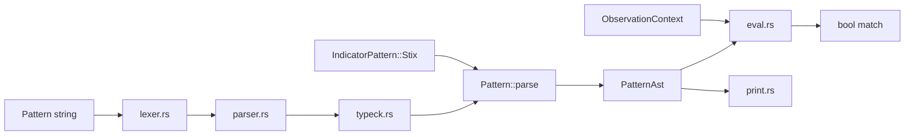

# rstix

`rstix` is the rsigma workspace crate for **STIX 2.1**. It provides typed Rust objects for all 42 built-in STIX types (3 meta, 19 SDO, 2 SRO, 18 SCO), bundle ingestion with streaming, extension round-trip, T1 advisory validation via `Bundle::validate()` (default `serde`), and an optional T2 Validation Pipeline (`validate` feature).

API reference: [docs.rs/rstix](https://docs.rs/rstix), the [crate README](https://github.com/timescale/rsigma/blob/main/crates/rstix/README.md), and the [crate source](https://github.com/timescale/rsigma/tree/main/crates/rstix).

```toml
# Cargo.toml
[dependencies]
rstix = "{{ rsigma.version }}"
# For Pattern Engine + Validation Pipeline:
# rstix = { version = "{{ rsigma.version }}", features = ["pattern", "validate"] }
# Graph, marking, store (combine as needed):
# rstix = { version = "{{ rsigma.version }}", features = ["graph", "marking", "store"] }
```

## Feature status

| Area | Status |
| ----- | ------ |
| **Core Foundation** (`core`, `id`, `vocab`) | Complete |
| **Data Model + Serialization** (`model`, `Bundle`, `parse_reader`, `Bundle::validate`) | Complete — see [Validation tiers](#validation-tiers), [Conformance notes](#conformance-notes-stix-21), and [Model invariants](#model-invariants-summary) |
| **Pattern Engine** (`pattern` — parse, type-check, full Level 3 evaluation, canonical printer, Indicator wiring, `IndicatorBuilder`) | **Complete** |
| **Validation Pipeline** (`validate` — `Validator`, profiles, `STIX-E/W/I/H` diagnostics, all twelve checks, raw JSON entry) | **Complete** |
| **Graph + Marking + Store** (`graph`, `marking`, `store`, `store-fs` — property graph, TLP resolution, in-memory and filesystem store) | **Complete** |
| **TAXII Client** (`taxii`, `taxii-native-tls` — HTTP client for all TAXII 2.1 endpoint groups) | **Complete** |

## Quick start

```rust
use std::fs::File;
use std::io::BufReader;

use rstix::model::{Bundle, ValidationCode};
use rstix::parse_bundle;

// String parse (small bundles)
let bundle = parse_bundle(json_str)?;

// Streaming parse (large bundles, e.g. MITRE ATT&CK ~50 MiB)
let file = File::open("enterprise-attack.json")?;
let bundle = Bundle::parse_reader(BufReader::new(file))?;

// T0 MUST rules at parse where wired; T1 SHOULD via bundle.validate()
let report = bundle.validate();
for warning in report.warnings_with_code(ValidationCode::StixW0031TlpV1Encoding) {
    eprintln!("{}: {}", warning.object_id.as_deref().unwrap_or("?"), warning.message);
}

// Round-trip
let out = serde_json::to_string(&bundle)?;
```

## Pattern Engine (STIX §9)

The optional **`pattern`** feature adds the full STIX patterning engine.



| Module | Role | Status |
| ------ | ---- | ------ |
| `pattern/lexer.rs` | Tokenizer; 64 KiB input cap | Done |
| `pattern/parser.rs` | Recursive-descent parser | Done |
| `pattern/typeck.rs` | SCO schema type-checker | Done |
| `pattern/eval.rs` | Level 1–3 evaluation | Done |
| `pattern/context.rs` | `ObservationContext`, observed-data builder | Done |
| `pattern/security.rs` | Regex compile size limit + PCRE DOTALL for `MATCHES` | Done |
| `pattern/path.rs` | Object-path resolution, CIDR, `_ref` via bundle | Done |
| `pattern/print.rs` | Canonical pattern printer | Done |

```rust
use rstix::Pattern;
use rstix::pattern::{ObservationContext, TimestampedObservation};

let pattern = Pattern::parse("[ipv4-addr:value = '198.51.100.1/32']")?;
assert_eq!(pattern.canonical(), "[ipv4-addr:value = '198.51.100.1/32']");

let ctx = ObservationContext::from_scos(&observations);
assert!(pattern.evaluate(&ctx)?);
```

Build with `cargo build -p rstix --features pattern`.

### In scope (Pattern Engine — complete)

Lexer, Level 1–3 parser, SCO schema type-checker (18 built-in + custom types), `Pattern::parse`, `Pattern::evaluate`, `matches_single`, `matches_single_with_bundle`, `evaluate_observed_data`, `Pattern::canonical`, `IndicatorPattern` STIX AST wiring at deserialize, `IndicatorPattern::evaluate`, `IndicatorBuilder`, `ObservationContext`, full §9 comparison and temporal semantics, manifest-driven SCO field tests (`tests/pattern_eval_sco_fields.rs`, 276 cases), spec §9.8 parse/print round-trip tests, `fuzz_stix_pattern`.

Grammar authority: **STIX Specification §9**. Internal storage uses `PatternAst` after type-check.

Evaluation notes (STIX §9):

- **`TimestampedObservation::at`**: `Option<StixTimestamp>`; patterns with `WITHIN`, `FOLLOWEDBY`, `REPEATS`, or `START`/`STOP` return `MissingTimestamp` when any observation lacks a timestamp. Plain observation expressions accept `at: None`.
- **`matches_single_with_bundle`**: pass a bundle when Level 1 patterns dereference `_ref` paths. Absent optional `_ref` properties yield no match for comparisons and `false` for `EXISTS`; present refs that cannot be resolved in the bundle still return `RefResolution`.
- **`LIKE` / `MATCHES` (§9.6.1)**: pattern constants and string property values are NFC-normalized before comparison; `MATCHES` compiles with PCRE DOTALL (`.` matches newlines) and a 1 MiB compile-size cap (`pattern::security`).
- **Custom SCO types** (`x-usb-device`, …): vendor types deserialize as `CustomSco`; parsed and type-checked permissively (leaf properties as string).
- **`process:name`**: resolved from `image_ref` → file name when a bundle is present, otherwise from the executable token in `command_line`.
- **`file:created`**: alias for `ctime`.
- **`network-traffic:dst_ref.type`**: `_ref` dereference then `type` on the target SCO.
- **`file:hashes.MD5`**: dictionary dot-key syntax per §9.7.3.
- **`extensions.'…'`**: predefined SCO extension paths (e.g. `windows-pebinary-ext.sections[*].entropy`).
- **`ISSUBSET` / `ISSUPERSET` on string**: IP/CIDR subset checks per §9.6.

Tests: `tests/fixtures/pattern/` (STIX §9.8), `tests/fixtures/pattern/sco-fields/` (SCO field manifest, 276 cases), `tests/pattern_parse.rs`, `tests/pattern_eval.rs`, `tests/pattern_spec_eval.rs`, `tests/pattern_eval_operators.rs`, `tests/pattern_eval_sco_fields.rs`, `tests/pattern_eval_errors.rs`, `tests/pattern_eval_security.rs`, `tests/pattern_indicator.rs`, unit modules `pattern::parser::level1`, `level23`, `not`, `pattern::typeck::`, `pattern::eval`, `pattern::security`.

Later workspace phases may index indicators by `Pattern::observed_types()` but do not reimplement pattern grammar.

## TAXII Client

Two optional feature flags (`taxii` implies `serde`; `taxii-native-tls` implies `taxii`):

| Feature | Module | Highlights |
| ------- | ------ | ---------- |
| `taxii` | `rstix::taxii` | TAXII 2.1 HTTP client ([`TaxiiClient`](https://github.com/timescale/rsigma/blob/main/crates/rstix/README.md#public-api-surface-rstixtaxii), TLS 1.2+1.3 via rustls, SPKI pin / DANE, auth, pagination, SRV + `dns_nameserver()`). Channels §6 not implemented. |
| `taxii-native-tls` | (client TLS) | Native TLS via `TaxiiClientConfig::tls_native` (rstix pins its own `reqwest` 0.13 with `native-tls`; PKCS#12 client certificates). Incompatible with pinning/DANE. Does not flip workspace `reqwest` 0.12 to native TLS. |

```rust
use rstix::taxii::{BearerAuth, TaxiiClient, TaxiiClientConfig, TaxiiFilter};
use futures::StreamExt;

let client = TaxiiClient::new(
    TaxiiClientConfig::new("https://taxii.example.com").auth(BearerAuth::new(token)),
)?;
let discovery = client.discover().await?;
let mut stream = client.objects_stream(api_root_url, "col1", TaxiiFilter::new());
while let Some(obj) = stream.next().await {
    let _obj = obj?;
}
```

```bash
cargo test -p rstix --features taxii --test taxii_client
```

Optional live harness: see [`tests/taxii-live/README.md`](https://github.com/timescale/rsigma/blob/main/crates/rstix/tests/taxii-live/README.md).

Full **API surface tables** and **invariant decisions**: [crate README — TAXII Client](https://github.com/timescale/rsigma/blob/main/crates/rstix/README.md#taxii-client).

## Graph + Marking + Store

Four optional feature flags (each implies `serde`; `store-fs` also implies `store`):

| Feature | Module | Highlights |
| ------- | ------ | ---------- |
| `graph` | `rstix::graph` | `StixGraph::from_bundle`, sighting + relationship SRO edges, `in_refs` / incoming traversal, `EdgeTraversal` chain, `RelationshipExpander::expand_from`, `unresolved_references` |
| `marking` | `rstix::marking` | `MarkingResolver`, `TlpV2Level` (incl. AMBER+STRICT), granular selector resolution, `permits_disclosure`, `EffectiveMarking::language_tags` |
| `store` | `rstix::store` | `StixStore` trait, `MemoryStore` (type-indexed queries, full-text search, pagination, export/delete), SCO fingerprint conflicts and content updates in `ImportReport` |
| `store-fs` | `rstix::store::FsStore` | Filesystem-backed durable store (`store-fs` implies `store`) |

```rust
use rstix::graph::{EdgePredicate, StixGraph};
use rstix::marking::MarkingResolver;
use rstix::store::{MemoryStore, StixStore};
use rstix::parse_bundle;

let bundle = parse_bundle(json)?;
let graph = StixGraph::from_bundle(&bundle)?;
let resolver = MarkingResolver::new(&bundle);
let store = MemoryStore::new();
store.import_bundle(&bundle)?;
```

Acceptance filters: `cargo test -p rstix --features graph,serde -- graph::`; `marking::`; `store::`; `store-fs` for `FsStore`.

Full API and invariant tables: [crate README](https://github.com/timescale/rsigma/blob/main/crates/rstix/README.md).

### Pattern Engine design decisions

Formal record of engineering choices for the Pattern Engine. Full text: [crate README — Pattern Engine design decisions](https://github.com/timescale/rsigma/blob/main/crates/rstix/README.md#pattern-engine-design-decisions).

<a id="dd-pe-001--indicatorbuilder-validates-at-build-not-in-setters"></a>

#### DD-PE-001 — `IndicatorBuilder` validates at `build()`, not in setters

| | |
| --- | --- |
| **Status** | Accepted (Pattern Engine PR 3.6) |
| **Applies to** | `IndicatorBuilder`, `IndicatorBuilderError` |

**Context.** Indicators need STIX pattern parse/type-check (when `pattern` is enabled) plus `Indicator::validate()`. Construction paths are JSON deserialize and `IndicatorBuilder`.

**Decision.** Setters store configuration only. `build()` is the materialization boundary: required fields, `Pattern::parse` for STIX patterns, then `Indicator::validate()`. `stix_pattern()` does not parse.

**Rationale.**

1. **Parity with deserialize** — wire JSON parses the pattern when the `Indicator` is materialized, not per-field during tokenization.
2. **One error surface** — missing `valid_from`, bad pattern, and model invariants all return from `build()` as `IndicatorBuilderError`.
3. **Fluent API** — setters return `Self`; callers use a single `?` at the end of the chain.

**Alternatives not chosen:** parse in `stix_pattern() -> Result<Self, _>` (fail-fast but breaks fluent chain); error accumulation in the builder (same outcome, more state); type-state builder (compile-time safety, out of scope for the Pattern Engine slice).

**Consequences.** Pattern errors appear at `build()`. With `pattern` off, only the raw string is stored. Callers who want eager parse can use `IndicatorPattern::stix(...)?` and `.pattern(...)`.

## Public API surface

### Crate root (`rstix`)

| Symbol | Role |
| ------ | ---- |
| `parse_bundle(&str)` | Parse a bundle JSON string with default `ParseOptions` (`serde` feature). |
| `Bundle` | Typed container; navigation, serialize, T1 `validate()` (`serde` feature). |
| `StixObject` | Top-level enum: SDO / SCO / SRO / Meta / Custom. |
| `ParseOptions`, `TypeRegistry` | Limits, custom type registration. |
| `ValidationReport`, `ValidationCode`, `ValidationFinding` | Semantic validation output. |
| `ParseError`, `model::ModelError` | Parse-time failures for rules enforced at T0 (see [Validation tiers](#validation-tiers)). |
| `Pattern`, `PatternAst`, `PatternScoType`, `PatternError`, `PatternMatchError` | STIX pattern parse and type-check at crate root (`pattern` feature). |
| `pattern::ObservationContext`, `pattern::TimestampedObservation` | Pattern evaluation context (`pattern` feature). |

### `core`

`StixId`, 42 typed ID wrappers, `StixObjectKind`, `StixTimestamp`, `TaxiiTimestamp`, `Confidence`, `SpecVersion`, `LanguageTag`, `QueryableStixObject`, `QueryValue`.

### `model`

| Submodule | Contents |
| --------- | -------- |
| `common` | `SdoSroCommonProps`, `ScoCommonProps`, `ExternalReference`, `GranularMarking`, `ExtensionMap`, `KillChainPhase` |
| `meta` | `MarkingDefinition`, `ExtensionDefinition`, `LanguageContent`, TLP UUID constants |
| `sdo` | All 19 SDOs, `SdoObject`, `IndicatorPattern`, `IndicatorBuilder`, `ObservedDataForm`, `ObservedDataEmbeddedObject` |
| `sro` | `Relationship`, `Sighting`, `SroObject` |
| `sco` | All 18 SCOs, `ScoObject`, typed ref unions, 12 predefined extensions under `sco::extensions` |
| `validate` | Shared MUST validators (used at deserialize and bundle ref checks) |
| `validation` | `Bundle::validate()` implementation and `ValidationCode` enum |

### `id`

Deterministic SCO UUIDv5: `select_id_contributing_properties`, JCS canonicalization, `generate_sco_id`, `verify_sco_deterministic_id`.

### `vocab`

Closed vocabulary tables (`encryption-algorithm-enum`, `opinion-enum`, …), a reference `HASH_ALGORITHM_ENUM` set (hash keys are not validated at parse — see [Conformance notes](#conformance-notes-stix-21)), and open vocabulary tables (`REGION_OV`, malware types, …) used by the Validation Pipeline.

## Bundle parsing

### Methods

| Method | Use when |
| ------ | -------- |
| `Bundle::parse(&str)` | Entire JSON is in memory. |
| `Bundle::parse_with_options(&str, &ParseOptions)` | Custom types or stricter limits. |
| `Bundle::parse_reader(R: Read)` | Large files; uses `serde_json` streaming reader with byte cap. |
| `Bundle::parse_reader_with_options(R, &ParseOptions)` | Streaming + options. |

### Default `ParseOptions`

| Field | Default | Purpose |
| ----- | ------- | ------- |
| `max_nesting_depth` | 64 | Reject deeply nested JSON (DoS guard). |
| `max_string_length` | 1_048_576 (1 MiB) | Max length of any JSON string value. |
| `max_bundle_bytes` | 256 MiB | Max bytes read from stream / checked for string parse. |
| `max_object_count` | `usize::MAX` | Max objects in one bundle. |
| `allow_custom` | `false` | Unknown `type` → error unless registered or allowed. |

### Navigation

| Method | Description |
| ------ | ----------- |
| `bundle.objects()` | All objects in document order. |
| `bundle.get(&StixId)` | Untyped lookup by id. |
| `bundle.get_typed::<T>(&StixId)` | Typed lookup (`Malware`, custom types, …). |
| `bundle.objects_of_type::<T>()` | Iterator over all objects of type `T`. |
| `bundle.extra_properties(&StixId)` | Top-level `x_*` and hoisted extension keys peeled at parse. |
| `bundle.validate_refs()` | Re-run in-bundle ref existence and ref-kind checks (normally called during parse). |
| `bundle.validate()` | Collect T1 SHOULD-level semantic warnings. |

Plan API name `get::<T>()` is implemented as **`get_typed::<T>()`** to avoid clashing with untyped `get`.

## Custom STIX types

Register extension SDOs per `ParseOptions` instance (not global):

```rust
use rstix::model::{Bundle, BundleObjectCast, ParseOptions, StixObject};

#[derive(serde::Deserialize, serde::Serialize)]
struct XMySdo { /* ... */ }

impl BundleObjectCast for XMySdo {
    fn cast_from(object: &StixObject) -> Option<&Self> {
        match object {
            StixObject::Custom(c) => c.downcast_typed(),
            _ => None,
        }
    }
}

let opts = ParseOptions::new().register_custom_type::<XMySdo>("x-my-sdo");
let bundle = Bundle::parse_with_options(json, &opts)?;
```

## Semantic validation (`Bundle::validate`)

Default **`serde` parse** enforces MUST rules wired at the deserialize boundary (see [Validation tiers](#validation-tiers)). **`Bundle::validate()`** collects **SHOULD**-level and advisory findings without rejecting the bundle. Stricter gates use the optional **`validate`** feature (`Validator` profiles).

| `ValidationCode` | Meaning |
| ---------------- | ------- |
| `StixW0031TlpV1Encoding` | Legacy TLP 1.x marking encoding or TLP1 marking ref (STIX-W0031). |
| `ScoDeterministicIdMismatch` | SCO `id` does not match UUIDv5 from id-contributing properties. |
| `GranularSelectorSemanticInvalid` | Granular-marking selector does not resolve on the object. |
| `LanguageContentValueMismatch` | Translation type, list length, or nested object shape does not mirror the target (§7.1.1). |
| `LanguageContentObjectModifiedMismatch` | `object_modified` does not match target `modified`. |
| `LocationCountryNotIso3166` | `country` is not ISO 3166-1 alpha-2. |
| `LocationRegionNotInOpenVocab` | `region` is not in STIX `region-ov`. |
| `InvalidCapecExternalReference` | CAPEC `external_id` shape (attack-pattern). |
| `InvalidCveExternalReference` | CVE `external_id` shape (vulnerability). |
| `RelationshipEndpointMatrixInvalid` | Relationship source/target types outside STIX 2.1 matrix. |
| `EncryptionAlgorithmInvalid` | Artifact `encryption_algorithm` not in closed vocabulary. |

`ValidationCode::LanguageContentFieldUnknown` exists for pipeline/legacy mapping but is **not emitted** by `Bundle::validate()` (§7.1.1 unknown target fields are ignored without a warning).

There is no `strict` parse flag on `Bundle::parse`. Use **`Validator`** profiles when structured diagnostics or profile-driven pass/fail is required.

### Data Model + Serialization design decisions

Formal record of wire-parse engineering choices. Full text: [crate README — Data Model + Serialization design decisions](https://github.com/timescale/rsigma/blob/main/crates/rstix/README.md#data-model--serialization-design-decisions).

<a id="dd-dm-001--wire-must-at-parse"></a>

#### DD-DM-001 — Wire MUST at parse (`domain-name`, `email-addr`, `url`)

| | |
| --- | --- |
| **Status** | Accepted (#327) |
| **Applies to** | `serde` feature (default), `domain-name`, `email-addr`, `url` SCO types |
| **Spec** | STIX 2.1 §6.4, §6.5, §6.15 |

**Decision.** Malformed `domain-name`, `email-addr`, and `url` values are **rejected at default `serde` parse**. URL schemes are limited to `http`, `https`, and `ftp`. Other wire-format checks use T1 (`Bundle::validate()`) or T2 (Validation Pipeline) as documented in [Validation tiers](#validation-tiers).

## Wire-format validation (DD-DM-001)

STIX **MUST** rules for `domain-name.value` (RFC 1034 / RFC 5890), `email-addr.value` (RFC 5322 addr-spec), and `url.value` (RFC 3986) are enforced at the **default `serde` parse boundary** per **DD-DM-001** above, via optional deps (`idna`, `email_address`, `url`, `base64`, `encoding_rs`) enabled by the `serde` feature. `--no-default-features` builds omit those crates.

| Field | Spec reference | Parse boundary (`serde`) |
| ----- | -------------- | ------------------------ |
| `domain-name.value` | RFC 1034 / 5890 | IDNA (UTS #46) + label rules |
| `email-addr.value` | RFC 5322 | RFC 5322 addr-spec (`email_address`) |
| `url.value` | RFC 3986 | URL parse (`http`, `https`, `ftp` schemes) |

The Validation Pipeline re-runs the same checks on typed objects during the schema phase.

SCO `*_enc` properties (§3.1 / §3.9.1) MUST be IANA character-set names and MUST NOT appear without their base property. Spec-defined properties are `file.name_enc` and `directory.path_enc`; other `_enc` keys in `common.extra` follow the same rules. `email-message` RFC 2047 encoded-words are decoded on ingest (§6.6). Pattern evaluation can address vendor `_enc` siblings via `common.extra` when present on the wire object.

## Extensions and round-trip

- Top-level **`x_*`** keys are peeled before typed deserialize → `Bundle::extra_properties()`, merged back on serialize.
- **`toplevel-property-extension`** keys are hoisted from `extensions` the same way.
- Standalone leaf deserialize stores unknown keys in **`common.extra`** (SDO/SRO/SCO) or **`MarkingDefinition.extra`**, drained into `extra_properties` during bundle parse.
- Deprecated observed-data **`objects`** maps accept embedded **SCO or SRO** members (`ObservedDataEmbeddedObject`).

### Serialization map conventions

When adding wire-facing maps, match existing `model/` types (PR #213 review):

| Use | Map type | Examples |
| --- | -------- | -------- |
| JSON object properties where **stable key order** matters (strict round-trip, JCS, bundle re-serialize) | **`BTreeMap`** | `ExtensionMap`, `ExternalReference.hashes`, `LanguageContent.contents`, `common.extra`, SCO `hashes`, values in `Bundle.extra_properties()` |
| Internal **indexes** keyed by STIX id where order is irrelevant | **`HashMap`** | `Bundle.id_index`, graph adjacency, store buckets, marking resolver index |

Do not use `HashMap` for a new property bag that participates in `roundtrip_strict`.

## Testing

| Layer | Location |
| ----- | -------- |
| Wire round-trip | `tests/spec.rs`, `tests/fixtures/spec/` |
| Bundle integration | `tests/bundle.rs` |
| Semantic validation | `tests/validation.rs`, `tests/fixtures/validation/` |
| Validation Pipeline | `tests/validate_conformance.rs`, `tests/validate_diagnostic_coverage.rs`, `tests/validate_pipeline.rs`, `tests/fixtures/conformance/` (`validate` feature) |
| Graph / Marking / Store | `tests/graph.rs`, `tests/marking.rs`, `tests/store.rs`, `tests/store_fs.rs` |
| Streaming + custom types + ATT&CK | `tests/integration.rs` |
| Pattern parse + type-check + evaluation | `tests/pattern_parse.rs`, `tests/pattern_eval.rs`, `tests/pattern_spec_eval.rs`, `tests/pattern_eval_operators.rs`, `tests/pattern_eval_sco_fields.rs`, `tests/pattern_eval_errors.rs`, `tests/pattern_eval_security.rs`, `tests/pattern_indicator.rs`, `tests/fixtures/pattern/`, `tests/fixtures/pattern/sco-fields/` (requires `pattern` feature) |
| Fuzz | `fuzz/fuzz_targets/fuzz_rstix_parse_bundle.rs`, `fuzz/fuzz_targets/fuzz_rstix_validate_json.rs` (`validate` feature) |

Run crate tests:

```bash
cargo test -p rstix --features serde
cargo test -p rstix --features pattern   # Pattern Engine
```

<a id="local-mitre-attck-corpus-test"></a>

### Local MITRE ATT&CK corpus

The full MITRE ATT&CK STIX bundle (~50 MiB) is available for download and parsing. CI uses a synthetic 5000-object streaming test. For local verification, download a bundle (for example MITRE ATT&CK 19.1) and point the integration test at it:

```bash
RSTIX_ATTCK_BUNDLE=/path/to/enterprise-attack-19.1.json \
  cargo test -p rstix --features serde attck_corpus_roundtrip_when_present -- --nocapture
```

This runs `parse_reader` → serialize → reparse and asserts object count stability. Verified against `enterprise-attack-19.1.json` (~53 MiB) locally.

## STIX version vs TLP marking encoding

Three independent ideas — do not mix them:

| | STIX object model | TLP v1 encoding (legacy) | TLP v2 encoding (current) |
| --- | --- | --- | --- |
| **JSON** | `"spec_version": "2.1"` | `"definition_type":"tlp"`, `"definition":{"tlp":"white"}` | `"extensions":{…,"tlp_2_0":"clear"}` |
| **Meaning** | Object follows STIX 2.1 rules | Old TLP label wire format (deprecated for **new** markings) | Current TLP label wire format |
| **rstix constants** | `SpecVersion::V2_1` | `TLP1_WHITE_ID` … `TLP1_RED_ID` | `TLP2_CLEAR_ID` … `TLP2_RED_ID` |

A STIX **2.1** bundle can contain `marking-definition` objects that still use the **legacy TLP v1 encoding** — that is normal (ATT&CK references the predefined v1 UUIDs).

Full developer guide: [crate README — STIX version vs TLP marking encoding](https://github.com/timescale/rsigma/blob/main/crates/rstix/README.md#stix-version-vs-tlp-marking-encoding).

<a id="validation-tiers"></a>

## Validation tiers

| Tier | API | Severity | Examples |
| ---- | --- | -------- | -------- |
| **T0 — parse** | `Bundle::parse`, `parse_reader`, leaf `Deserialize` | Hard error | Type discriminants, in-bundle ref existence, DD-DM-001 domain/email/url format, SCO MUST in `validate()` at deserialize |
| **T1 — advisory** | `Bundle::validate()` | Warnings only | Relationship matrix, TLP v1 (STIX-W0031), granular selectors, language-content mirroring, location ISO/region, SCO deterministic id |
| **T2 — pipeline** | `Validator` (`validate` feature) | Structured diagnostics | All twelve validation phases, conformance corpus |

Full detail: [crate README — Validation tiers](https://github.com/timescale/rsigma/blob/main/crates/rstix/README.md#validation-tiers).

<a id="conformance-notes-stix-21"></a>

## Conformance notes (STIX 2.1)

rstix **phase delivery is complete** for bundle parse, patterning, validation pipeline, graph, marking, and store. **Wire conformance** is substantially met with documented exceptions:

| Topic | rstix behavior today |
| ----- | -------------------- |
| Report / Grouping / Note / Opinion `object_refs` | Ref kind limited to **SDO or SCO** at bundle parse; empty lists accepted |
| SDO `name` / grouping `context` | Empty strings accepted at parse |
| Malware Analysis time ordering | Not checked in `MalwareAnalysis::validate()` |
| Language-content `object_ref` | **SDO-only** ref kind; target must exist in bundle |
| IPv4 / IPv6 / MAC `value` | Non-empty string only (no address/MAC syntax check) |
| URL schemes | `http`, `https`, `ftp` only (DD-DM-001) |
| `encryption-algorithm-enum` | Advisory check uses `ENCRYPTION_ALGORITHM_ENUM`, which does not match the STIX 2.1 normative set |
| `hash-algorithm-ov` | Open in STIX; hash keys not validated at parse |
| Open vocabulary tables | Curated subsets in `vocab/open.rs`; unknown wire values not rejected at T0 |

Full table: [crate README — Conformance notes](https://github.com/timescale/rsigma/blob/main/crates/rstix/README.md#conformance-notes-stix-21).

<a id="model-invariants-summary"></a>

## Model invariants (summary)

Full table: [crate README — Model invariant decisions](https://github.com/timescale/rsigma/blob/main/crates/rstix/README.md#model-invariant-decisions-modelcommon).

- **T0 (parse):** id/type match, in-bundle ref resolution, extension routing, SCO forbidden common props, SDO/SRO time ordering, DD-DM-001 domain/email/url format, `_enc` IANA charset + pairing, and type-specific MUST rules documented in `ModelError`.
- **T1 (`Bundle::validate()`):** relationship matrix, CAPEC/CVE, encryption algorithm, TLP v1 warnings (STIX-W0031), granular selector semantics, language-content rules, location country/region vocabularies, SCO deterministic id.
- **Partial T0:** report/grouping/note/opinion `object_refs` (SDO/SCO kind only; empty lists allowed); see [Conformance notes](#conformance-notes-stix-21).
- **Map types:** wire-facing property bags use `BTreeMap` for deterministic JSON key order; internal id indexes use `HashMap`.

Pattern Engine engineering choices (separate from STIX spec invariants): [Pattern Engine design decisions](#pattern-engine-design-decisions).

## Validation Pipeline

Optional **`validate`** feature (implies `serde` + `pattern`) adds profile-based **`Validator`** with structured `STIX-E/W/I/H` diagnostics (T2). Advisory **`Bundle::validate()`** (T1) is available with **`serde` alone**; with `validate` enabled it routes through `validate::legacy::bundle_validate` for alignment with pipeline semantic checks — see **DD-VP-001** in the crate README.

| Profile | Phases | Use case |
| ------- | ------ | -------- |
| `consumer_permissive` | JSON, type, schema, references (4 of 12) | Mixed-trust ingest |
| `consumer_strict` | all 12 | Untrusted external input |
| `producer_strict` | all except references (11 of 12) | Publishing/export |
| `interop_strict` | all 12, zero leniency | OASIS interop tests |

```rust
use rstix::validate::{Validator, ValidationPhase};

let report = Validator::consumer_strict().validate_json_str(untrusted_json);
assert!(report.is_valid());

let partial = Validator::builder()
    .with_phase(ValidationPhase::Schema)
    .build()
    .validate_bundle(&bundle);
```

All twelve pipeline checks are implemented. The conformance harness (`tests/fixtures/conformance/`) and `validate_diagnostic_coverage` assert one case per `DiagnosticCode::ALL` entry (39 codes).

## Feature flags

| Feature | Purpose |
| ------- | ------- |
| `serde` (default) | Bundle parsing, serialization, advisory validation. |
| `pattern` | STIX pattern lexer, Level 1–3 parser, type-checker, and evaluator. |
| `validate` | Profile-based Validation Pipeline (`Validator`, structured diagnostics, conformance corpus). |
| `graph` | Property graph over parsed bundles (`StixGraph`, `RelationshipExpander`). |
| `marking` | TLP and statement marking resolution (`MarkingResolver`, granular selectors). |
| `store` | In-memory STIX store (`MemoryStore`, `StixQuery`, `ImportReport`). |
| `store-fs` | Filesystem-backed durable store (`FsStore`; implies `store`). |
| `taxii` | TAXII 2.1 HTTP client (`TaxiiClient`, `TaxiiEnvelope`, auth, pagination, retry). |
| `taxii-native-tls` | Native TLS for `TaxiiClient` (implies `taxii`; default uses rustls). |

## Related docs

- [Architecture — crate map](../reference/architecture.md#rstix)
- [Feature flags — rstix](../reference/feature-flags.md#rstix)
- [Fuzzing — `fuzz_rstix_parse_bundle`](../developers/fuzzing.md)
- [Fuzzing — `fuzz_rstix_validate_json`](../developers/fuzzing.md)
- [Crate README](https://github.com/timescale/rsigma/blob/main/crates/rstix/README.md)
