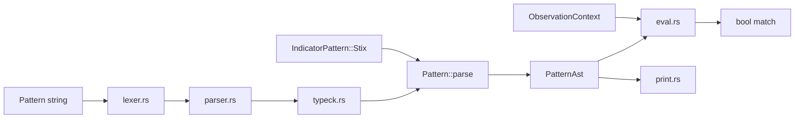

# rstix

`rstix` is the rsigma workspace crate for **STIX 2.1** (and future **TAXII 2.1** client work). It provides typed Rust objects for all 42 built-in STIX types, bundle ingestion, extension round-trip, and a semantic validation pipeline.

Canonical API reference: [docs.rs/rstix](https://docs.rs/rstix). Contributor-facing detail: [crate README](https://github.com/timescale/rsigma/blob/main/crates/rstix/README.md).

## Feature status

| Area | Status |
| ----- | ------ |
| **Core Foundation** (`core`, `id`, `vocab`) | Complete |
| **Data Model + Serialization** (`model`, `Bundle`, `parse_reader`, `Bundle::validate`) | Complete |
| **Pattern Engine** (`pattern` — parse, type-check, full Level 3 evaluation, canonical printer, Indicator wiring, `IndicatorBuilder`) | **Complete** |
| **Validation Pipeline** (`validate` — `Validator`, profiles, `STIX-E/W/I/H` diagnostics, raw JSON entry, root type check) | **Scaffold** (remaining check logic next) |
| **Graph + Marking + Store** | Planned |
| **TAXII Client** | Planned |

## Quick start

```rust
use std::fs::File;
use std::io::BufReader;

use rstix::model::{Bundle, ValidationCode};
use rstix::parse_bundle;

// String parse (small bundles)
let bundle = parse_bundle(json_str)?;

// Streaming parse (large bundles, e.g. MITRE ATT&CK ~50 MiB)
let file = File::open("enterprise-attack.json")?;
let bundle = Bundle::parse_reader(BufReader::new(file))?;

// MUST rules enforced at parse; SHOULD rules as warnings
let report = bundle.validate();
for warning in report.warnings_with_code(ValidationCode::StixW0031TlpV1Encoding) {
    eprintln!("{}: {}", warning.object_id.as_deref().unwrap_or("?"), warning.message);
}

// Round-trip
let out = serde_json::to_string(&bundle)?;
```

## Pattern Engine (STIX §9)

The optional **`pattern`** feature adds the full STIX patterning engine.



| Module | Role | Status |
| ------ | ---- | ------ |
| `pattern/lexer.rs` | Tokenizer; 64 KiB input cap | Done |
| `pattern/parser.rs` | Recursive-descent parser | Done |
| `pattern/typeck.rs` | SCO schema type-checker | Done |
| `pattern/eval.rs` | Level 1–3 evaluation | Done |
| `pattern/context.rs` | `ObservationContext`, observed-data builder | Done |
| `pattern/security.rs` | Regex compile size limit + PCRE DOTALL for `MATCHES` | Done |
| `pattern/path.rs` | Object-path resolution, CIDR, `_ref` via bundle | Done |
| `pattern/print.rs` | Canonical pattern printer | Done |

```rust
use rstix::Pattern;
use rstix::pattern::{ObservationContext, TimestampedObservation};

let pattern = Pattern::parse("[ipv4-addr:value = '198.51.100.1/32']")?;
assert_eq!(pattern.canonical(), "[ipv4-addr:value = '198.51.100.1/32']");

let ctx = ObservationContext::from_scos(&observations);
assert!(pattern.evaluate(&ctx)?);
```

Build with `cargo build -p rstix --features pattern`.

### In scope (Pattern Engine — complete)

Lexer, Level 1–3 parser, SCO schema type-checker (18 built-in + custom types), `Pattern::parse`, `Pattern::evaluate`, `matches_single`, `matches_single_with_bundle`, `evaluate_observed_data`, `Pattern::canonical`, `IndicatorPattern` STIX AST wiring at deserialize, `IndicatorPattern::evaluate`, `IndicatorBuilder`, `ObservationContext`, full §9 comparison and temporal semantics, manifest-driven SCO field tests (`tests/pattern_eval_sco_fields.rs`, 276 cases), spec §9.8 parse/print round-trip tests, `fuzz_stix_pattern`.

Grammar authority: **STIX Specification §9**. Internal storage uses `PatternAst` after type-check.

Evaluation notes (STIX §9):

- **`TimestampedObservation::at`**: `Option<StixTimestamp>`; patterns with `WITHIN`, `FOLLOWEDBY`, `REPEATS`, or `START`/`STOP` return `MissingTimestamp` when any observation lacks a timestamp. Plain observation expressions accept `at: None`.
- **`matches_single_with_bundle`**: pass a bundle when Level 1 patterns dereference `_ref` paths. Absent optional `_ref` properties yield no match for comparisons and `false` for `EXISTS`; present refs that cannot be resolved in the bundle still return `RefResolution`.
- **`LIKE` / `MATCHES` (§9.6.1)**: pattern constants and string property values are NFC-normalized before comparison; `MATCHES` compiles with PCRE DOTALL (`.` matches newlines) and a 1 MiB compile-size cap (`pattern::security`).
- **Custom SCO types**: vendor types (e.g. `x-usb-device`) deserialize as `CustomSco` and evaluate nested property paths.
- **`process:name`**: resolved from `image_ref` → file name when a bundle is present, otherwise from the executable token in `command_line`.
- **`file:created`**: alias for `ctime`.
- **`network-traffic:dst_ref.type`**: `_ref` dereference then `type` on the target SCO.
- **`file:hashes.MD5`**: dictionary dot-key syntax per §9.7.3.
- **`extensions.'…'`**: predefined SCO extension paths (e.g. `windows-pebinary-ext.sections[*].entropy`).
- **`ISSUBSET` / `ISSUPERSET` on string**: IP/CIDR subset checks per §9.6.
- **Custom SCO types** (`x-usb-device`, …): parsed and type-checked permissively (leaf properties as string).

Tests: `tests/fixtures/pattern/` (STIX §9.8), `tests/fixtures/pattern/sco-fields/` (SCO field manifest), `tests/pattern_parse.rs`, `tests/pattern_eval.rs`, `tests/pattern_spec_eval.rs`, `tests/pattern_eval_operators.rs`, `tests/pattern_eval_sco_fields.rs`, `tests/pattern_eval_errors.rs`, unit modules `pattern::parser::level1`, `level23`, `not`, `pattern::typeck::`, `pattern::eval`, `pattern::security`.

Later workspace phases (Graph + Marking + Store, TAXII Client) may index indicators by `Pattern::observed_types()` but do not reimplement pattern grammar.

### Pattern Engine design decisions

Formal record of engineering choices for the Pattern Engine. Full text: [crate README — Pattern Engine design decisions](https://github.com/timescale/rsigma/blob/main/crates/rstix/README.md#pattern-engine-design-decisions).

<a id="dd-pe-001--indicatorbuilder-validates-at-build-not-in-setters"></a>

#### DD-PE-001 — `IndicatorBuilder` validates at `build()`, not in setters

| | |
| --- | --- |
| **Status** | Accepted (Pattern Engine PR 3.6) |
| **Applies to** | `IndicatorBuilder`, `IndicatorBuilderError` |

**Context.** Indicators need STIX pattern parse/type-check (when `pattern` is enabled) plus `Indicator::validate()`. Construction paths are JSON deserialize and `IndicatorBuilder`.

**Decision.** Setters store configuration only. `build()` is the materialization boundary: required fields, `Pattern::parse` for STIX patterns, then `Indicator::validate()`. `stix_pattern()` does not parse.

**Rationale.**

1. **Parity with deserialize** — wire JSON parses the pattern when the `Indicator` is materialized, not per-field during tokenization.
2. **One error surface** — missing `valid_from`, bad pattern, and model invariants all return from `build()` as `IndicatorBuilderError`.
3. **Fluent API** — setters return `Self`; callers use a single `?` at the end of the chain.

**Alternatives not chosen:** parse in `stix_pattern() -> Result<Self, _>` (fail-fast but breaks fluent chain); error accumulation in the builder (same outcome, more state); type-state builder (compile-time safety, out of scope for Phase 3).

**Consequences.** Pattern errors appear at `build()`. With `pattern` off, only the raw string is stored. Callers who want eager parse can use `IndicatorPattern::stix(...)?` and `.pattern(...)`.

## Public API surface

### Crate root (`rstix`)

| Symbol | Role |
| ------ | ---- |
| `parse_bundle(&str)` | Parse a bundle JSON string with default [`ParseOptions`](https://docs.rs/rstix/latest/rstix/model/struct.ParseOptions.html). |
| `Bundle` | Typed container; navigation, serialize, `validate()`. |
| `StixObject` | Top-level enum: SDO / SCO / SRO / Meta / Custom. |
| `ParseOptions`, `TypeRegistry` | Limits, custom type registration. |
| `ValidationReport`, `ValidationCode`, `ValidationFinding` | Semantic validation output. |
| `ParseError`, `model::ModelError` | Parse-time failures (MUST rules). |
| `Pattern`, `PatternAst`, `PatternScoType`, `PatternError`, `PatternMatchError`, `ObservationContext`, `TimestampedObservation` | STIX pattern parse, type-check, and evaluation (`pattern` feature). |

### `core`

`StixId`, 42 typed ID wrappers, `StixObjectKind`, `StixTimestamp`, `TaxiiTimestamp`, `Confidence`, `SpecVersion`, `LanguageTag`, `QueryableStixObject`, `QueryValue`.

### `model`

| Submodule | Contents |
| --------- | -------- |
| `common` | `SdoSroCommonProps`, `ScoCommonProps`, `ExternalReference`, `GranularMarking`, `ExtensionMap`, `KillChainPhase` |
| `meta` | `MarkingDefinition`, `ExtensionDefinition`, `LanguageContent`, TLP UUID constants |
| `sdo` | All 19 SDOs, `SdoObject`, `IndicatorPattern`, `IndicatorBuilder`, `ObservedDataForm`, `ObservedDataEmbeddedObject` |
| `sro` | `Relationship`, `Sighting`, `SroObject` |
| `sco` | All 18 SCOs, `ScoObject`, typed ref unions, 12 predefined extensions under `sco::extensions` |
| `validate` | Shared MUST validators (used at deserialize and bundle ref checks) |
| `validation` | `Bundle::validate()` implementation and `ValidationCode` enum |

### `id`

Deterministic SCO UUIDv5: `select_id_contributing_properties`, JCS canonicalization, `generate_sco_id`, `verify_sco_deterministic_id`.

### `vocab`

Closed enums (hash algorithms, encryption algorithms, opinion values) and open vocabularies (`REGION_OV`, malware types, etc.).

## Bundle parsing

### Methods

| Method | Use when |
| ------ | -------- |
| `Bundle::parse(&str)` | Entire JSON is in memory. |
| `Bundle::parse_with_options(&str, &ParseOptions)` | Custom types or stricter limits. |
| `Bundle::parse_reader(R: Read)` | Large files; uses `serde_json` streaming reader with byte cap. |
| `Bundle::parse_reader_with_options(R, &ParseOptions)` | Streaming + options. |

### Default `ParseOptions`

| Field | Default | Purpose |
| ----- | ------- | ------- |
| `max_nesting_depth` | 64 | Reject deeply nested JSON (DoS guard). |
| `max_string_length` | 1_048_576 (1 MiB) | Max length of any JSON string value. |
| `max_bundle_bytes` | 256 MiB | Max bytes read from stream / checked for string parse. |
| `max_object_count` | `usize::MAX` | Max objects in one bundle. |
| `allow_custom` | `false` | Unknown `type` → error unless registered or allowed. |

### Navigation

| Method | Description |
| ------ | ----------- |
| `bundle.objects()` | All objects in document order. |
| `bundle.get(&StixId)` | Untyped lookup by id. |
| `bundle.get_typed::<T>(&StixId)` | Typed lookup (`Malware`, custom types, …). |
| `bundle.objects_of_type::<T>()` | Iterator over all objects of type `T`. |
| `bundle.extra_properties(&StixId)` | Top-level `x_*` and hoisted extension keys peeled at parse. |
| `bundle.validate_refs()` | Re-run MUST ref resolution (normally called during parse). |

Plan API name `get::<T>()` is implemented as **`get_typed::<T>()`** to avoid clashing with untyped `get`.

## Custom STIX types

Register extension SDOs per `ParseOptions` instance (not global):

```rust
use rstix::model::{Bundle, BundleObjectCast, ParseOptions, StixObject};

#[derive(serde::Deserialize, serde::Serialize)]
struct XMySdo { /* ... */ }

impl BundleObjectCast for XMySdo {
    fn cast_from(object: &StixObject) -> Option<&Self> {
        match object {
            StixObject::Custom(c) => c.downcast_typed(),
            _ => None,
        }
    }
}

let opts = ParseOptions::new().register_custom_type::<XMySdo>("x-my-sdo");
let bundle = Bundle::parse_with_options(json, &opts)?;
```

## Semantic validation (`Bundle::validate`)

Parse enforces STIX **MUST** rules (hard errors). **`Bundle::validate()`** collects **SHOULD**-level and advisory findings without rejecting the bundle.

| `ValidationCode` | Meaning |
| ---------------- | ------- |
| `StixW0031TlpV1Encoding` | Legacy TLP 1.x marking encoding or TLP1 marking ref (STIX-W0031). |
| `ScoDeterministicIdMismatch` | SCO `id` does not match UUIDv5 from id-contributing properties. |
| `GranularSelectorSemanticInvalid` | Granular-marking selector does not resolve on the object. |
| `LanguageContentFieldUnknown` | Translation field is not a property on the target object. |
| `LanguageContentValueMismatch` | Translation type or list length does not mirror the target property. |
| `LanguageContentObjectModifiedMismatch` | `object_modified` does not match target `modified`. |
| `LocationCountryNotIso3166` | `country` is not ISO 3166-1 alpha-2. |
| `LocationRegionNotInOpenVocab` | `region` is not in STIX `region-ov`. |
| `InvalidCapecExternalReference` | CAPEC `external_id` shape (attack-pattern). |
| `InvalidCveExternalReference` | CVE `external_id` shape (vulnerability). |
| `RelationshipEndpointMatrixInvalid` | Relationship source/target types outside STIX 2.1 matrix. |
| `EncryptionAlgorithmInvalid` | Artifact `encryption_algorithm` not in closed vocabulary. |

There is no `strict` parse flag: permissive parse + explicit `validate()` is the supported workflow (see maintainer direction on [issue #267](https://github.com/timescale/rsigma/issues/267)).

## Wire-format validation (pragmatic vs full spec)

STIX **SHOULD** cite full Internet standards for some string fields. rstix uses **lightweight structural checks** at parse time — enough to reject obvious garbage without pulling in full IDNA/email parsers.

| Field | STIX reference | rstix today | Full standard (not implemented) |
| ----- | -------------- | ----------- | -------------------------------- |
| `domain-name.value` | RFC 1034 / 5890 | Label structure, no empty labels, no `..` | **IDNA**: Unicode domain → Punycode (`xn--…`), full UTS #46 |
| `email-addr.value` | RFC 5322 | Non-empty local@domain with dot in domain, no whitespace | **RFC 5322**: full addr-spec grammar (quoted strings, comments, IP literals) |
| `url.value` | Valid URL | `http://`, `https://`, or `ftp://` prefix | WHATWG URL parser, IDNA in host, normalization |

**Why full IDNA / RFC 5322 are not in Data Model + Serialization:** they are large, locale-sensitive parsers unrelated to STIX object typing. Basic checks catch malformed CTI early; strict compliance belongs in an optional validation profile or a dedicated dependency (`idna`, `mail-parser`, etc.) if a downstream consumer requires it.

## Extensions and round-trip

- Top-level **`x_*`** keys are peeled before typed deserialize → `Bundle::extra_properties()`, merged back on serialize.
- **`toplevel-property-extension`** keys are hoisted from `extensions` the same way.
- Standalone leaf deserialize stores unknown keys in **`common.extra`** (SDO/SRO/SCO) or **`MarkingDefinition.extra`**, drained into `extra_properties` during bundle parse.

## Testing

| Layer | Location |
| ----- | -------- |
| Wire round-trip | `tests/spec.rs`, `tests/fixtures/spec/` |
| Bundle integration | `tests/bundle.rs` |
| Semantic validation | `tests/validation.rs`, `tests/fixtures/validation/` |
| Streaming + custom types + ATT&CK | `tests/integration.rs` |
| Pattern parse + type-check + evaluation | `tests/pattern_parse.rs`, `tests/pattern_eval.rs`, `tests/pattern_spec_eval.rs`, `tests/pattern_eval_operators.rs`, `tests/pattern_eval_sco_fields.rs`, `tests/pattern_eval_errors.rs`, `tests/fixtures/pattern/`, `tests/fixtures/pattern/sco-fields/` (requires `pattern` feature) |
| Fuzz | `fuzz/fuzz_targets/fuzz_rstix_parse_bundle.rs` |

Run crate tests:

```bash
cargo test -p rstix --features serde
cargo test -p rstix --features pattern   # Pattern Engine
```

### Local MITRE ATT&CK corpus

The full MITRE ATT&CK STIX bundle (~50 MiB) is available for download and parsing. CI uses a synthetic 5000-object streaming test. For local verification, download a bundle (for example MITRE ATT&CK 19.1) and point the integration test at it:

```bash
RSTIX_ATTCK_BUNDLE=/path/to/enterprise-attack-19.1.json \
  cargo test -p rstix --features serde attck_corpus_roundtrip_when_present -- --nocapture
```

This runs `parse_reader` → serialize → reparse and asserts object count stability. Verified against `enterprise-attack-19.1.json` (~53 MiB) locally.

## STIX version vs TLP marking encoding

Three independent ideas — do not mix them:

| | STIX object model | TLP v1 encoding (legacy) | TLP v2 encoding (current) |
| --- | --- | --- | --- |
| **JSON** | `"spec_version": "2.1"` | `"definition_type":"tlp"`, `"definition":{"tlp":"white"}` | `"extensions":{…,"tlp_2_0":"clear"}` |
| **Meaning** | Object follows STIX 2.1 rules | Old TLP label wire format (deprecated for **new** markings) | Current TLP label wire format |
| **rstix constants** | `SpecVersion::V2_1` | `TLP1_WHITE_ID` … `TLP1_RED_ID` | `TLP2_CLEAR_ID` … `TLP2_RED_ID` |

A STIX **2.1** bundle can contain `marking-definition` objects that still use the **legacy TLP v1 encoding** — that is normal (ATT&CK references the predefined v1 UUIDs).

Full developer guide: [crate README — STIX version vs TLP marking encoding](https://github.com/timescale/rsigma/blob/main/crates/rstix/README.md#stix-version-vs-tlp-marking-encoding).

## Model invariants (summary)

Full table: [crate README — Model invariant decisions](https://github.com/timescale/rsigma/blob/main/crates/rstix/README.md#model-invariant-decisions-modelcommon).

- **MUST at parse:** id/type match, ref resolution in bundle, extension routing, SCO forbidden common props, SDO/SRO time ordering, and type-specific MUST rules documented in `ModelError`.
- **SHOULD via `validate()`:** relationship matrix, CAPEC/CVE, encryption algorithm, TLP v1 warnings, granular selector semantics, language-content rules, location country/region vocabularies, SCO deterministic id.

Pattern Engine engineering choices (separate from STIX spec invariants): [Pattern Engine design decisions](#pattern-engine-design-decisions).

## Validation Pipeline

Optional **`validate`** feature (implies `serde` + `pattern`). Distinct from advisory [`Bundle::validate()`](https://github.com/timescale/rsigma/blob/main/crates/rstix/README.md#validation-pipeline) — see **DD-VP-001** in the crate README.

```rust
use rstix::validate::{Validator, ValidationPhase};

let report = Validator::consumer_strict().validate_json_str(untrusted_json);
assert!(report.is_valid());

let partial = Validator::builder()
    .with_phase(ValidationPhase::Schema)
    .build()
    .validate_bundle(&bundle);
```

**Scaffold (this release):** profiles, diagnostic taxonomy, dispatcher, raw JSON entry (`STIX-E0001` with span metadata), root type discrimination (`STIX-E0002`), parse-error bridging (`STIX-E0003` for missing ids), `ValidatorBuilder::with_allow_custom` / `with_parse_options`, and `STIX-I0020` informational diagnostics for not-yet-implemented checks. Remaining check implementations and OASIS conformance tests follow in later releases.

## Feature flags

| Feature | Purpose |
| ------- | ------- |
| `serde` (default) | Bundle parsing, serialization, advisory validation. |
| `pattern` | STIX pattern lexer, Level 1–3 parser, type-checker, and evaluator. |
| `validate` | Profile-based Validation Pipeline (`Validator`, structured diagnostics). |

## Related docs

- [Architecture — crate map](../reference/architecture.md#rstix)
- [Feature flags — rstix](../reference/feature-flags.md#rstix)
- [Fuzzing — `fuzz_rstix_parse_bundle`](../developers/fuzzing.md)
- [Fuzzing — `fuzz_rstix_validate_json`](../developers/fuzzing.md)
- [Crate README](https://github.com/timescale/rsigma/blob/main/crates/rstix/README.md)
