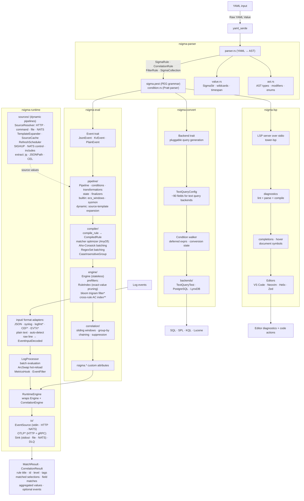

# Architecture

RSigma is a workspace of seven crates organised around one principle: rule processing and event evaluation are pure library code; everything I/O-bound or runtime-shaped is layered on top. This page documents the crate map, the execution shapes, and how the pieces interact at runtime.

For operator-facing material see the [User Guide](../guide/evaluating-rules.md). For per-crate API docs see [docs.rs/rsigma](https://docs.rs/rsigma).

## Ecosystem

The streaming-detection ecosystem at a glance: rules, pipelines, dynamic sources, and log events flow into the engine, which fans out to enrichment, sinks, and downstream systems.


## Crate map

The crate-level view below is also available as a [rendered SVG](https://raw.githubusercontent.com/timescale/rsigma/main/assets/internal_architecture.svg).



`*` feature-gated. `**` requires the `daachorse-index` feature.

## Crate responsibilities

The dependency direction goes left to right in the diagram above. Higher crates depend on lower crates; the reverse is never true.

| Crate | Role | Key types | Feature gates |
|-------|------|-----------|---------------|
| [`rsigma-parser`](https://docs.rs/rsigma-parser) | YAML → AST. The only crate that touches Sigma source. | `SigmaCollection`, `SigmaRule`, `CorrelationRule`, `FilterRule`, `Condition`, `SigmaStr`, `Modifier` | — |
| [`rsigma-eval`](https://docs.rs/rsigma-eval) | Compile AST to a matcher tree, evaluate events. Detection and correlation engine. Processing pipeline machinery. | `Engine`, `CorrelationEngine`, `Pipeline`, `Transformation`, `CompiledRule`, `Event`, `JsonEvent`, `MatchResult`, `CorrelationResult` | `parallel`, `daachorse-index` |
| [`rsigma-convert`](https://docs.rs/rsigma-convert) | Lower the parser AST into backend-native queries. | `Backend` trait, `TextQueryConfig`, `PostgresBackend`, `LynxDbBackend`, `TestBackend` | — |
| [`rsigma-runtime`](https://docs.rs/rsigma-runtime) | Streaming runtime. Input adapters, sinks, dynamic-source resolver, NATS/OTLP plumbing, hot-reload. | `LogProcessor`, `RuntimeEngine`, `EventSource`, `Sink`, `SourceResolver`, `SourceCache`, `TemplateExpander`, `EvtxFileReader` | `nats`, `otlp`, `logfmt`, `cef`, `evtx`, `daachorse-index` |
| [`rsigma-lsp`](https://docs.rs/rsigma-lsp) | Language Server Protocol for editors. Diagnostics from the linter + parser + compiler, plus completions, hovers, and symbols. | `Backend` (tower-lsp impl), `Diagnostic` mapping | — |
| `rstix` | STIX 2.1 + TAXII 2.1 library crate under phased implementation. | `parse_bundle` (stub in Phase 0), feature-gated module surface for model/pattern/validate/graph/store/taxii | `serde`, `pattern`, `validate`, `graph`, `marking`, `store`, `enrichment`, `taxii`, `testing` |
| `rsigma-cli` | The `rsigma` binary. Wires the other crates into a CLI and the streaming daemon. | `engine eval`, `engine daemon`, `rule *`, `backend *`, `pipeline resolve` | `daemon`, `daemon-nats`, `daemon-otlp`, plus all eval/runtime feature flags. |

`rsigma-parser` has no Rust dependencies on the others. `rsigma-eval`, `rsigma-convert`, and `rsigma-lsp` depend on `rsigma-parser` and nothing else above it. `rsigma-runtime` depends on `rsigma-parser` and `rsigma-eval`. `rsigma-cli` depends on everything.

## The four execution shapes

The same compiled rules can be evaluated in four shapes; each is a different entry into the same engine.

### 1. Library

A program embeds `rsigma-parser` and `rsigma-eval` directly:

```rust
let collection = rsigma_parser::parse_sigma_yaml(yaml)?;
let mut engine = rsigma_eval::Engine::new();
engine.add_collection(&collection)?;
let event = rsigma_eval::JsonEvent::borrow(&json);
let matches = engine.evaluate(&event);
```

No I/O, no thread spawning, no async runtime. The same `Engine` struct backs every other shape.

### 2. One-shot CLI (`engine eval`)

`rsigma-cli` reads rules and events, instantiates `Engine`, evaluates each event, prints `MatchResult` lines to stdout, exits. Useful for fixtures, hunts, and forensic replay over `.evtx`. See [`engine eval`](../cli/engine/eval.md) and [Evaluating Rules](../guide/evaluating-rules.md).

### 3. Streaming daemon (`engine daemon`)

`rsigma-cli`'s `daemon` subcommand wires `rsigma-runtime`'s `LogProcessor` around `RuntimeEngine` (which embeds `Engine` + `CorrelationEngine`). Adds:

- One `EventSource` (stdin, HTTP, NATS).
- One or more `Sink`s (stdout, file, NATS), plus an optional DLQ.
- Hot-reload via `ArcSwap` (file watcher + `SIGHUP` + `POST /api/v1/reload`).
- Optional SQLite-backed correlation state (`--state-db`).
- Optional OTLP receiver (HTTP + gRPC) when built with `daemon-otlp`.
- Prometheus `/metrics`, REST control endpoints, health probes.

See [Streaming Detection](../guide/streaming-detection.md) and the [`engine daemon`](../cli/engine/daemon.md) flag table.

### 4. Backend conversion (`backend convert`)

`rsigma-convert`'s `Backend` trait drives a recursive walk over the parser AST and emits backend-native queries (SQL, SPL2). The trait uses `TextQueryConfig` (around 90 fields mirroring pySigma's `TextQueryBackend` configuration) to keep backend implementations declarative.

PostgreSQL/TimescaleDB and LynxDB are the two production targets today. See [`backend convert`](../cli/backend/convert.md), [PostgreSQL backend](backends/postgres.md), [LynxDB backend](backends/lynxdb.md).

### Plus: LSP

`rsigma-lsp` runs over stdio via `tower-lsp`. On every save, it parses, lints, and compiles the buffer through `rsigma-parser` + `rsigma-eval`, then maps any findings into LSP diagnostics. It also exposes completions, hovers, and document symbols. See [VS Code](../editors/vscode.md) and [Neovim](../editors/neovim.md).

## Data flow

### YAML to AST (`rsigma-parser`)

```text
.yml file → yaml_serde::Value → SigmaCollection {
    rules:        Vec<SigmaRule>,
    correlations: Vec<CorrelationRule>,
    filters:      Vec<FilterRule>,
}
```

- Multi-document YAML (`---`) maps to `SigmaCollection` with each document parsed into the appropriate kind.
- Conditions go through a separate Pratt parser (`condition.rs`) that consumes the [Sigma condition expression grammar](https://sigmahq.io/docs/basics/conditions.html) with `not > and > or` precedence.
- The parser is strict on the spec: unknown top-level keys fail compilation; unrecognised modifiers fail compilation. (Linting is a separate pass that surfaces best-practice issues without failing compilation.)

### AST to compiled rules (`rsigma-eval::compiler`)

`Engine::add_collection` first runs every loaded pipeline against each rule, in priority order, then compiles the rewritten rules into `CompiledRule`. Compilation builds the matcher tree: a tree of nodes per detection item, with the matcher optimizer transforming subtrees in-place.

The matcher optimizer makes three transparent rewrites:

| Pass | Trigger | Effect |
|------|---------|--------|
| Aho-Corasick batching | `AnyOf` group of 8+ `contains` needles | Collapses into one Aho-Corasick automaton. |
| RegexSet batching | `AnyOf` group of 3+ regex matchers | Collapses into one `regex::RegexSet`. |
| `CaseInsensitiveGroup` | A group whose children are all case-insensitive | Lowercases the haystack once, dispatches via `matches_pre_lowered`. |

See [Performance Tuning: the matcher optimizer](../guide/performance-tuning.md#always-on-the-matcher-optimizer).

### Event evaluation (`rsigma-eval::engine`)

For each event:

1. Apply opt-in pre-filters in order:
   - `RuleIndex` exact-value pruning (always on).
   - Bloom trigram filter (`set_bloom_prefilter(true)`).
   - Cross-rule Aho-Corasick (`set_cross_rule_ac(true)`, requires `daachorse-index` build feature).
2. For each candidate rule, walk the matcher tree against the event.
3. Emit a `MatchResult` per firing detection.
4. Feed every firing detection into `CorrelationEngine`; any correlation that crosses its threshold emits a `CorrelationResult`.

The engine itself is stateless. Correlation state lives on the `CorrelationEngine`, with a hard cap (`max_state_entries`, default 100,000; 10% eviction on overrun). See [Performance Tuning: memory pressure and correlation state](../guide/performance-tuning.md#memory-pressure-and-correlation-state).

### Streaming pipeline (`rsigma-runtime`)

The streaming runtime wraps the synchronous `Engine` in an async pipeline:

```text
EventSource ──► bounded mpsc ──► LogProcessor ──► bounded mpsc ──► Sinks
   (stdin,                           (batch                          (stdout,
    HTTP,                             evaluation,                     file,
    NATS,                             ArcSwap                         NATS,
    OTLP)                             hot-reload)                     DLQ)
```

The bounded mpsc channels apply back-pressure: when the engine cannot keep up, the source blocks instead of dropping events. `rsigma_back_pressure_events_total` counts how often that happens. See [Observability](../guide/observability.md#prometheus-metrics).

`ArcSwap` hot-reload swaps an `Arc<Engine>` atomically; in-flight evaluations see the old engine and complete normally; new events get the new one. The reload path is triggered by a `notify`-based file watcher on the rules and pipeline files, by `SIGHUP`, or by `POST /api/v1/reload`.

### Dynamic source resolution (`rsigma-runtime::sources`)

On every rule-load (including reloads), every pipeline that declares a `sources:` block runs through the `SourceResolver` machinery:

1. Per source, dispatch on type: HTTP (`reqwest`), command (tokio `Command`), file (read + optional `notify` watch), NATS (subject subscribe, requires `nats` feature).
2. Parse the response according to `format:` (`json`, `yaml`, `lines`, `csv`).
3. Apply the `extract:` expression (`jq` via `jaq`, JSONPath via `serde_json_path`, or CEL).
4. Store in `SourceCache` (in-memory by default; SQLite-backed under `--state-db`).
5. `TemplateExpander` substitutes the resolved values into the pipeline's `vars:` entries.

Refresh policies and on-error behaviour are documented in [Dynamic Pipeline Sources](dynamic-sources.md).

## Performance posture

Three transparent passes (matcher optimizer) always run. Three opt-in passes (`--bloom-prefilter`, `--cross-rule-ac`, and the `parallel` rayon path enabled by default in the CLI) require explicit knobs. The streaming daemon's `--buffer-size` (default 10000) and `--batch-size` (default 1) tune throughput vs tail latency.

Verified Criterion numbers ship in the [Benchmarks](../benchmarks.md) page. Headline figures: 2 µs per event for 100 rules, 30 µs per event for 1k rules, 162 µs per event for 5k rules. Cross-rule AC delivers up to ~100× speed-up on pure-substring rule sets dominated by non-matching events.

## Threat model

RSigma assumes a trusted operator providing rules, pipelines, and source declarations on disk, plus an event stream from a trusted upstream agent. Every external input is bounded by a hard limit (event size, condition size, response body size, command execution time, recursion depth) so a malformed input cannot exhaust memory or CPU. The daemon HTTP and gRPC listeners are unauthenticated today; either deploy behind a reverse proxy or build with the optional `daemon-tls` feature and terminate TLS in-process via the `--tls-cert` / `--tls-key` (and optionally `--tls-client-ca` for mTLS) flags. Full catalogue in [Security Hardening](security.md).

## See also

- [Source diagram](https://github.com/timescale/rsigma/blob/main/assets/architecture.mmd) — the Mermaid file this page renders from.
- [Per-crate READMEs](https://github.com/timescale/rsigma/tree/main/crates) for the implementation-side documentation.
- [docs.rs/rsigma](https://docs.rs/rsigma) for the library API.
- [Benchmarks](../benchmarks.md) for the Criterion results across parser, evaluator, correlation engine, runtime, and dynamic pipelines.
- [Performance Tuning](../guide/performance-tuning.md), [Observability](../guide/observability.md), [Security Hardening](security.md) for the operator-facing concerns.
